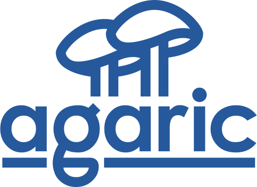

---

 
 

DDEV is an open source tool for running local PHP development environments in minutes. Its powerful, flexible per-project environment configurations can be extended, version controlled, and shared. DDEV allows development teams to adopt a consistent Docker workflow without the complexities of bespoke configuration.

## Get Started

1. **Check [System Requirements](https://ddev.readthedocs.io/):** macOS (Intel and Apple Silicon), Windows 10/11, WSL2, Linux, and [Gitpod](https://www.gitpod.io).
2. **Install [Docker/Colima and DDEV](https://ddev.readthedocs.io/en/latest/users/install/)**.
3. **Try a [CMS Quick Start Guide](https://ddev.readthedocs.io/en/latest/users/quickstart/)**.

If you need help, our friendly community provides [great support](https://ddev.readthedocs.io/en/latest/users/support).

## Partial Features

* Quickly create local web development environments based on code repositories, with minimal configuration.
* Import a database to any of your local environments.
* Import upload files to match the project (e.g. Drupal sites/default/files or WordPress `wp-content/uploads`).
* Customizable integration with hosting platforms like [Platform.sh](https://platform.sh), [Pantheon](https://pantheon.io), [Acquia](https://www.acquia.com) and others.
* Run commands within the Docker environment using `ddev exec`.
* View logs from the web and database containers.
* Use `ddev ssh` to explore the Linux environment inside the container.
* List running projects with `ddev list`.
* Snapshot databases with `ddev snapshot`.
* Temporarily share your development website with others using `ddev share`.
* Create custom commands as simple shell scripts.
* Enjoy effortless, trusted HTTPS support.
* Extend and customize environments as much (or as little!) as you need to.

Run `ddev` to see all the [commands](https://ddev.readthedocs.io/en/latest/users/usage/cli/).

## Contributing

See “How can I contribute to DDEV?” in the [FAQ](https://ddev.readthedocs.io/en/latest/users/usage/faq/), and the [Contributing](CONTRIBUTING.md) page.

## Wonderful Sponsors

