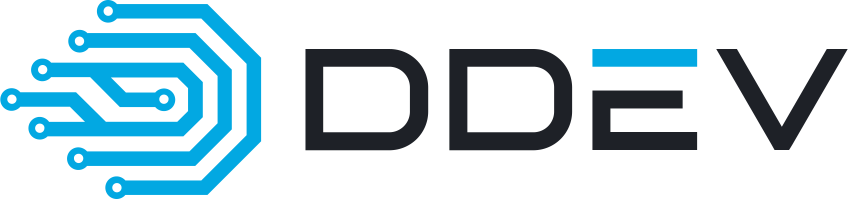

---
search:
  boost: .5
---
# Brand Guide

## Logos

| Figurative Mark                        | Word/Figurative Mark                               |
|----------------------------------------|----------------------------------------------------|
|  |  |

You can find a set of DDEV logos [here](https://github.com/ddev/ddev/tree/main/docs/content/developers/logos).

If possible, use the [SVG version](https://github.com/ddev/ddev/tree/main/docs/content/developers/logos/SVG) of the logo, as a vector graphic is independent of the resolution and gives the best results regardless of the pixel density of the display.

If the SVG format is not supported, you can use the exported PNG versions of the logo. Use [@2x](https://github.com/ddev/ddev/tree/main/docs/content/developers/logos/2x), [@3x](https://github.com/ddev/ddev/tree/main/docs/content/developers/logos/3x), and [@4x](https://github.com/ddev/ddev/tree/main/docs/content/developers/logos/4x) for high
pixel density displays. Many applications support [@2x](https://github.com/ddev/ddev/tree/main/docs/content/developers/logos/2x) annotations in the image path and automatically choose the correct image for the display in use.

PNG variants are generated using this script executed from the `ddev/ddev` repository root:

```bash
# brew install --cask inkscape
# brew install oxipng
svg_dir="docs/content/developers/logos/SVG"
output_dirs=("1x" "2x" "3x" "4x")
dpis=(96 192 288 384)
for file in "$svg_dir"/*.svg; do
  base_name=$(basename "${file%.svg}")
  for i in "${!dpis[@]}"; do
    dpi="${dpis[$i]}"
    output_dir="${svg_dir}/../${output_dirs[$i]}"
    mkdir -p "$output_dir"
    if [[ "${dpi}" == "96" ]]; then
      # No @1x for 1x resolution
      output_filename="$output_dir/${base_name}.png"
    else
      output_filename="$output_dir/${base_name}@${output_dirs[$i]}.png"
    fi
    # Export PNG at the specified DPI
    inkscape "$file" --export-dpi "$dpi" --export-filename "$output_filename"
    # Optimize the PNG file (lossless)
    oxipng -o max --strip safe --alpha "$output_filename"
  done
done
```

## Color Plate

| DDEV Blue | DDEV Black | DDEV White |
|-----------|------------|------------|
| `#02a8e2` | `#1e2127`  | `#e1ded8`  |

## Use of the Word Mark DDEV

The product DDEV is always referenced in capital letters.

When referring to the binary `ddev`, lowercase letters are preferred.
