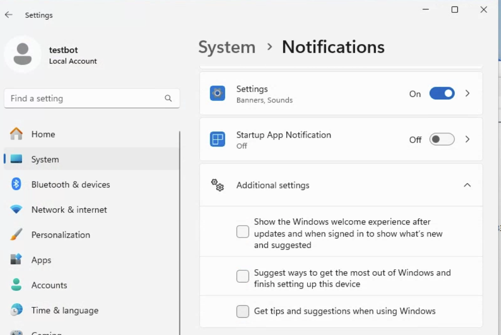
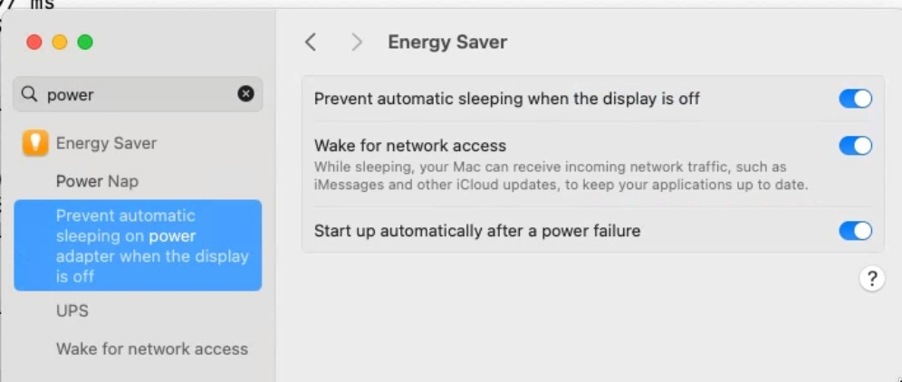
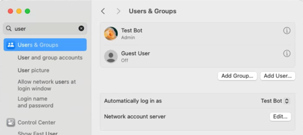
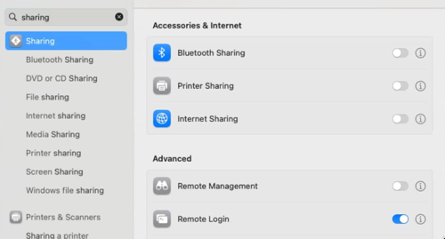
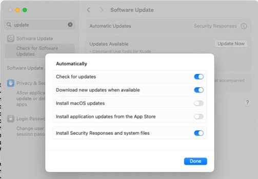
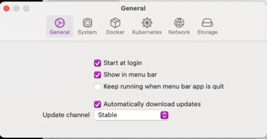

---
search:
  boost: .2
---
# Buildkite Test Agent Setup

We are using [Buildkite](https://buildkite.com/ddev) for Windows and macOS testing. The build machines and `buildkite-agent` must be set up before use.

## Windows Test Agent Setup

1. Create the user “testbot” on the machine. Use the password for `ddevtestbot@gmail.com`, available in 1Password.
2. In admin PowerShell, `wsl --install`.
3. Install [Docker Desktop for Windows](https://www.docker.com/products/docker-desktop/)
4. In admin PowerShell, `Set-ExecutionPolicy -Scope "CurrentUser" -ExecutionPolicy "RemoteSigned"`.
5. In admin PowerShell, download and run [windows_buildkite_start.ps1](scripts/windows_buildkite_start.ps1) with `curl <url> -O windows_buildkite_start.ps1`.
6. After restart, in **administrative** Git Bash window, `Rename-Computer <testbot-win10(home|pro)-<description>-1` and then `export BUILDKITE_AGENT_TOKEN=<token>`.
7. (Skip on WSL2 Docker Desktop setup.) Now download and run [`windows_buildkite-testmachine_setup.sh`](scripts/windows_buildkite_setup.sh).
8. (Skip on WSL2 Docker Desktop setup.) Download and run [windows_postinstall.sh](scripts/windows_postinstall.sh).
9. Launch Docker. It may require you to take further actions.
   * Check "Launch on login"
   * Check "Add the *.docker.internal names to the host's /etc/hosts file"
   * Uncheck "SBOM Indexing"
   * Under "Resources" uncheck "Resource Saver"
10. Log into Chrome with the user `ddevtestbot@gmail.com` and enable Chrome Remote Desktop.
11. (Skip on WSL2 Docker Desktop setup.) Enable gd, fileinfo, and curl extensions in `/c/tools/php*/php.ini`.
12. If a laptop, set the “lid closing” setting to do nothing.
13. Set the “Sleep after time” setting in settings to never.
14. Install [winaero tweaker](https://winaero.com/request.php?1796) and “Enable user autologin checkbox”. Set up the machine to [automatically log in on boot](https://www.cnet.com/how-to/automatically-log-in-to-your-windows-10-pc/).  Then run netplwiz, provide the password for the main user, uncheck “require a password to log in”.
15. (Skip on WSL2 Docker Desktop setup.) Set the `buildkite-agent` service to run as the testbot user and use delayed start: Choose “Automatic, delayed start” and on the “Log On” tab in the services widget it must be set up to log in as the testbot user, so it inherits environment variables and home directory (and can access NFS, has testbot Git config, etc).
16. `git config --global --add safe.directory '*'`.
17. (Skip on WSL2 Docker Desktop setup.) Manually run `testbot_maintenance.sh`, `curl -sL -O https://raw.githubusercontent.com/ddev/ddev/master/.buildkite/testbot_maintenance.sh && bash testbot_maintenance.sh`.
18. (Skip on WSL2 Docker Desktop setup.) Run `.buildkite/sanetestbot.sh` to check your work.
19. (Skip on WSL2 Docker Desktop setup.) Reboot the machine and do a test run. (On Windows, the machine name only takes effect on reboot.)
20. Verify that `go`, `ddev`, `git-bash` are in the path.
21. In “Advanced Windows Update Settings” enable “Receive updates for other Microsoft products” to make sure you get WSL2 kernel upgrades. Make sure to run Windows Update to get the latest kernel.
22. Turn off the settings that cause the "windows experience" prompts after new upgrades:


## Additional Windows Setup for WSL2+Docker Desktop Testing

1. The Ubuntu distro should be set up with the user `buildkite-agent`
2. `sudo apt update && sudo apt install -y apt-transport-https autojump build-essential ca-certificates curl dirmngr etckeeper expect git gnupg icinga2 jq libcurl4-gnutls-dev libnss3-tools lsb-release mariadb-client nagios-plugins postgresql-client unzip vim zip`
3. `sudo snap install --classic go`
4. Install `ngrok` with the [`linux apt` technique](https://ngrok.com/download).
5. `curl -fsSL https://keys.openpgp.org/vks/v1/by-fingerprint/32A37959C2FA5C3C99EFBC32A79206696452D198 | sudo gpg --dearmor -o /usr/share/keyrings/buildkite-agent-archive-keyring.gpg`
6. `echo "deb [signed-by=/usr/share/keyrings/buildkite-agent-archive-keyring.gpg] https://apt.buildkite.com/buildkite-agent stable main" | sudo tee /etc/apt/sources.list.d/buildkite-agent.list`
7. `sudo apt-get update && sudo apt-get install -y buildkite-agent`
8. `buildkite-agent` should have home directory `/var/lib/buildkite-agent`: `sudo usermod -d /var/lib/buildkite-agent buildkite-agent`
9. Configure buildkite agent in /etc/buildkite-agent:
    * `tags="os=wsl2,architecture=amd64,dockertype=dockerforwindows"`
    * token="xxx"
10. `sudo systemctl enable buildkite-agent && sudo systemctl start buildkite-agent`
11. In PowerShell: `wsl.exe --update`. Watch for the escalation to complete, it does require escalation.
12. Open WSL2 and check out [ddev/ddev](https://github.com/ddev/ddev).
13. Install DDEV using the [standard WSL2 Docker Desktop installation](https://ddev.readthedocs.io/en/stable/users/install/ddev-installation/#wsl2-docker-desktop-install-script)
14. Delete the CAROOT and WSLENV environment variables from administrative PowerShell:

     ```powershell
     [Environment]::SetEnvironmentVariable("CAROOT", $null, "Machine")
     [Environment]::SetEnvironmentVariable("WSLENV", $null, "Machine")
     ```

15. Install Homebrew: `/bin/bash -c "$(curl -fsSL https://raw.githubusercontent.com/Homebrew/install/HEAD/install.sh)"`
16. Configure brew in PATH with:

     ```
     echo 'export PATH="/snap/bin:/home/linuxbrew/.linuxbrew/bin:$PATH"' >>~/.bashrc
     source ~/.bashrc
     ```

17. As root user, add sudo capability with `echo "ALL ALL=NOPASSWD: ALL" >/etc/sudoers.d/all && chmod 440 /etc/sudoers.d/all`.
18. Manually run DDEV's `.buildkite/testbot_maintenance.sh`.
19. `git config --global --add safe.directory '*'`
20. Follow the [Icinga instructions](https://newmonitor.thefays.us/icingaweb2/doc/module/director/chapter/Working-with-agents) to configure the agent. Under the host's "Agent" tab it provides a script to configure the agent.
21. Windows Terminal should be installed. Set "Ubuntu" as the default and have it start on Windows startup.
22. `echo "capath=/etc/ssl/certs/" >>~/.curlrc`
23. `nc.exe -L -p 9003` on Windows to trigger and allow Windows Defender.
24. Run `ngrok authtoken <token>` with token for free account.

## Additional Windows Setup for WSL2+Docker-Inside Testing

1. Uninstall Docker Desktop.
2. Remove all of the entries (especially `host.docker.internal`) that Docker Desktop might have added in `C:\Windows\system32\drivers\etc\hosts`.
3. Install Docker and basics in WSL2:

    ```bash
    sudo mkdir -p /etc/apt/keyrings
    sudo mkdir -p /etc/apt/keyrings && sudo rm -f /etc/apt/keyrings/docker.gpg && curl -fsSL https://download.docker.com/linux/ubuntu/gpg | sudo gpg --dearmor -o /etc/apt/keyrings/docker.gpg
    echo "deb [arch=$(dpkg --print-architecture) signed-by=/etc/apt/keyrings/docker.gpg] https://download.docker.com/linux/ubuntu $(lsb_release -cs) stable" | sudo tee /etc/apt/sources.list.d/docker.list > /dev/null
    sudo apt-get update && sudo apt-get install -y docker-ce docker-ce-cli etckeeper containerd.io docker-compose-plugin
    sudo usermod -aG docker $USER
    ```

4. Run `.buildkite/sanetestbot.sh`

## Icinga2 monitoring setup for WSL2 instances

1. Icinga Director web UI, configure the host on `newmonitor.thefays.us`, normally making a copy of an existing identical item.
2. Deploy the new host using Icinga Director.
3. On the WSL2 Ubuntu instance, install needed packages: `sudo apt-get update && sudo apt-get install -y etckeeper icinga2 monitoring-plugins-contrib nagios-plugins`
4. Add `nagios` to the `docker` group in `/etc/group`.
5. `sudo icinga2 node wizard` to configure the agent, see [docs](https://icinga.com/docs/icinga-2/latest/doc/06-distributed-monitoring/#agentsatellite-setup-on-linux)
6. Restart `sudo systemctl restart icinga2`
7. Hope that it can all work sometime.

## macOS Docker Desktop Test Agent Setup (Intel and Apple Silicon)

1. Create the user “testbot” on the machine. Use the password for `ddevtestbot@gmail.com`, available in 1Password.
2. Change the name of the machine to something in keeping with current style, perhaps `testbot-macos-arm64-8`. This is done in **Settings** → **General** → **About** → **Name** and in **Sharing** → **Computer Name** and in **Sharing** → **Local Hostname**.
3. Download and install Chrome and log the browser into the account used for test runners. It will pick up the Chrome Remote Desktop setup as a result. Configure Chrome Remote Desktop to serve. When this is done, the machine will be available for remote access and most other tasks can be done using Chrome Remote Desktop.
4. The machine should be on the correct network and have a static IP handed out by DHCP. IP addresses are listed in /etc/hosts on `pi.ddev.site`, so this one should be added.
5. Power should be set up as in .
6. Auto login should be set up as in , see [automatically log in on boot](https://support.apple.com/en-us/HT201476).
7. Remote login should be enabled as in .
8. Automatic updates should be set to mostly security only as in .
9. Set the time zone to US MT (nearest city: Denver, Colorado).
10. `sudo mkdir -p /usr/local/bin && sudo chown -R testbot /usr/local/bin`
11. Install [Homebrew](https://brew.sh/) `/bin/bash -c "$(curl -fsSL https://raw.githubusercontent.com/Homebrew/install/HEAD/install.sh)"`
12. After installing Homebrew follow the instructions it gives you at the end to add brew to your PATH.
13. Install everything you’ll need with `brew install buildkite/buildkite/buildkite-agent bats-core composer ddev/ddev/ddev git golang jq mysql-client mkcert netcat p7zip  && brew install --cask docker iterm2 ngrok && brew link --force mysql-client`.
14. Run `ngrok authtoken <token>` with token for free account from 1Password.
15. Run `mkcert -install`.
16. If Docker Desktop will be deployed, run Docker manually and go through its configuration routine.
17. If OrbStack will be deployed, install it from [orbstack.dev](https://orbstack.dev).
    * Install with Docker only.
    * Click "Sign in" in the lower left to sign in with OrbStack credentials (normal test runner gmail address; it will receive an email with a login code).
    * Configure it to automatically start and download updates, see .
18. If Rancher Desktop will be deployed, install it.
    * Turn off kubernetes.
19. Run iTerm. You may need to allow full disk access permissions.
20. Run `mkdir ~/workspace && cd ~/workspace && git clone https://github.com/ddev/ddev`.
21. Set up `nfsd` by running `bash ~/workspace/ddev/scripts/macos_ddev_nfs_setup.sh`.
22. `git config --global --add safe.directory '*'`.
23. Edit `/usr/local/etc/buildkite-agent/buildkite-agent.cfg` or `/opt/homebrew/etc/buildkite-agent/buildkite-agent.cfg` to add
    * the agent `token` (from [agents tab](https://buildkite.com/organizations/ddev/agents), "Reveal Agent Token").
    * the agent `name` (the name of the machine).
    * `tags`, like `"os=macos,architecture=arm64,osvariant=sonoma,dockertype=dockerformac,rancher-desktop=true,orbstack=true,docker-desktop=true"`
    * `build-path="~/tmp/buildkite-agent/builds"`
24. Run `brew services start buildkite-agent`.
25. Run `bash ~/workspace/ddev/.buildkite/testbot_maintenance.sh`.
26. Run `bash ~/workspace/ddev/.buildkite/sanetestbot.sh` to check your work.
27. The `testbot` user's SSH account is used for monitoring, so `ssh-keygen` and then add the public key `id_testbot` from 1Password to `~/.ssh/authorized_keys` and `chmod 600 ~/.ssh/authorized_keys`.
28. Add the new machine to Icinga by copying an existing Icinga service to the new one. This is done in **Icinga Director** → **Services** → **Single Services** → **Select a Service** → **Clone** → **Deploy**. The new service has to have `by-ssh-address` set to the name of the test runner, and that address needs to be added to `pi.ddev.site`'s `/etc/hosts` file.
29. If `zsh` is the shell configured, add `/etc/zshenv` so that `/usr/local/bin/docker` will be picked up:

    ```bash
    PATH=$PATH:/usr/local/bin:/opt/homebrew/bin
    ```

## Additional Colima macOS setup

1. `brew install colima`
2. `colima start --cpu 4 --memory 6 --disk 100 --vm-type=qemu --mount-type=sshfs --dns=1.1.1.1`
3. `colima stop`
4. `colima start vz --cpu 4 --memory 6 --disk 60 --vm-type=vz --mount-type=virtiofs --dns=1.1.1.1`
5. `colima stop vz`

Then the Buildkite agent must be configured with tags `colima=true` and `colima_vz=true`.

## Additional Lima macOS setup (not yet working)

1. `limactl create --name=lima-vz --vm-type=vz --mount-type=virtiofs --mount="~/:w" --memory=6 --cpus=4 --disk=100 template://docker`
2. `limactl start lima-vz`
3. `docker context use lima-lima-vz`

Then the Buildkite agent must be configured with tags `lima=true`.
