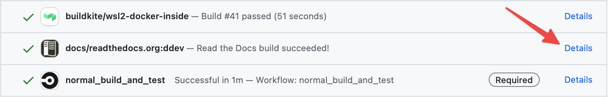

---
search:
  boost: .5
---
# Working on the Docs

This page is about working with the DDEV documentation. See the [Writing Style Guide](writing-style-guide.md) for stylistic guidance.

## Fix Docs Using Web Browser

The documentation is built and checked automatically with various [GitHub Actions workflows](https://github.com/ddev/ddev/actions). While it may help to [check your work locally](#fork-or-clone-the-ddev-repository) for more involved PRs, you can more quickly make suggestions using GitHub in a browser:

1. Click the pencil in the upper right. That will take you to the right page on GitHub.
2. Click the pencil button on GitHub and follow the instructions to create your change.
3. Save your changes and follow the prompts to create a PR.
4. In the checks on your PR, click the “details” link by `docs/readthedocs.org:ddev` to browse the docs build created by your PR.
5. Once the PR has run its checks, you’ll see an item labeled `docs/readthedocs.org:ddev`. Click “Details” to review a docs build that includes your changes:
    
6. Take a look at the [“Check docs” action](https://github.com/ddev/ddev/actions/workflows/docscheck.yml) to make sure there were no linting or spelling errors.

## Fork or Clone the DDEV Repository

To start making changes you’ll need a local copy of the DDEV documentation, so [fork the DDEV repository](https://github.com/ddev/ddev/fork) which includes the documentation.

After forking the repository, you can clone it to your local machine.

## Make Changes

Now that you’ve got a local copy, you can make your changes.

| Action               | Path                                                                    |
|----------------------|-------------------------------------------------------------------------|
| Documentation        | `./docs/content/users/*` <br> `./docs/content/developers/*`             |
| MkDocs configuration | `./mkdocs.yml`                                                          |
| Front end            | `./docs/content/assets/extra.css` <br> `./docs/content/assets/extra.js` |

## Preview Changes

Preview your changes locally by running `make mkdocs-serve`.

This will launch a web server on port 8000 and automatically refresh pages as they’re edited.

!!!tip "Installing mkdocs locally on macOS"
    On macOS with recent versions of Homebrew use this technique to install mkdocs:

    ```bash
    brew install pipx
    export PIPX_BIN_DIR=/usr/local/bin
    pipx install mkdocs
    pipx runpip mkdocs install -r docs/mkdocs-pip-requirements
    pipx ensurepath
    ```

!!!tip "Installing mkdocs locally on Debian/Ubuntu Linux or WSL2 with Ubuntu"

    ```bash
    sudo apt update && sudo apt install python3-full python-is-python3 pipx
    export PIPX_BIN_DIR=/usr/local/bin
    export PIPX_HOME=/usr/local/pipx
    sudo --preserve-env pipx install mkdocs --pip-args "-r docs/mkdocs-pip-requirements"
    ```

## Check Markdown for Errors

Run `make markdownlint` before you publish changes to quickly check your files for errors or inconsistencies.

!!!warning "`markdownlint-cli` required!"
    The `make markdownlint` command requires you to have `markdownlint-cli` installed, which you can do by executing `npm install -g markdownlint-cli`

## Check for Spelling Errors

Run `make pyspelling` to check for spelling errors. Output will be brief if all goes well:

```
➜  make pyspelling
pyspelling:
Spelling check passed :)
```

If you’ve added a correctly-spelled word that gets flagged, like “Symfony” for example, you’ll need to add it to `.spellcheckwordlist.txt` in the [root of DDEV’s repository](https://github.com/ddev/ddev/blob/main/.spellcheckwordlist.txt).

!!!warning "`pyspelling` and `aspell` required!"
    It’s probably best to install packages locally before attempting to run `make pyspelling`:

    ```
    sudo -H pip3 install pyspelling pymdown-extensions
    sudo apt-get install aspell
    ```

## Publish Changes

If all looks good, it’s time to commit your changes and make a pull request back into the official DDEV repository.

When you make a pull request, several tasks and test actions will be run. One of those is a task named `docs/readthedocs.org:ddev`, which builds a version of the docs containing all the changes from your pull request. You can use that to confirm the final result is exactly what you’d expect.
