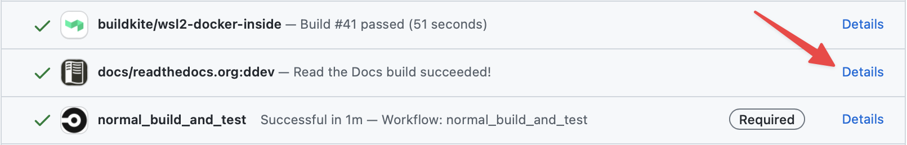

---
search:
  boost: .5
---
# Working on the Docs

This page is about working with the DDEV documentation. See the [Writing Style Guide](writing-style-guide.md) for stylistic guidance.

## Fix Docs Using Web Browser

The documentation is built and checked automatically with various [GitHub Actions workflows](https://github.com/ddev/ddev/actions). While it may help to [check your work locally](#fork-or-clone-the-ddev-repository) for more involved PRs, you can more quickly make suggestions using GitHub in a browser:

1. Click the pencil in the upper right. That will take you to the right page on GitHub.
2. Click the pencil button on GitHub and follow the instructions to create your change.
3. Save your changes and follow the prompts to create a PR.
4. In the checks on your PR, click the “details” link by `docs/readthedocs.org:ddev` to browse the docs build created by your PR.
5. Once the PR has run its checks, you’ll see an item labeled `docs/readthedocs.org:ddev`. Click “Details” to review a docs build that includes your changes:
    
6. Take a look at the [“Check docs” action](https://github.com/ddev/ddev/actions/workflows/docs-check.yml) to make sure there were no linting or spelling errors.

## Fork or Clone the DDEV Repository

To start making changes you’ll need a local copy of the DDEV documentation, so [fork the DDEV repository](https://github.com/ddev/ddev/fork) which includes the documentation.

After forking the repository, you can clone it to your local machine.

## Make Changes

Now that you’ve got a local copy, you can make your changes.

| Action                 | Path                                                                    |
|------------------------|-------------------------------------------------------------------------|
| Documentation          | `./docs/content/users/*` <br> `./docs/content/developers/*`             |
| Zensical configuration | `./mkdocs.yml`                                                          |
| Front end              | `./docs/content/assets/extra.css` <br> `./docs/content/assets/extra.js` |

## Development Tools Installation

For documentation development and testing, install the required tools once using:

```bash
scripts/install-dev-tools.sh
```

This installs `zensical`, `pyspelling`, `markdownlint`, `textlint`, `linkspector`, and `aspell` to `$HOME/.ddev-dev-tools/`.

The project's `.envrc` automatically adds these tools to your PATH when you're in the DDEV directory. If you want the tools available globally, add this to your shell profile (`.bashrc`, `.bash_profile`, or `.zshrc`):

```bash
export PATH="$HOME/.ddev-dev-tools/python/bin:$HOME/.ddev-dev-tools/node/bin:$PATH"
```

Alternatively, you can use the project-level `.envrc` installation method:

1. Install `direnv` with `brew install direnv` or `sudo apt-get update && sudo apt-get install -y direnv` or whatever technique is appropriate for your system.
2. Hook `direnv` into your shell, see [docs](https://direnv.net/docs/hook.html).
3. Create global configuration for `direnv` in `~/.config/direnv/direnv.toml` allowing it to be loaded without the `direnv allow` command, see  [docs](https://github.com/direnv/direnv/blob/master/man/direnv.toml.1.md), adjusting for your project path:

```
[global]
strict_env = true
[whitelist]
exact = ["~/workspace/ddev/.envrc"]
```

**Recommended**: Use the unified installation script for better performance and fewer per-project installations.

## Preview Changes

Preview your changes locally by running `make zensical-serve`.

This will launch a web server on port 8000 and automatically refresh pages as they’re edited.

## Check Markdown for Errors

Run `make markdownlint` before you publish changes to quickly check your files for errors or inconsistencies.

!!!warning "`markdownlint-cli` required!"
    The `make markdownlint` command requires you to have `markdownlint-cli` installed, which you can do by executing `npm install -g markdownlint-cli` or by using the `direnv` method above.

## Check for Spelling Errors

Run `make pyspelling` to check for spelling errors. Output will be brief if all goes well:

```
➜  make pyspelling
pyspelling:
Spelling check passed :)
```

If you’ve added a correctly-spelled word that gets flagged, like “Symfony” for example, you’ll need to add it to `.spellcheckwordlist.txt` in the [root of DDEV’s repository](https://github.com/ddev/ddev/blob/main/.spellcheckwordlist.txt).

!!!warning "`pyspelling` and `aspell` required!"
    It's probably best to install packages locally before attempting to run `make pyspelling`:

    ```
    sudo -H pip3 install pyspelling pymdown-extensions
    sudo apt-get install aspell
    ```

## Check for Link Errors

Check external links using `make linkspector`.

## Publish Changes

If all looks good, it’s time to commit your changes and make a pull request back into the official DDEV repository.

When you make a pull request, several tasks and test actions will be run. One of those is a task named `docs/readthedocs.org:ddev`, which builds a version of the docs containing all the changes from your pull request. You can use that to confirm the final result is exactly what you’d expect.

## Updating Stable Docs Without a Release

[ReadTheDocs](https://readthedocs.org) serves `/stable/` from a dedicated `stable` branch (not from the latest tag directly). On every non-prerelease GitHub release, the [`docs-stable` workflow](https://github.com/ddev/ddev/actions/workflows/docs-stable.yml) automatically resets that branch to the release tag.

To push a doc fix to the stable docs without cutting a new release, commit directly to the `stable` branch:

```bash
git fetch upstream
git checkout -b stable upstream/stable
# make your doc changes
git add docs/
git commit -m "docs: fix typo in install guide [skip ci]"
git push upstream stable
```

!!!note
    The `[skip ci]` in the commit message prevents GitHub Actions and Buildkite from running tests on the `stable` branch. ReadTheDocs will still rebuild `/stable/` automatically on the push.
