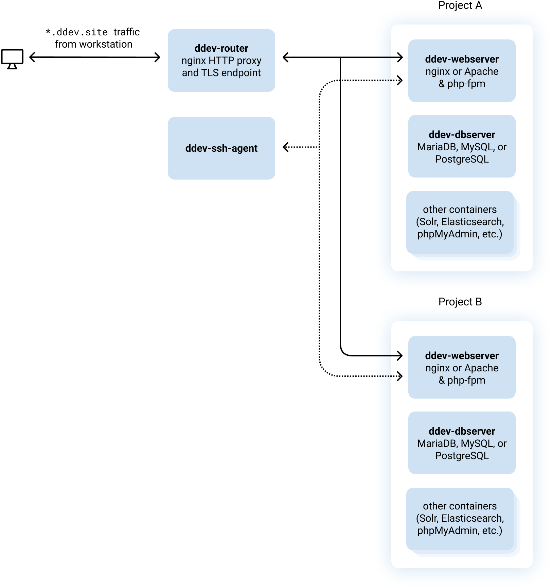

# How DDEV Works

DDEV is a [Go](https://go.dev) application that stores its configuration in [files on your workstation](#directory-tour).  
It uses those blueprints to mount your project files into [Docker containers](#container-architecture) that facilitate the operation of a local development environment.

DDEV writes and uses [docker-compose](https://docs.docker.com/compose/) files for you, which is a detail you can cheerfully ignore unless you’re Docker-curious or [defining your own services](../extend/custom-compose-files.md).

## Directory Tour

A project’s `.ddev` directory can be intimidating at first, so let’s take a look at what lives in there.

!!!tip "Yours May Differ Slightly"
    You may have some directories or files that aren’t listed here, likely added by custom services.  
    For example, if you see a `solr` directory, it probably pertains to a custom Solr [add-on service](../extend/additional-services.md).

`apache` directory
: Default Apache configuration when using `webserver_type: apache-fpm`, which [can be customized](../extend/customization-extendibility.md#providing-custom-apache-configuration).

`commands` subdirectories
: Project custom [shell commands](../extend/custom-commands.md) that can run on the host or inside a container.

`config.yaml`
: The project’s main [configuration file](../configuration/config.md).

`config.*.yaml` files
: [Environmental overrides](../configuration/config.md#environmental-overrides) for parts of `config.yaml`.

`db-build` directory
: Can be used to provide a [custom Dockerfile](../extend/customizing-images.md) for the database container.

`db_snapshots` directory
: Where snapshots go when you run the [`ddev snapshot`](../basics/commands.md#snapshot) command. You can safely delete anything in here that you don’t need.

`docker-compose.*.yaml` files
: Where Docker-friendly users can provide their own [custom compose files](../extend/custom-compose-files.md) that add or override services. Read more in [Additional Service Configurations & Add-ons](../extend/additional-services.md) and check out examples in [ddev-contrib](https://github.com/drud/ddev-contrib).

`homeadditions` directory
: Files to be copied into the web container on startup. You could use this, for example, to override the default home directory contents (`.profile`, `.bashrc`, `.composer`, `.ssh`), or include scripts that you’d like to be available inside the container. (You can do the same thing globally in `~/.ddev/homeadditions`.) Check out the [homeadditions docs](../extend/in-container-configuration.md) for more.

`mutagen` directory
: Contains `mutagen/mutagen.yml`, where you can [override the default Mutagen configuration](../install/performance.md#advanced-mutagen-configuration-options).

`mysql` directory
: Contains [optional `mysql` or `mariadb` configuration](../extend/customization-extendibility.md#providing-custom-mysqlmariadb-configuration-mycnf).

`nginx` directory
: Can be used for add-on nginx snippets.

`nginx_full` directory
: Contains the nginx configuration used by the web container, which [can be customized](../extend/customization-extendibility.md#providing-custom-nginx-configuration).

`postgres` directory
: Contains `postgres/postgresql.conf`, which can be edited if needed. Remove the `#ddev-generated` line at the top to take it over.

`providers` directory
: Contains examples and implementations to demonstrate how the [`ddev pull`](../basics/commands.md#pull) command can work with [hosting providers](../providers/index.md).

`web-build` directory
: Can be used to provide a [custom Dockerfile](../extend/customizing-images.md) for the web container.

`xhprof` directory
: Contains the `xhprof_prepend.php` file that can be used to customize [xhprof](../debugging-profiling/xhprof-profiling.md) behavior for different types of websites.

### Look But Don’t Touch

Files beginning with `.` are hidden because they shouldn’t be fiddled with; most are regenerated, and thus overwritten, on every `ddev start`:

`.dbimageBuild` directory
: The generated Dockerfile used to customize the `db` container on first start.

`.ddev-docker-compose-base.yaml`
: The base docker-compose file used to describe a project.

`.ddev-docker-compose-full.yaml`
: The result of preprocessing `.ddev-docker-compose-base.yaml` using `docker-compose config`. Mostly it replaces environment variables with their values.

`.gitignore`
: The `.gitignore` is generated by DDEV and should generally not be edited or checked in. (It gitignores itself to make sure you don’t check it in.) It’s generated on every `ddev start` and will change as DDEV versions change, so if you check it in by accident it will always be showing changes that you don’t need to see in `git status`.

`.global_commands`
: Temporary directory used to get global commands available inside a project. You shouldn’t ever have to look there.

`.homeadditions`
: Temporary directory used to consolidate global `homeadditions` with project-level `homeadditions`. You shouldn’t ever have to look here.

`.webimageBuild` directory
: The generated Dockerfile used to customize the web container on first start.

## Container Architecture

It’s easiest to think of DDEV as a set of little networked computers (Docker containers) that are in a different network from your workstation but still reachable from it.

When you install or upgrade DDEV you’re mostly installing a single `ddev` binary. When you use it, it downloads the Docker images it needs, and then starts them based on what’s needed for your projects.

* The `ddev-webserver` container (one per project) runs `nginx` or `apache` and `php-fpm` for a single site, so it does all the basic work of a PHP-interpreting web server.
* The `ddev-dbserver` container (one per project) handles MariaDB/MySQL/PostgreSQL database management. It can be reached from the web server by the hostname `db` or with the more explicit name `ddev-<projectname>-db`.
* The optional `dba` container runs phpMyAdmin for projects with MySQL or MariaDB.
* Additional add-on services may be there for a given project, for example `solr` or `elasticsearch` or `memcached`.

Although it’s not common usage, different projects can communicate with each other as described in the [FAQ](faq.md#can-different-projects-communicate-with-each-other).

Now for the two oddball global containers (there’s only one of each):

* The `ddev-router` container is a “reverse proxy”. It takes incoming HTTP/S requests, looks up the hostname in the incoming URL, and routes it to the correct project’s `ddev-webserver`. Depending on the project’s configuration with [`additional_hostnames`](../configuration/config.md#additional_hostnames) and [`additional_fqdns`](../configuration/config.md#additional_fqdns), it can route many different URLs to a single project’s `ddev-webserver`. If, like most people, you use the named URLs like `https://something.ddev.site`, your request goes through the router. When you use the `127.0.0.1` URLs, the requests go directly to the `ddev-webserver`.
* The `ddev-ssh-agent` container runs an `ssh-agent` inside the Docker network so that after run [`ddev auth ssh`](../basics/commands.md#auth-ssh) all the different projects can use your SSH keys for outgoing requests—like private Composer access or SCP from a remote host.

Here’s a basic diagram of how it works inside the Docker network:

