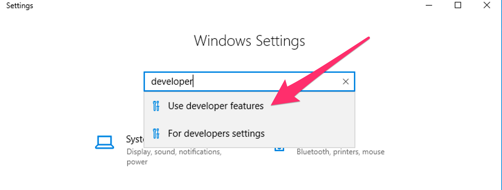
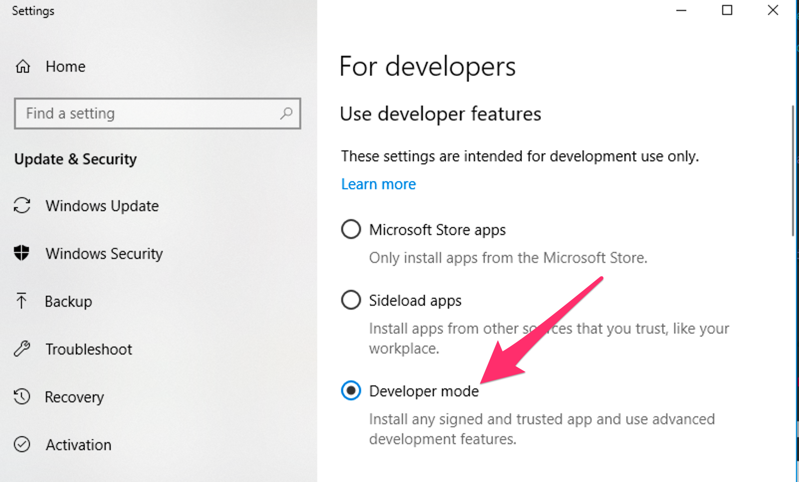

# Built-in Developer Tools

Run `ddev describe` to see the project information and services available for your project and how to access them.

## Command-line Tools in the Containers

Hundreds of useful developer tools are included inside the containers. Any of these tools can be used via `ddev exec` or `ddev ssh`. A short listing is:

* MySQL client (`mysql`) - Command-line interface for interacting with MySQL/MariaDB.
* Postgresql client (`psql`) - Command-line tool for Postgresql.
* [Drush](http://www.drush.org) - Command-line shell and Unix scripting interface for Drupal.
* [PHIVE](https://phar.io/) - Command line tool for "PHAR Installation and Verification Environment"
* [WP-CLI](http://wp-cli.org/) - Command-line tools for managing WordPress installations, available both as "wp" and as "wp-cli".
* npm and yarn (and the `ddev yarn` command will run yarn for you, `ddev help yarn`)
* node
* sqlite3

These tools can be accessed for single commands using [`ddev exec <command>`](cli-usage.md#executing-commands-in-containers) or [`ddev ssh`](cli-usage.md#ssh-into-containers) for an interactive bash or sh session.

You can also add tools that are not provided by default using [`webimage_extra_packages` or a custom Dockerfile](../extend/customizing-images.md).

## DDEV and Composer

ddev provides a built-in command to simplify use of [Composer](https://getcomposer.org/), the dependency manager for PHP, that allows a user to create and manage projects without having Composer installed on the host machine. Generally, executing any Composer command through DDEV is as simple as prepending the command with `ddev`. DDEV will execute the command at the project root in the web container, passing (almost) all arguments and flags to Composer. To execute Composer in other directories within the container, use `ddev ssh` or `ddev exec -d <dir>`. For example:

`ddev composer help`
`ddev composer require <package>`

Additionally, Composer can be used to initialize new projects with `ddev composer create`. This command supports limited argument and flag options, and will install a new project to the project root in `/var/www/html`. The package and version arguments are required:

`ddev composer create [<flags>] "<package>:<version>"`

For example:

`ddev composer create --no-dev "typo3/cms-base-distribution:^9"`

To execute a fully-featured `composer create-project` command, you can execute the command from within the container after executing `ddev ssh`, or pass the full command to `ddev exec`, like so:

`ddev exec composer create-project ...`

DDEV-Local uses composer version 2 by default. If you want to roll back to version 1, `ddev config --composer-version=1 && ddev start`

**composer.json Location**: The most common situation is for the composer.json to be in the project root, but if your composer.json is not in the project root, use the `composer_root` option in `.ddev/config.yaml` or `ddev config --composer-root <dir>`. The `composer_root` value is the *relative* path from the project root to the directory where the composer.json file is. So if the composer.json is `docroot/composer.json`, the `composer_root` value should be `docroot`.

Note: if you run `ddev composer global require`, (or run `composer global require` inside the web container) the global packages will be installed in the in-container user's home directory ( ~/.composer) and will disappear on the next container restart, requiring rerun of the command. You may need an additional step of synchronizing created composer configuration and installed packages with the DDEV's [homeadditions folder](../extend/in-container-configuration.md) on the host.

<a name="windows-os-and-ddev-composer"></a>

### Windows OS and `ddev composer`

Both composer and some configurations of Docker Desktop for Windows introduce quite complex filesystem workarounds. DDEV attempts to help you with each of them.

You generally don't have to worry about any of this, but it does keep things cleaner. Mostly just a few of the more complex TYPO3 projects have been affected.

* On some older configurations of Docker Desktop for Windows, symlinks are created in the container as "simulated symlinks", or XSym files. These are special text files that behave as symlinks inside the container (on CIFS filesystem), but appear as simple text files on the Windows host. (on the CIFS filesystem used by Docker for Windows inside the container there is no capability to create real symlinks, even though Windows now has this capability.)
* DDEV-Local attempts to clean up for this situation. Since Windows 10/11+ (in developer mode) can create real symlinks, DDEV-Local scans your repository after a `ddev composer` command and attempts to convert XSym files into real symlinks. On older versions of Windows 10, it can only do this if your Windows 10 workstation is set to "Developer Mode".
* On Windows 10/11+, to set your computer to developer mode, search for "developer" in settings. Screenshots are below.





### Limitations with `ddev composer`

* Using `ddev composer --version` or `ddev composer -V` will not work, since `ddev` tries to utilize the command for itself. Use `ddev composer -- --version` instead.

## Email Capture and Review (MailHog)

[MailHog](https://github.com/MailHog/MailHog) is a mail catcher which is configured to capture and display emails sent by PHP in the development environment.

After your project is started, access the MailHog web interface at its default port like this:
`http://mysite.ddev.site:8025` or just use `ddev launch -m` to get to it.

Please note this will not intercept emails if your application is configured to use SMTP or a 3rd-party ESP integration. If you are using SMTP for outgoing mail handling ([Swift Mailer](https://www.drupal.org/project/swiftmailer) or [SMTP](https://www.drupal.org/project/smtp) modules for example), update your application configuration to use `localhost` on port `1025` as the SMTP server locally in order to use MailHog.

For Laravel projects, Mailhog will capture Swift messages via SMTP. Update your `.env` to use Mailhog with the following settings:

```env
MAIL_MAILER=smtp
MAIL_HOST=localhost
MAIL_PORT=1025
MAIL_USERNAME=null
MAIL_PASSWORD=null
MAIL_ENCRYPTION=null
```

## Using Development Tools on the Host Machine

It is possible in many cases to use development tools installed on your host machine on a project provisioned by ddev. Tools that interact with files and require no database connection, such as Git or Composer, can be run from the host machine against the code base for a ddev project with no additional configuration necessary.

### Database Connections from the Host

If you need to connect to the database of your project from the host machine, run `ddev describe` to show the database connection information, like `Host: localhost:49156`.

The port referenced is unique per running project, and randomly chosen from available ports on your system when you run `ddev start`.

You can force this port to be the same on every `ddev start` by setting `host_db_port` in the project .ddev/config.yaml. For example, `host_db_port: "49156"` or `ddev config --host-db-port=49156`. This value needs to be different on each running DDEV project, and unless it is set, the database port will change on every `ddev start`.

You can use this port with various tools that need a direct port, like `mysql` or `psql` clients, but it's usually easiest to use `ddev mysql`, `ddev psql`, `ddev sequelace`, `ddev tableplus`, etc, which set everything up for you.

## Using Drush 8 installed Installation on the Host Computer

**Warning:** Using drush on the host is discouraged, and you'll have some trouble with it. It's also mostly irrelevant for Drupal8, as you should be using composer-installed project-level drush.

If you have PHP and Drush installed on your host system and the environment variable IS_DDEV_PROJECT=true, you can use drush to interact with a ddev project. On the host system the extra include host-side configuration for the database and port are derived in the settings.ddev.php file to allow drush to access the database server. This may not work for all drush commands because of course the actual webserver environment is not available.

Note that on Drupal 8+ if you want to use `drush uli` on the host (or other drush commands that require a default URI), you'll need to set DRUSH_OPTIONS_URI on the host. For example, `export DRUSH_OPTIONS_URI=https://mysite.ddev.site`.

## DDEV and Terminus

[Terminus](https://pantheon.io/docs/terminus/) is a command line tool providing advanced interaction with [Pantheon](https://pantheon.io/) services. As of version [1.13.0](https://github.com/drud/ddev/releases/tag/v1.13.0), terminus is available inside the project's container, allowing users to get information from, or issue commands to their Pantheon-hosted sites. This is an especially helpful feature for Windows users as terminus is only officially supported on unix-based systems.

To use terminus, you'll first need to:

1. Use a machine token, more discussion in [Pantheon provider discussion](../providers/pantheon.md).
2. Use `ddev ssh` to tunnel into your container
3. Issue a command using the keyword `terminus`. For help using terminus try `terminus list` to get a list of possible commands.

Terminus also allows you to issue [drush](https://www.drush.org/), [WP-CLI](https://wp-cli.org/), and [composer](https://getcomposer.org/) commands to your pantheon server. These are all usable from within the container as well, but will require authentication via either your Pantheon password or an SSH key. To use your host machine's SSH key, you can use the `ddev auth ssh` command [described here](cli-usage.md#ssh-into-containers).
