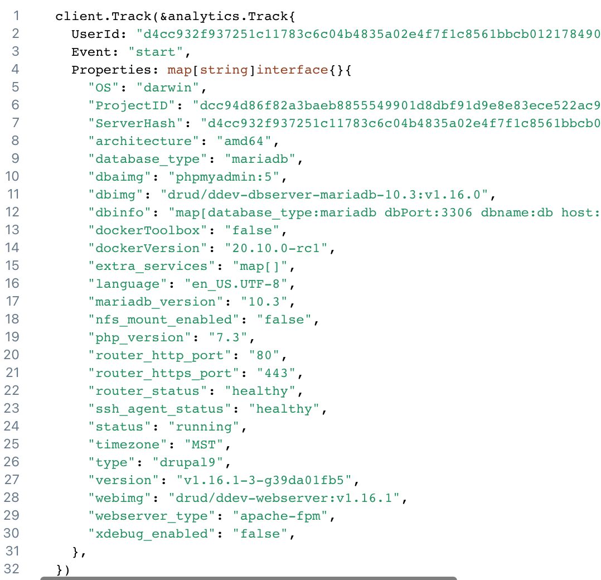

## DDEV-Local Command-Line Usage

Type `ddev` or `ddev -h`in a terminal window to see the available ddev commands. There are commands to configure a project, start, stop, describe, etc. Each command also has help. For example, `ddev stop -h` shows that `ddev rm` is an alias, and shows all the many flags that can be used with `ddev stop`.

## Favorite Commands

Each of these commands has full help. For example, `ddev start -h` or `ddev help start`. Just typing `ddev` will get you a list of available commands.

* `ddev config` configures a project for ddev, creating a .ddev directory according to your responses. It should be executed in the project (repository) root.
* `ddev start` and `ddev stop` start and stop the containers that comprise a project. `ddev restart` just does a stop and a start. `ddev poweroff` stops all ddev-related containers and projects.
* `ddev describe` or `ddev describe <projectname>` gives you full details about the project, what ports it uses, how to access them, etc. (Change the format with `ddev config global --table-style=bright` or `bold` or `default`)
* `ddev list` shows running projects. (Change the format with `ddev config global --table-style=bright` or `bold` or `default`)
* `ddev mysql` gives direct access to the mysql client and `ddev psql` to the PostgreSQL `psql` client.
* `ddev sequelpro`, `ddev sequelace`, and `ddev tableplus` (macOS only, if the app is installed) give access to the Sequel Pro, Sequel Ace, or TablePlus database browser GUIs.
* `ddev heidisql` (Windows/WSL2 only, if installed) gives access to the HeidiSQL database browser GUI.
* `ddev import-db` and `ddev export-db` let you import or export a sql or compressed sql file.
* `ddev composer` lets you run composer (inside the container), for example `ddev composer install` will do a full composer install for you without even needing composer on your computer. See [developer tools](developer-tools.md#ddev-and-composer). Composer version 2 is the default, but you can also configure composer version 1.
* `ddev snapshot` makes a very fast snapshot of your database that can be easily and quickly restored with `ddev snapshot restore`.
* `ddev share` requires ngrok and at least a free account on [ngrok.com](https://ngrok.com) so you can let someone in the next office or on the other side of the planet see your project and what you're working on. `ddev share -h` gives more info about how to set up ngrok.
* `ddev ssh` opens a bash session in the web container (or other container).
* `ddev launch` or `ddev launch some/uri` will launch a browser with the current project's URL (or a full URL to `/some/uri`). `ddev launch -p` will launch the phpMyAdmin UI, and `ddev launch -m` will launch the MailHog UI.
* `ddev delete` is the same as `ddev stop --remove-data` and will delete a project's database and ddev's record of the project's existence. It doesn't touch your project or code. `ddev delete -O` will omit the snapshot creation step that would otherwise take place, and `ddev delete images` gets rid of spare Docker images you may have on your machine.
* `ddev xdebug` enables xdebug, `ddev xdebug off` disables it, `ddev xdebug status` shows status
* `ddev xhprof` enables xhprof, `ddev xhprof off` disables it, `ddev xhprof status` shows status
* `ddev drush` (Drupal and Backdrop only) gives direct access to the drush CLI
* `ddev artisan` (Laravel only) gives direct access to the Laravel artisan CLI
* `ddev magento` (Magento2 only) gives access to the magento CLI
* `ddev yarn` gives direct access to the yarn CLI
* `ddev config global --simple-formatting` tells ddev to not try to make a fancy table in `ddev describe` and `ddev list`

## Node.js, npm, nvm, and yarn

`nodejs`, `npm`, `nvm` and `yarn` are preinstalled in the web container. You can configure the default value of the installed nodejs version with the `nodejs_version` option in `.ddev/config.yaml` or with `ddev config --nodejs_version`. You can also override that with any value using the built-in `nvm` in the web container or with `ddev nvm`, for example `ddev nvm install 6`. There is also a `ddev yarn` command.

## Partial Bundled Tools List

In addition to the *commands* listed above, there are loads and loads of tools included inside the containers:

* `ddev describe` tells how to access **MailHog**, which captures email in your development environment.
* `ddev describe` tells how to use the built-in **phpMyAdmin** and `ddev launch -p` gives direct access to it.
* Composer, git, node, npm, nvm, and dozens of other tools are installed in the web container, and you can access them via `ddev ssh` or `ddev exec`. Composer v2 is the default. To use composer v1, `ddev config --composer-version=1`.
* `ddev logs` gets you webserver logs; `ddev logs -s db` gets dbserver logs.
* `sqlite3` and the `mysql` and `psql` clients are inside the web container (and `mysql` or `psql` client is also in the db container).

## Quickstart Guides

Here are quickstart instructions for generic PHP, WordPress, Drupal 6, Drupal 7, Drupal 8, TYPO3, Backdrop, Magento, Magento 2, Laravel, and Shopware 6.

**Prerequisites:** Before you start, follow the [installation instructions](../index.md#installation). Make sure to [check the system requirements](../index.md#system-requirements), you will need *docker*  to use ddev.

=== "Any (generic)"

    DDEV works happily with most any PHP or static HTML/js project, although it has special additional support for several CMSs. But you don't need special support if you already know how to configure your project.
    
    1. Create a directory (`mkdir my-new-project`) or clone your project (`git clone <your_project>`)
    2. Change to the new directory (`cd my-new-project`)
    3. Run `ddev config` and set the project type and docroot, which are usually auto-detected, but may not be if there's no code in there yet.
    4. Run `ddev start`
    6. If a composer build, `ddev composer install`
    4. Configure any database settings; host='db', user='db', password='db', database='db'
    5. If needed, import a database with `ddev import-db --src=/path/to/db.sql.gz`.
    6. Visit the project and continue on.

=== "WordPress"

    There are several easy ways to use DDEV with WordPress:

    === "wp-cli"

        DDEV has built-in support for [WP-CLI](https://wp-cli.org/), the command-line interface for WordPress.
        
        ```bash
        mkdir my-wp-site
        cd my-wp-site/
        
        # create a new DDEV project inside the newly created folder
        # (the primary URL is automatically set to https://<folder>.ddev.site) 
        
        ddev config --project-type=wordpress
        ddev start
        
        # download latest WordPress (via WP-CLI)
        
        ddev wp core download
        
        # finish the installation in your browser:
        
        ddev launch
        
        # optional: you can use the following installation command 
        # (we need to use single quotes to get the primary site URL from .ddev/config.yaml as variable)
        
        ddev wp core install --url='$DDEV_PRIMARY_URL' --title='New-WordPress' --admin_user=admin --admin_email=admin@example.com --prompt=admin_password
        
        # open WordPress admin dashboard in your browser:
        
        ddev launch wp-admin/
        ```

    === "roots/bedrock"
    
        ```bash
        mkdir my-wp-bedrock-site
        cd my-wp-bedrock-site
        ddev config --project-type=wordpress --docroot=web --create-docroot
        ddev start
        ddev composer create roots/bedrock
        ```
    
        Now, since [Bedrock](https://roots.io/bedrock/) uses a configuration technique which is unusual for WordPress, edit the .env file which has been created in the project root, and set:
    
        ```
            DB_NAME=db
            DB_USER=db
            DB_PASSWORD=db
            DB_HOST=db
            WP_HOME=${DDEV_PRIMARY_URL}
            WP_SITEURL=${WP_HOME}/wp
            WP_ENV=development
        ```
    
        You can then `ddev start` and `ddev launch`.
    
        For more details see [Bedrock installation](https://roots.io/bedrock/docs/installing-bedrock/).

    === "git clone"
    
        To get started using DDEV with an existing WordPress project, clone the project's repository. Note that the git URL shown here is just an example.
        
        ```bash
        git clone https://github.com/example/example-site.git
        cd example-site
        ddev config
        ```
        
        You'll see a message like:
        
        ```php
        An existing user-managed wp-config.php file has been detected!
        Project ddev settings have been written to:
        
        /Users/rfay/workspace/bedrock/web/wp-config-ddev.php
        
        Please comment out any database connection settings in your wp-config.php and
        add the following snippet to your wp-config.php, near the bottom of the file
        and before the include of wp-settings.php:
        
        // Include for ddev-managed settings in wp-config-ddev.php.
        $ddev_settings = dirname(__FILE__) . '/wp-config-ddev.php';
        if (is_readable($ddev_settings) && !defined('DB_USER')) {
          require_once($ddev_settings);
        }
        
        If you don't care about those settings, or config is managed in a .env
        file, etc, then you can eliminate this message by putting a line that says
        // wp-config-ddev.php not needed
        in your wp-config.php
        ```
        
        So just add the suggested include into your wp-config.php, or take the workaround shown.
        
        Now start your project with `ddev start`
        
        Quickstart instructions regarding database imports can be found under [Database Imports](#database-imports).

=== "Drupal"

    === "Drupal 9 Composer"
        ```bash
        mkdir my-drupal9-site
        cd my-drupal9-site
        ddev config --project-type=drupal9 --docroot=web --create-docroot
        ddev start
        ddev composer create "drupal/recommended-project" --no-install
        ddev composer require drush/drush --no-install
        ddev composer install
        ddev drush site:install -y
        ddev drush uli
        ddev launch
        ```

    === "Drupal 10"
    
        [Drupal 10](https://www.drupal.org/about/10) is not yet released, but lots of people want to test and contribute to it. It's easy to set it up in DDEV:
        
        ```bash
        mkdir my-drupal10-site
        cd my-drupal10-site
        ddev config --project-type=drupal10 --docroot=web --create-docroot
        ddev start
        ddev composer create --no-install drupal/recommended-project:^10@alpha
        ddev composer require drush/drush --no-install
        ddev composer install
        ddev drush site:install -y
        ddev drush uli
        ddev launch
        ```
        
        Note that as Drupal 10 moves from alpha to beta and then release, you'll want to change the tag from `^10@alpha` to `^10@beta` and then `^10`.

    === "Drupal 6/7"
    
        Using DDEV with a Drupal 6 or 7 project is as simple as cloning the project's repository and checking out its directory.
        
        ```bash
        git clone https://github.com/user/my-drupal-site
        cd my-drupal-site
        ddev config # Follow the prompts to select type and docroot
        ddev start
        ddev launch /install.php
        ```
        
        (Drupal 7 doesn't know how to redirect from the front page to the /install.php if the database is not set up but the settings files *are* set up, so launching with /install.php gets you started with an installation. You can also `drush site-install`, `ddev exec drush site-install --yes`)
        
        Quickstart instructions for database imports can be found under [Database Imports](#database-imports).

    === "Git clone"
    
        Note that the git URL shown below is an example only, you'll need to use your own project.
        
        ```bash
        git clone https://github.com/example/example-site
        cd example-site
        ddev config # Follow the prompts to set drupal version and docroot
        ddev composer install  # If a composer build
        ddev launch
        ```

=== "TYPO3"

    === "Composer build"
        
        ```bash
        mkdir my-typo3-site
        cd my-typo3-site
        ddev config --project-type=typo3 --docroot=public --create-docroot
        ddev start
        ddev composer create "typo3/cms-base-distribution" --no-install
        ddev composer install
        ddev exec touch public/FIRST_INSTALL
        ddev launch
        ```

    === "Git clone"
    
        ```bash
        git clone https://github.com/example/example-site
        cd example-site
        ddev config
        ddev composer install
        ddev launch
        ```

=== "Backdrop"

    To get started with Backdrop, clone the project repository and navigate to the project directory.
    
    ```bash
    git clone https://github.com/example/example-site
    cd example-site
    ddev config
    ddev start
    ddev launch
    ```

=== "OpenMage/Magento 1"

    1. Download OpenMage from [release page](https://github.com/OpenMage/magento-lts/releases).
    2. Make a directory for it, for example `mkdir ~/workspace/OpenMage` and change to the new directory `cd ~/workspace/OpenMage`.
    3. `ddev config` and accept the defaults.
    4. (Install sample data - see below)
    5. Run `ddev start`
    6. Follow the URL to the base site.

    You may want the [Magento 1 Sample Data](https://github.com/Vinai/compressed-magento-sample-data) for experimentation:

    * Download Magento [1.9.1.0 Sample Data](https://raw.githubusercontent.com/Vinai/compressed-magento-sample-data/1.9.1.0/compressed-magento-sample-data-1.9.1.0.tgz).
    * Extract the download, for example `tar -zxf ~/Downloads/compressed-magento-sample-data-1.9.1.0.tgz --strip-components=1`
    * Import the example database "magento_sample_data_for_1.9.1.0.sql" with `ddev import-db --src=magento_sample_data_for_1.9.1.0.sql` to database **before** running OpenMage install.

    Note that OpenMage is a huge codebase and using `mutagen_enabled: true` is recommended for performance on macOS and traditional Windows, see [docs](performance.md#using-mutagen).

=== "Magento 2"

    Normal details of a composer build for Magento 2 are on [Magento 2 site](https://devdocs.magento.com/guides/v2.4/install-gde/composer.html) You must have a public and private key to install from Magento's repository; when prompted for "username" and "password" in the composer create it's asking for your public and private keys.
    
    ```bash
    mkdir ddev-magento2 && cd ddev-magento2
    ddev config --project-type=magento2 --php-version=8.1 --docroot=pub --create-docroot --disable-settings-management
    ddev get drud/ddev-elasticsearch
    ddev start
    ddev composer create --no-install --repository=https://repo.magento.com/ magento/project-community-edition -y
    ddev composer install
    rm -f app/etc/env.php
    # Change the base-url below to your project's URL
    ddev magento setup:install --base-url='https://ddev-magento2.ddev.site/' --cleanup-database --db-host=db --db-name=db --db-user=db --db-password=db --elasticsearch-host=elasticsearch --admin-firstname=Magento --admin-lastname=User --admin-email=user@example.com --admin-user=admin --admin-password=admin123 --language=en_US
    ddev magento deploy:mode:set developer
    ddev magento module:disable Magento_TwoFactorAuth
    ddev config --disable-settings-management=false
    ```
    
    Of course, change the admin name and related information is needed.
    
    You may want to add the [Magento 2 Sample Data](https://devdocs.magento.com/guides/v2.4/install-gde/install/sample-data-after-composer.html) with `ddev magento sampledata:deploy && ddev magento setup:upgrade`.
    
    Note that Magento 2 is a huge codebase and using `mutagen_enabled: true` is recommended for performance on macOS and traditional Windows, see [docs](performance.md#using-mutagen).

=== "Laravel"

    Get started with Laravel projects on ddev either using a new or existing composer project or by cloning a git repository.
    The Laravel project type can be used for [Lumen](https://lumen.laravel.com/) just as it can for Laravel.
    
    ```bash
    mkdir my-laravel-app
    cd my-laravel-app
    ddev config --project-type=laravel --docroot=public --create-docroot
    ddev start
    ddev composer create --prefer-dist laravel/laravel
    ddev exec "cat .env.example | sed  -E 's/DB_(HOST|DATABASE|USERNAME|PASSWORD)=(.*)/DB_\1=db/g' > .env"
    ddev exec "php artisan key:generate"
    ddev launch
    ```

    
    In the examples above we used a one liner to copy `.env.example` as `env`and set the `DB_HOST`, `DB_DATABASE`, `DB_USERNAME` and `DB_PASSWORD` environment variables to the value of `db`.
    These values are DDEV's default settings for the Database connection.
    
    Instead of setting each connection variable we can add a ddev to the `connections` array in `config/database.php` like this:
    
    ```php
    <?php
    return [
        ...
        'connections' => [
            ...
            'ddev' => [
                'driver' => 'mysql',
                'host' => 'db',
                'port' => 3306,
                'database' => 'db',
                'username' => 'db',
                'password' => 'db',
                'unix_socket' => '',
                'charset' => 'utf8mb4',
                'collation' => 'utf8mb4_unicode_ci',
                'prefix' => '',
                'strict' => true,
                'engine' => null,
            ],
        ],
      ...
    ];
    ```
    
    This way we only need to change the value of `DB_CONNECTION` to `ddev` in the `.env` to work with the `db` service.
    This is very handy if you have a local database installed and you want to switch between the connections faster by changing only one variable in `.env`

=== "Shopware 6"
    
    You can set up a Shopware 6 environment many ways, but this shows you one recommended technique:
    
    ```bash
    git clone --branch=6.4 https://github.com/shopware/production my-shopware6
    cd my-shopware6
    ddev config --project-type=shopware6 --docroot=public
    ddev start
    ddev composer install
    ddev exec bin/console system:setup --no-interaction --database-url=mysql://db:db@db:3306/db --app-url='${DDEV_PRIMARY_URL}'
    ddev exec bin/console system:install --create-database --basic-setup
    ddev launch /admin
    ```
    
    Now log into the admin site (/admin) using the web browser. The default credentials are username=admin, password=shopware. You can use the web UI to install sample data or accomplish many other tasks.
    
    For more advanced tasks like adding elasticsearch, building and watching storefront and administration, see [susi.dev](https://susi.dev/ddev-shopware-6).

### Database Imports

Import a database with just one command; There is support for several file formats, including: **.sql, sql.gz, mysql, mysql.gz, tar, tar.gz, and zip**.

Here's an example of a database import using ddev:

```bash
ddev import-db --src=dumpfile.sql.gz
```

It is also possible to use phpMyAdmin for database imports, but that approach is much slower. Also, the web and db containers container the `mysql` or `psql` client, which can be used for imports, and the `ddev mysql` and `ddev psql` command can be used in the same way you might use `mysql` or `psql` on a server.

**Note for Backdrop users:** In addition to importing a Backdrop database, you will need to extract a copy of your Backdrop project's configuration into the local `active` directory. The location for this directory can vary depending on the contents of your Backdrop `settings.php` file, but the default location is `[docroot]/files/config_[random letters and numbers]/active`. Please refer to the [Backdrop documentation](https://docs.backdropcms.org/) for more information on moving your Backdrop site into the DDEV environment.

## Getting Started

Check out the git repository for the project you want to work on. `cd` into the directory, run `ddev config`, and follow the prompts.

Configuration files have now been created for your project. Take a look at the project's .ddev/config.yaml file.

Now that the configuration files have been created, you can start your project with `ddev start` (still from within the project working directory):

```
ddev start

Starting environment for drupal8...
Creating local-drupal8-db
Creating local-drupal8-web
Waiting for the environment to become ready. This may take a couple of minutes...
Successfully started drupal8
Your project can be reached at: <http://drupal8.ddev.site>
```

And you can now visit your working project by URL or just give the command `ddev launch`. Enjoy!

### Configuration files

**Note:** If you're providing the settings.php or wp-config.php and DDEV is creating the settings.ddev.php (or wp-config-local.php, AdditionalConfig.php, or similar), the main settings file must explicitly include the appropriate DDEV-generated settings file.  Any changes you need should be included somewhere that loads after DDEV's settings file, for example in Drupal's settings.php *after* settings.ddev.php is included. (see "Adding Configuration" below).

**Note:** If you do *not* want DDEV-Local to create or manage settings files, set `disable_settings_management: true` in your .ddev/config.yaml or `ddev config --disable-settings-management` and you will be the only one that edits or updates settings files.

The `ddev config` command attempts to create a CMS-specific settings file with DDEV credentials pre-populated.

For **Drupal** and **Backdrop**, DDEV settings are written to a DDEV-managed file, settings.ddev.php. The `ddev config` command will ensure that these settings are included in your settings.php through the following steps:

* Write DDEV settings to settings.ddev.php
* If no settings.php file exists, create one that includes settings.ddev.php
* If a settings.php file already exists, ensure that it includes settings.ddev.php, modifying settings.php to write the include if necessary.

For **Magento 1**, DDEV settings go into `app/etc/local.xml`

In **Magento 2**, DDEV settings go into `app/etc/env.php`

For **TYPO3**, DDEV settings are written to AdditionalConfiguration.php.  If AdditionalConfiguration.php exists and is not managed by DDEV, it will not be modified.

For **WordPress**, DDEV settings are written to a DDEV-managed file, wp-config-ddev.php. The `ddev config` command will attempt to write settings through the following steps:

* Write DDEV settings to wp-config-ddev.php
* If no wp-config.php exists, create one that include wp-config-ddev.php
* If a DDEV-managed wp-config.php exists, create one that includes wp-config.php
* If a user-managed wp-config.php exists, instruct the user on how to modify it to include DDEV settings

How do you know if DDEV manages a settings file? You will see the following comment. Remove the comment and DDEV will not attempt to overwrite it!  If you are letting DDEV create its settings file, it is recommended that you leave this comment so DDEV can continue to manage it, and make any needed changes in another settings file.

```

/**
 #ddev-generated: Automatically generated Drupal settings.php file.
 ddev manages this file and may delete or overwrite the file unless this comment is removed.
 */

```

#### Adding configuration

**Drupal and Backdrop**:  In settings.php, enable loading settings.local.php after settings.ddev.php is included (create a new one if it doesn't already exist), and make changes there (wrapping with `if (getenv('IS_DDEV_PROJECT') == 'true')` as needed).

**WordPress**:  Load a wp-config-local.php after wp-config-ddev.php, and make changes there (wrapping with `if (getenv('IS_DDEV_PROJECT') == 'true')` as needed).

## Listing project information

`ddev list` or `ddev list --active-only` current projects.

```

➜  ddev list
NAME          TYPE     LOCATION                   URL(s)                                STATUS
d8git         drupal8  ~/workspace/d8git          <https://d8git.ddev.local>              running
                                                  <http://d8git.ddev.local>
hobobiker     drupal6  ~/workspace/hobobiker.com                                        stopped

```

```

➜  ddev list --active-only
NAME     TYPE     LOCATION             URL(s)                      STATUS
drupal8  drupal8  ~/workspace/drupal8  <http://drupal8.ddev.site>   running
                                       <https://drupal8.ddev.site>

```

You can also see more detailed information about a project by running `ddev describe` from its working directory. You can also run `ddev describe [project-name]` from any location to see the detailed information for a running project.

```
NAME        TYPE     LOCATION                URL                           STATUS
d9composer  drupal8  ~/workspace/d9composer  https://d9composer.ddev.site  running

Project Information
-------------------
PHP version:    7.4
MariaDB version 10.3

URLs
----
https://d9composer.ddev.site
https://127.0.0.1:33232
http://d9composer.ddev.site
http://127.0.0.1:33233

MySQL/MariaDB Credentials
-------------------------
Username: "db", Password: "db", Default database: "db"

or use root credentials when needed: Username: "root", Password: "root"

Database hostname and port INSIDE container: ddev-d9-db:3306
To connect to db server inside container or in project settings files:
mysql --host=ddev-d9-dbcomposer --user=db --password=db --database=db
Database hostname and port from HOST: 127.0.0.1:33231
To connect to mysql from your host machine,
mysql --host=127.0.0.1 --port=33231 --user=db --password=db --database=db

Other Services
--------------
MailHog (https):    https://d9composer.ddev.site:8026
MailHog:            http://d9composer.ddev.site:8025
phpMyAdmin (https): https://d9composer.ddev.site:8037
phpMyAdmin:         http://d9composer.ddev.site:8036

DDEV ROUTER STATUS: healthy
ssh-auth status: healthy
```

## Removing projects from DDEV-Local

To remove a project from DDEV-Local's listing you can use the destructive option (deletes database, removes item from ddev's list, removes hostname entry in hosts file):

`ddev delete <projectname>`
or
`ddev delete --omit-snapshot <projectname>`

Or if you just don't want it to show up in `ddev list` any more, use `ddev stop --unlist <projectname>` to unlist it until the next time you `ddev start` or `ddev config` the project.

## Importing assets for an existing project

An important aspect of local web development is the ability to have a precise recreation of the project you are working on locally, including up-to-date database contents and static assets such as uploaded images and files. ddev provides functionality to help with importing assets to your local environment with two commands.

### Importing a database

The `ddev import-db` command is provided for importing the database for a project. Running this command will provide a prompt for you to specify the location of your database import. By default `ddev import-db` empties the default "db" database and then loads the provided dumpfile. Most people use it with command flags, like `ddev import-db --src=.tarballs/db.sql.gz` but it can also prompt for the location of the dumpfile if you just use `ddev import-db`:

```bash
ddev import-db
Provide the path to the database you wish to import.
Import path:
~/Downloads/db.sql
Importing database...
Successfully imported database for drupal8
```

#### Supported file types

Database import supports the following file types:

* Raw SQL Dump (.sql)
* Gzipped SQL Dump (.sql.gz)
* (Gzipped) Tarball Archive (.tar, .tar.gz, .tgz)
* Zip Archive (.zip)
* stdin

If a Tarball Archive or Zip Archive is provided for the import, you will be provided an additional prompt, allowing you to specify a path within the archive to use for the import asset. The specified path should provide a Raw SQL Dump (.sql). In the following example, the database we want to import is named data.sql and resides at the top-level of the archive:

```bash
ddev import-db
Provide the path to the database you wish to import.
Import path:
~/Downloads/site-backup.tar.gz
You provided an archive. Do you want to extract from a specific path in your archive? You may leave this blank if you wish to use the full archive contents
Archive extraction path:
data.sql
Importing database...
A settings file already exists for your application, so ddev did not generate one.
Run 'ddev describe' to find the database credentials for this application.
Successfully imported database for drupal8

```

#### Non-interactive usage

If you want to use import-db without answering prompts, you can use the `--src` flag to provide the path to the import asset. If you are importing an archive, and wish to specify the path within the archive to extract, you can use the `--extract-path` flag in conjunction with the `--src` flag. Examples:

```bash
ddev import-db --src=/tmp/mydb.sql.gz
gzip -dc /tmp/mydb.sql.gz | ddev import-db
ddev import-db <mydb.sql
```

#### Database import notes

* Importing from a dumpfile via stdin will not show progress because there's no way the import can know how far along through the import it has progressed.
* Use `ddev import-db --target-db <some_database>` to import to a non-default database (other than the default "db" database). This will create the database if it doesn't exist already.
* Use `ddev import-db --no-drop` to import without first emptying the database.
* If a database already exists and the import does not specify dropping tables, the contents of the imported dumpfile will be *added* to the database. Most full database dumps do a table drop and create before loading, but if yours does not, you can drop all tables with `ddev stop --remove-data` before importing.

### Exporting a Database

You can export a database with `ddev export-db`, which outputs to stdout or with options to a file:

```bash
ddev export-db --file=/tmp/db.sql.gz
ddev export-db --gzip=false --file=/tmp/db.sql
ddev export-db >/tmp/db.sql.gz
```

### Importing static file assets

To import static file assets for a project, such as uploaded images and documents, use the command `ddev import-files`. This command will prompt you to specify the location of your import asset, then import the assets into the project's upload directory. To define a custom upload directory, set the `upload_dir` key in your project's `config.yaml`. If no custom upload directory is defined, the default will be used:

* For Drupal projects, this is the `sites/default/files` directory.
* For WordPress projects, this is the `wp-content/uploads` directory.
* For TYPO3 projects, this is the `fileadmin` directory.
* For Backdrop projects, this is the `files` .
* For Magento 1 projects, this is the `media` directory.
* For Magento 2 projects, this is the `pub/media` directory.

```bash
ddev import-files
Provide the path to the directory or archive you wish to import. Please note, if the destination directory exists, it will be replaced with the import assets specified here.
Import path:
~/Downloads/files.tar.gz
Successfully imported files for drupal8
```

#### Supported archive types for file import

Static asset import supports the following file types:

* A directory containing static assets
* (Gzipped) Tarball Archive (.tar, .tar.gz, .tgz)
* Zip Archive (.zip)

If a Tarball Archive or Zip Archive is provided for the import, you will be provided an additional prompt, allowing you to specify a path within the archive to use for the import asset. In the following example, the assets we want to import reside at "web/sites/default/files":

```bash
ddev import-files
Provide the path to the directory or archive you wish to import. Please note, if the destination directory exists, it will be replaced with the import assets specified here.
Import path:
~/Downloads/site-backup.tar.gz
You provided an archive. Do you want to extract from a specific path in your archive? You may leave this blank if you wish to use the full archive contents
Archive extraction path:
web/sites/default/files
Successfully imported files for drupal8

```

#### Non-interactive usage for ddev import-files

If you want to use import-files without answering prompts, you can use the `--src` flag to provide the path to the import asset. If you are importing an archive, and wish to specify the path within the archive to extract, you can use the `--extract-path` flag in conjunction with the `--src` flag. Example:

`ddev import-files --src=/tmp/files.tgz`

## Snapshotting and restoring a database

The project database is stored in a docker volume, but can be snapshotted (and later restored) with the `ddev snapshot` command. A snapshot is automatically taken when you do a `ddev stop --remove-data`. For example:

```bash
ddev snapshot
Creating database snapshot d9_20220107124831-mariadb_10.3.gz
Created database snapshot d9_20220107124831-mariadb_10.3.gz

ddev snapshot restore d9_20220107124831-mariadb_10.3.gz
Stopping db container for snapshot restore of 'd9_20220107124831-mariadb_10.3.gz'...
Restored database snapshot d9_20220107124831-mariadb_10.3.gz
```

Snapshots are stored as gzipped files in the project's .ddev/db_snapshots directory, and the file created for a snapshot can be renamed as necessary. For example, if you rename the above d9_20220107124831-mariadb_10.3.gz file to "working-before-migration-mariadb_10.3.gz", then you can use `ddev snapshot restore working-before-migration-mariadb_10.3.gz`. (Note that the description of the database type and version (`mariadb_10.3` for example) must remain intact.)
To restore the latest snapshot add the `--latest` flag (`ddev snapshot restore --latest`).

All snapshots of a project can be removed with `ddev snapshot --cleanup`. A single snapshot can be removed by `ddev snapshot --cleanup --name <snapshot-name>`.

To see all existing snapshots of a project use `ddev snapshot --list`.
All existing snapshots of all projects can be listed by adding the `--all` option to the command (`ddev snapshot --list --all`).

Note that with very large snapshots or perhaps with slower systems, the default timeout to wait for the snapshot restore to complete may not be adequate. In these cases you can increase the timeout by setting `default_container_timeout` to a higher value. Also, if it does time out on you, that doesn't mean it has actually failed. You can watch the snapshot restore complete with `ddev logs -s db`.

## Interacting with your project

DDEV provides several commands to facilitate interacting with your project in the development environment. These commands can be run within the working directory of your project while the project is running in ddev.

### Executing Commands in Containers

The `ddev exec` command allows you to run shell commands in the container for a ddev service. By default, commands are executed on the web service container, in the docroot path of your project. This allows you to use [the developer tools included in the web container](developer-tools.md). For example, to run the "ls" in the web container, you would run `ddev exec ls` or `ddev . ls`.

To run a shell command in the container for a different service, use the `--service` (or `-s`) flag at the beginning of your exec command to specify the service the command should be run against. For example, to run the mysql client in the database, container, you would run `ddev exec --service db mysql`. To specify the directory in which a shell command will be run, use the `--dir` flag. For example, to see the contents of the `/usr/bin` directory, you would run `ddev exec --dir /usr/bin ls`.

To run privileged commands, sudo can be passed into `ddev exec`. For example, to update the container's apt package lists, use `ddev exec sudo apt-get update`.

Commands can also be executed using the shorter `ddev . <cmd>` alias.

Normally, `ddev exec` commands are executed in the container using bash, which means that environment variables and redirection and pipes can be used. For example, a complex command like `ddev exec 'ls -l ${DDEV_FILES_DIR} | grep x >/tmp/junk.out'` will be interpreted by bash and will work. However, there are cases where bash introduces too much complexity and it's best to just run the command directly. In those cases, something like `ddev exec --raw ls -l "dir1" "dir2"` may be useful. with `--raw` the ls command is executed directly instead of the full command being interpreted by bash. But you cannot use environment variables, pipes, redirection, etc.

### SSH Into Containers

The `ddev ssh` command will open an interactive bash or sh shell session to the container for a ddev service. The web service is connected to by default. The session can be ended by typing `exit`. To connect to another service, use the `--service` flag to specify the service you want to connect to. For example, to connect to the database container, you would run `ddev ssh --service db`. To specify the destination directory, use the `--dir` flag. For example, to connect to the database container and be placed into the `/home` directory, you would run `ddev ssh --service db --dir /home`.

If you want to use your personal ssh keys within the web container, that's possible. Use `ddev auth ssh` to add the keys from your ~/.ssh directory and provide a passphrase, and then those keys will be usable from within the web container. You generally only have to `ddev auth ssh` one time per computer reboot. This is a very popular approach for accessing private composer repositories, or for using drush aliases against remote servers.

### Log Access

The `ddev logs` command allows you to easily view error logs from the web container (both nginx/apache and php-fpm logs are concatenated). To follow the log (watch the lines in real time), run `ddev logs -f`. When you are done, press CTRL+C to exit from the log trail. Similarly, `ddev logs -s db` will show logs from a running or stopped db container.

## Stopping a project

To remove a project's containers run `ddev stop` in the working directory of the project. To remove any running project's containers, providing the project name as an argument, e.g. `ddev stop <projectname>`.

`ddev stop` is *not* destructive. It removes the docker containers but does not remove the database for the project, and does nothing to your codebase. This allows you to have many configured projects with databases loaded without wasting docker containers on unused projects. **`ddev stop` does not affect the project code base and files.**

To remove the imported database for a project, use the flag `--remove-data`, as in `ddev stop --remove-data`. This command will destroy both the containers and the imported database contents.

## DDEV Command Auto-Completion

Bash auto-completion is available for ddev. Bash auto-completion is included in the homebrew install on macOS and Linux. For other platforms, download the [latest ddev release](https://github.com/drud/ddev/releases) tarball and locate `ddev_bash_completion.sh` inside it. This can be installed wherever your bash_completions.d is. For example, `cp ddev_bash_completion.sh /etc/bash_completion.d/ddev`.

<a name="opt-in-usage-information"></a>

## Opt-In Usage Information

When you start ddev for the first time (or install a new release) you'll be asked to decide whether to opt-in to send usage and error information to the developers. You can change this at any time by editing the `~/.ddev/global_config.yaml` file and setting `instrumentation_opt_in: true` or `instrumentation_opt_in: false`.

If you do choose to send the diagnostics it helps us tremendously in our effort to improve this tool. What information gets sent? Here's an example of what we might see:



Of course if you have any reservations about this, please just opt-out (`ddev config global --instrumentation-opt-in=false`). If you have any problems or concerns with it, we'd like to know.

## Using DDEV offline, and top-level-domain options

DDEV-Local attempts to make offline use work as well as possible, and you really shouldn't have to do anything to make it work:

* It doesn't attempt instrumentation or update reporting if offline
* It uses /etc/hosts entries instead of DNS resolution if DNS resolution fails

However, it does not (yet) attempt to prevent docker pulls if a new docker image is required, so you'll want to make sure that you try a `ddev start` before going offline to make sure everything has been pulled.

If you have a project running when you're online (using DNS for name resolution) and you then go offline, you'll want to do a `ddev restart` to get the hostname added into /etc/hosts for name resolution.

You have general options as well:

In `.ddev/config.yaml` `use_dns_when_possible: false` will make ddev never try to use DNS for resolution, instead adding hostnames to /etc/hosts. You can also use `ddev config --use-dns-when-possible=false` to set this configuration option.
In `.ddev/config.yaml` `project_tld: example.com` (or any other domain) can set ddev to use a project that could never be looked up in DNS. You can also use `ddev config --project-tld=example.com`

You can also set up a local DNS server like dnsmasq (Linux and macOS, `brew install dnsmasq`) or ([unbound](https://github.com/NLnetLabs/unbound) or many others on Windows) in your own host environment that serves the project_tld that you choose, and DNS resolution will work just fine. You'll likely want a wildcard A record pointing to 127.0.0.1 (on most ddev installations). If you use dnsmasq you must configure it to allow DNS rebinding.

If you're using a browser on Windows, accessing a DDEV project in WSL2, Windows will attempt to resolve the site name via DNS. If you do not have an internet connection, this will fail. To resolve this, update your `C:\Windows\System32\drivers\etc\hosts` file.

```
127.0.0.1 example.ddev.site
```

* Note: You must have administrative privileges to save this file.

* See [Windows Hosts File limited to 10 hosts per IP address line](https://ddev.readthedocs.io/en/stable/users/troubleshooting/#windows-hosts-file-limited-to-10-hosts-per-ip-address-line) for additional troubleshooting.
