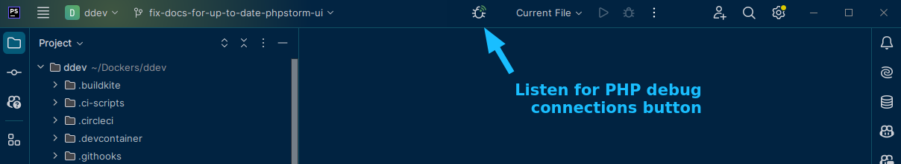

# Step Debugging with Xdebug

Every DDEV project is automatically configured with Xdebug so that popular IDEs can do step debugging of PHP code.

Xdebug is a server-side tool, and it’s installed automatically in the container so you don’t have to install or configure it on your workstation. Xdebug is disabled by default for performance reasons, so you’ll need to enable it and configure your IDE before can start debugging.

All IDEs basically work the same, listening on a port and reacting when they’re contacted there. IDEs other than those listed here work fine, if they listen on Xdebug’s default port 9003.

**Key facts:**

* Enable Xdebug by running [`ddev xdebug`](../usage/commands.md#xdebug) or `ddev xdebug on` from your project directory.
It will remain enabled until you start or restart the project.
* Disable Xdebug for better performance when not debugging with `ddev xdebug off`.
* Toggle Xdebug on and off easily with `ddev xdebug toggle`.
* `ddev xdebug status` will show Xdebug’s current status.
* You may need to open port 9003 in your firewall to allow Xdebug access. (See [Troubleshooting Xdebug](#troubleshooting-xdebug) below.)
* The IDE’s debug server port must be set to Xdebug’s default 9003, which is already the case in popular IDEs. If the unusual case that you have a port conflict, see [Using Xdebug on a Port Other than the Default 9003](#using-xdebug-on-a-port-other-than-the-default-9003) below.
* In the case of using running your IDE inside WSL2 (using WSLg) or with a proxy setup like JetBrains Gateway, you can set that with `ddev config global --xdebug-ide-location=wsl2`. If you're running your IDE with a proxy inside the web container, you can set that with `ddev config global --xdebug-ide-location=container`.

For more background on Xdebug, see [Xdebug documentation](https://xdebug.org/docs/remote). The intention here is that one won’t have to understand Xdebug to do debugging.

## IDE Setup

* [PhpStorm](#phpstorm-debugging-setup)
* [Visual Studio Code (VS Code)](#visual-studio-code-vs-code-debugging-setup)

<a name="phpstorm"></a>

### PhpStorm Debugging Setup

[PhpStorm](https://www.jetbrains.com/phpstorm/download) is a leading PHP development IDE with extensive built-in debugging support. It provides two ways to do debugging: “zero-configuration” debugging which requires very little effort in the PhpStorm IDE, and a “run configuration” you can set up like Netbeans or Eclipse.

!!!tip "If you’re using PhpStorm inside WSL2 or Linux"
    Make PhpStorm listen for Xdebug using IPv4 by visiting Help → Edit Custom VM Options, and adding an additional line: `-Djava.net.preferIPv4Stack=true`. The Linux version of PhpStorm seems to otherwise default to only using IPv6.

!!!tip "If using PhpStorm inside WSL2 or with JetBrains Gateway"
    Make PhpStorm listen to the right IP address with `ddev config global --xdebug-ide-location=wsl2`

#### PhpStorm Zero-Configuration Debugging

PhpStorm [zero-configuration debugging](https://confluence.jetbrains.com/display/PhpStorm/Zero-configuration+Web+Application+Debugging+with+Xdebug+and+PhpStorm) will automatically detect a connection and offer to create a “server” that maps your workstation files to the container. This means you only have to:

1. Toggle the “Start Listening for PHP Debug Connections” button:
    
2. Set a breakpoint.
3. Visit a page that should stop in the breakpoint you set.
4. PhpStorm will ask you what mapping to use, so it can figure out how to map the path inside the container to the path on your workstation. The first time you do this with a project, PhpStorm will pop up a “server” dialog box to set the mapping. The default will work, but it’s best to click the checkbox to map the whole project directory to `/var/www/html`.

When using this zero-configuration option:

1. Use the latest DDEV version.
2. Under *Run* → *Edit Configurations*, check that there are no servers already defined. PhpStorm will create a new server for you if no others exist. You can delete all servers and have PhpStorm create a new one, or you can create/edit an existing server as discussed below.

#### PhpStorm "Run/Debug Configuration" Debugging

PhpStorm [run/debug configurations](https://www.jetbrains.com/help/phpstorm/run-debug-configuration.html) require more setup but may be easier and more flexible for some people.

1. Under the *Run* menu select *Edit configurations*.
2. Click the *+* in the upper left and choose *PHP Web Page* to create a configuration.
Give it a reasonable name.
3. Create a “server” for the project. Make sure *Name* is exactly the same as your host (e.g. `my-site.ddev.site`):
    
4. Add file mappings for the files on the server.
Click on the local repository path and add `/var/www/html` as the *Absolute path on the server* and your repository root as the path on the host.
5. Set an appropriate breakpoint.
6. Start debugging by clicking the “debug” button, which will launch a page in your browser:
    

!!!tip "If you’re using [additional_hostnames](../extend/additional-hostnames.md)"
    If you also want xdebug to trigger when using a URL other than the primary URL (as with  `additional_hostnames` or `additional_fqdns`), create a copy of the PhpStorm `server` (Settings->PHP->Servers) with the current settings and change the host and name to the desired ones. This will tell PHP Storm to listen to that hostname with the appropriate mapping.

#### PhpStorm and Command-Line Debugging

If you need to debug command-line PHP processes, especially code that’s outside the docroot, the environment variable `PHP_IDE_CONFIG` is already set inside the web container, so you don’t have to do much more.

However, if you’ve not yet used PhpStorm with Xdebug for a regular web request, do that to automatically create the PhpStorm “server” with the same name as your primary URL (*Languages and Frameworks* → *PHP* → *Servers*). The key job of the server is to map filesystem locations on the workstation (your computer) to filesystem locations on the remote server—in this case the `ddev-webserver` container. Often, PhpStorm automatically sets up a mapping that doesn’t include the entire project, meaning things like the `vendor` directory may not be mapped. You can fix this by mapping the top-level directory of your project to `/var/www/html` in the container:


If you encounter the error: "Can't find a source position. Server with name 'SITE_NAME.ddev.site' doesn't exist", change the "PHP | Servers" **Name** to **`SITE_NAME.ddev.site`**. In the example screenshot above both Name and Host are "**`d8composer.ddev.site`**".

### Visual Studio Code (VS Code) Debugging Setup

1. Install the [PHP Debug](https://marketplace.visualstudio.com/items?itemName=xdebug.php-debug) extension.
2. In the menu, choose *Run* → *Open Configuration* and add the [“Listen for Xdebug” configuration snippet](../snippets/launch.json) to the project’s `.vscode/launch.json`.
3. In the menu, choose *Terminal* → *Configure tasks* → *Create task.json from template* → *Others* and add the [“DDEV: Enable Xdebug” and “DDEV: Disable Xdebug” task snippet](../snippets/tasks.json) to the project’s `.vscode/tasks.json`.
4. Set a breakpoint in your `index.php`. If it isn’t solid red, restart.
5. In the menu, choose *Run* → *Start Debugging*. You may have to select “Listen for Xdebug” by the green arrowhead at the top left. The bottom pane of VS Code should now be orange (live) and should say “Listen for Xdebug”.
6. In a browser, visit your project and confirm you hit the breakpoint.

!!!tip "If you’re using VS Code on Windows with WSL2"
    VS Code should suggest two extensions if you have WSL2 enabled along with a PHP project: “[PHP Debug](https://marketplace.visualstudio.com/items?itemName=xdebug.php-debug)” and “[WSL](https://marketplace.visualstudio.com/items?itemName=ms-vscode-remote.remote-wsl)”. You’ll need to enable both of these extensions in your distro (e.g. Ubuntu).

## Using Xdebug on a Port Other than the Default 9003

By default, DDEV is set up to contact the default port, port 9003 on your IDE. However, if you have something else listening on that port or your IDE does not yet default to 9003, you’ll need to change the port. (PhpStorm and VS Code have switch to supporting 9003 instead of 9000 for some time now.)

* To override the port, add an override file in the project’s `.ddev/php directory`. For example, a file `.ddev/php/xdebug_client_port.ini` would change to use the legacy port 9000:

    ```ini
    [PHP]
    xdebug.client_port=9000
    ```

* Then change your IDE’s configuration to listen on the new port.

!!!tip
    If you’re using a PHP version below 7.2, you’ll be using Xdebug version 2.x instead of 3.x and your port config should be `xdebug.remote_port` instead.

## Troubleshooting Xdebug

The basic thing to understand about Xdebug is that it’s a network protocol. Your IDE (like PhpStorm) will listen on the Xdebug port (port 9003). If Xdebug is enabled in the DDEV web container (`ddev xdebug on`), PHP inside that container will try to open a TCP connection to the IDE. Docker’s networking places the host-side listening IDE at `host.docker.internal:9003`, so you have to make sure the network connection is clear and can be made and everything should work. Firewalls may get in the way.

Here are basic steps to take to sort out any difficulty:

* Make sure your IDE is listening for Xdebug.
* `ddev logs` may show you something like `Xdebug: [Step Debug] Could not connect to debugging client. Tried: host.docker.internal:9003 (fallback through xdebug.client_host/xdebug.client_port) :-(`. If it does, it may mean that your firewall is blocking the connection, or in a small number of cases that `host.docker.internal` is not figured out successfully by DDEV or Docker. If it does:
    * Temporarily disable your firewall. On Windows/WSL this is typically Windows Defender; on macOS you'll find it in settings; on Debian/Ubuntu it's typically `ufw` so `sudo ufw disable`.
    * If disabling the firewall fixes the problem, re-enable the firewall and add an exception for port 9003. Your firewall will have a way to do this; on Debian/Ubuntu run `sudo ufw allow 9003`.
* Delete existing PhpStorm "servers" in settings, or recreate VS Code’s `launch.json` file exactly as shown in the instructions here.
* Remember the standard Xdebug port is port 9003, and that's what all instructions here use. In the past some IDEs used port 9000.
* If your `~/.ddev/global_config.yaml` has `xdebug_ide_location` set, remove that to begin with except for [very unusual situations](../configuration/config.md#xdebug_ide_location). You can set it to the default value with `ddev config global --xdebug-ide-location=""`.
* Reboot your computer.
* If you're running WSL2 and have PhpStorm running inside WSL2 (the Linux version of PhpStorm) then `ddev config global --xdebug-ide-location=wsl2`. (This is unusual.)
* Temporarily disable any *firewall* or *VPN* if you’re having trouble. Xdebug is a network protocol, and the PHP process inside the web container must be able to establish a TCP connection to the listening IDE (PhpStorm, for example).
* Confirm that DDEV’s [`xdebug_ide_location`](../configuration/config.md#xdebug_ide_location) config setting is set properly, which in most cases should be set to an empty string. Check both your project's `.ddev/config.yaml` and DDEV’s global `~/.ddev/global_config.yaml`.
* Use `ddev xdebug on` to enable Xdebug when you want it, and `ddev xdebug off` when you’re done with it.
* You can also use `ddev xdebug toggle` to easily toggle Xdebug on and off.
* Set a breakpoint at the first executable line of your `index.php`.
* Tell your IDE to start listening. (PhpStorm: click the bug-listen button, VS Code: run the debugger.)
* Use `curl` or a browser to create a web request. For example, `curl https://d10.ddev.site` or run `ddev exec curl localhost`.
* `ddev ssh` into the web container. Can you run `telnet host.docker.internal 9003` and have it connect? If not, follow the instructions above about disabling firewall and adding an exception for port 9003.
* In PhpStorm, disable the “listen for connections” button so it won’t listen. Or exit PhpStorm. With another IDE like VS Code, stop the debugger from listening.
* `ddev ssh` into the web container. Can you run `telnet host.docker.internal 9003` and have it connect? If so, you have something else running on port 9003. On the host, use `sudo lsof -i :9003 -sTCP:LISTEN` to find out what’s there and stop it. Don’t continue debugging until your telnet command does not connect. (On Windows WSL2 you may have to look for listeners both inside WSL2 and on the Windows side.)
* Now click the “listen” button on PhpStorm to start listening for connections.
* `ddev ssh` and try the `telnet host.docker.internal 9003` again. It should connect. If not, maybe PhpStorm is not listening, or not configured to listen on port 9003?
* Check to make sure that Xdebug is enabled. You can use `php -i | grep -i xdebug` inside the container, or use any other technique you want that gives the output of `phpinfo()`, including Drupal’s `admin/reports/status/php`. You should see `with Xdebug v3` and `php -i | grep xdebug.mode` should give you `xdebug.mode => debug,develop => debug,develop"`.
* Set a breakpoint in the first relevant line of your `index.php` and then visit the site in a browser. It should stop at that first line.
* If you're using a flavor of IDE that connects directly into the web container like VS Code Language Server, you may want to use the [global `xdebug_ide_location` setting](../configuration/config.md#xdebug_ide_location) to explain to DDEV the situation. For example, `ddev config global --xdebug-ide-location=container`, which tells the PHP/Xdebug to connect directly to the listener inside the container.
* To find out what DDEV is using for the value of `host.docker.internal` you can run `DDEV_DEBUG=true ddev start` and it will explain how it's getting that value, which help troubleshoot some problems. You'll see something like `host.docker.internal='' because no other case was discovered` which can explain the usage.

### WSL2 Xdebug Troubleshooting

WSL2 is a complicated environment for Xdebug, especially if you're running your IDE on the Windows side, as most people do.

* With PhpStorm, consider using the "Remote Development" feature to connect to WSL. That runs an actual PhpStorm instance on WSL2 to reduce networking complexity.
* When using an IDE inside WSL2—like you would when running PhpStorm or Visual Studio Code inside WSL2, or using PhpStorm's "Remote Development" feature—you may need to use the [`xdebug_ide_location`](../configuration/config.md#xdebug_ide_location) setting to tell Xdebug to expect the IDE under WSL2. You can do this by running `ddev config global --xdebug-ide-location=wsl2`.
* `export DDEV_DEBUG=true && ddev start` will show you how DDEV is calculating the `host.docker.internal` IP address to be used when contacting the IDE, which may give a hint about problems you might discover in the general troubleshooting discussed above, when trying to connect to the listening IDE.
* If you're using docker-ce and have the IDE on the Windows side, `ip -4 route show default` in the WSL2 distro is the best known way to figure out where the IDE is in the Windows networking scheme, so DDEV uses that to determine `host.docker.internal`. That value should be the same as `host.docker.internal`, so running `ddev exec ping -c 1 host.docker.internal` will show you what's actually being used. If your IDE is actually at a different address, you can tell DDEV to override the discovered value for `host.docker.internal` by running `ddev config global --xdebug-ide-location=<some_ip_address>`.
* If you’re using PhpStorm inside WSL2 (or perhaps other Linux configurations), go to *Help* → *Edit Custom VM Options* and add an additional line: `-Djava.net.preferIPv4Stack=true` This makes PhpStorm listen for Xdebug using IPv4; the Linux version of PhpStorm seems to default to using only IPv6.
* If you’re on WSL2 using Docker Desktop, make sure that the `docker` command is the one provided by Docker Desktop. `ls -l $(which docker)` should show a link to `/mnt/wsl/docker-desktop...`. If you’re on WSL2 using Docker installed inside WSL2, make sure that `ls -l $(which docker)` is *not* a link to `/mnt/wsl`.
* You can run `export DDEV_DEBUG=true` and `ddev start` to get information about how `host.docker.internal` is figured out, which can help in some situations especially with WSL2. (`host.docker.internal` inside the web container is where Xdebug thinks it should connect to your IDE. You can see what it is set to by running `ddev exec ping host.docker.internal`.)
* On some WSL2 docker-ce systems you may have to work hard to find out the correct IP address for the Windows side. DDEV tries to figure this out for you, but it may not be able to do so. The IP address shown as `nameserver` in `/etc/resolv.conf` may be the correct one, and this used to be the recommended technique. If it's the address you need you can change the address DDEV will use for `host.docker.internal` using `ddev config global --xdebug-ide-location=<some-ip-address>`.
