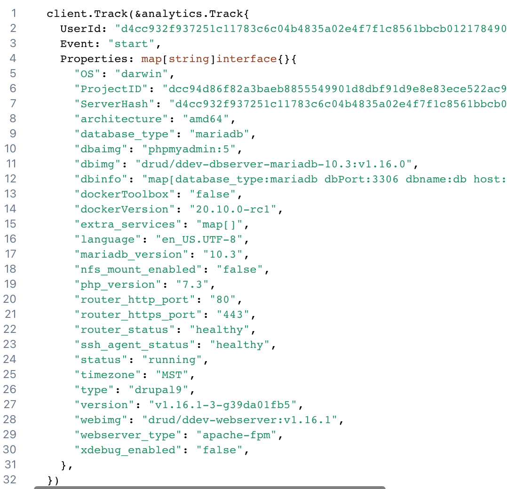

# Opt-In Usage Information

When you start ddev for the first time (or install a new release) you'll be asked to decide whether to opt-in to send usage and error information to the developers. You can change this at any time by editing the `~/.ddev/global_config.yaml` file and setting `instrumentation_opt_in: true` or `instrumentation_opt_in: false`.

If you do choose to send the diagnostics it helps us tremendously in our effort to improve this tool. What information gets sent? Here's an example of what we might see:

Of course if you have any reservations about this, please just opt-out (`ddev config global --instrumentation-opt-in=false`). If you have any problems or concerns with it, we'd like to know.
