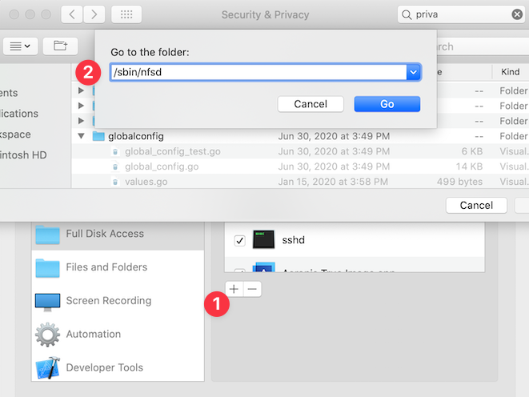
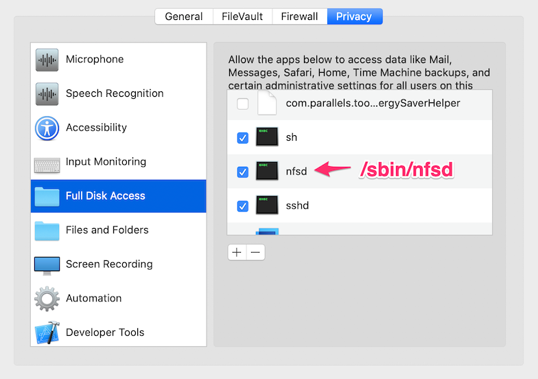

# Performance

DDEV is continually focused on quick project startup and fast responses to its web requests. DDEV’s performance is mostly an issue of how Docker runs on your workstation.

On Linux, including Windows WSL2 and Gitpod, Docker is fast. Most people are happy with Linux performance and don’t need to change anything.

On macOS and Windows with Docker Desktop, allocated resources and mounted filesystem performance can be significant bottlenecks. Taking a bit of time to optimize your setup can yield massive performance gains.

## Filesystem Performance

Mutagen can offer a big performance boost on macOS and Windows. It’s fast and doesn’t need any setup; you only need to enable it. Before Mutagen, Mac and Windows users configured NFS for speed improvements—though it requires setup and isn’t as fast.

Mutagen is enabled by default on Mac and traditional Windows, and it can be disabled per-project or globally.

=== "Mutagen"

    ## Mutagen

    ### What Mutagen Does

    The [Mutagen](https://mutagen.io) asynchronous caching feature is the best way to improve DDEV’s web-serving performance on macOS and Windows, and we recommend it for most projects. It can be significantly faster than NFS, massively faster than plain Docker or Colima, and it makes filesystem watchers (`fsnotify`/`inotify`) work correctly.

    Mutagen decouples in-container reads and writes from reads and writes on the host machine, so each can enjoy near-native speed. A change on the host gets changed “pretty soon” in the container, and a change in the container gets updated “pretty soon” on the host; neither filesystem is stuck waiting on the other one. This “pretty soon” means, however, that there’s a brief window where files on the host may not exactly match the files inside the container—so files that manage to change in both places can lead to conflicts.

    Docker bind-mounts, the traditional approach to getting your code into DDEV’s web container, check every file access against the file on the host. Docker’s way of doing these checks macOS and Windows is not very performant, even with NFS. Linux and Linux-like systems are faster because Docker provides native file-access performance.

    While Mutagen works fine and has automated tests for Linux and Windows WSL2, it may not be worth enabling on those systems since it won’t make the dramatic difference it does on macOS and Windows.

    Another major advantage of Mutagen over NFS is that it supports filesystem notifications, so file-watchers on both the host and inside the container will be notified when changes occur. This is a great advantage for many development tools, which otherwise have to poll for changes at greater expense. Instead, they can be notified via normal `inotify`/`fsnotify` techniques.

    ### Enabling and Disabling Mutagen

    !!!warning "Don’t Install Mutagen"
        You do not need to install anything to use Mutagen. DDEV installs and maintains its own `mutagen` binary.

    On macOS and traditional Windows, Mutagen is enabled globally by default. You can disable it with `ddev mutagen reset && ddev config global --performance-mode=none && ddev config --performance-mode=none`.

    If you’d rather use Mutagen on a specific project, run [`ddev stop`](../usage/commands.md#stop), enable it with `ddev config --performance-mode=mutagen`, and [`ddev start`](../usage/commands.md#start) again.

    You can’t disable Mutagen on individual projects if it’s enabled globally.

    To stop using Mutagen on a project, run `ddev mutagen reset && ddev config --performance-mode=none`.

    The `nfs-mount-enabled` feature is automatically turned off if you’re using Mutagen.


    ### Mutagen and User-Generated Uploads

    When Mutagen is enabled, DDEV attempts to exclude user-generated files in `upload_dirs` (if they exist) from syncing. It does this by using a bind-mount in the generated docker-compose configuration, and excluding the directories from syncing in `.ddev/mutagen/mutagen.yml`.

    If you have a non-standard location for user-generated files, like `private/fileadmin` with the deprecated `typo3-secure-web` approach, you should override the project defaults by setting `upload_dirs` in `.ddev/config.yaml` and pointing it at the correct directory. This will allow Mutagen to sync correctly.

    If you change the `upload_dirs`, run `ddev mutagen reset` to let Mutagen know about the changed behavior.

    ### Mutagen Integration Caveats

    If you run into an issue with Mutagen, please try to recreate and report it via a [support channel](../support.md)!

    Mutagen has generally been great for those using it, but it’s good to be aware of its trade-offs:

    * **It may not be the right choice for every project.**<br>
    Filesystem consistency has been excellent with Mutagen, but performance is its specialty. If consistency is your highest priority, then there are reasons to be cautious. Two-way sync is a very difficult computational problem, and problems *may* surface.
    * **The initial sync takes longer.**<br>
      For most projects, the first-time Mutagen sync of a project takes no more than 30 seconds, and subsequent starts take 10 seconds or less. If your project is taking a long time to sync, especially after the initial sync, see [Advanced Configuration](#advanced-mutagen-configuration-options) below to figure out what's taking time and how to bind-mount it.
    * **Reset if you change `mutagen.yml`.**<br>
    If you take control of the `mutagen.yml` file and make changes to it, run `ddev mutagen reset` after making changes.
    * **Avoid file changes when DDEV is stopped.**<br>
    If you change files—checking out a different branch, removing a file—while DDEV is stopped, Mutagen has no way to know about it. When you start again, it will get the files that are stored and bring them back to the host. If you *do* change files while DDEV is stopped, run `ddev mutagen reset` before restarting the project so Mutagen only starts with awareness of the host’s file contents.
    * **It modestly increases disk usage.**<br>
    Mutagen integration increases the size of your project code’s disk usage, because the code exists both on your computer *and* inside a Docker volume. Your user-uploaded files directories (`upload_dirs`) are normally excluded from Mutagen so they're not a problem for most project types or generic configurations where `upload_dirs` is specified. Take care that you have enough overall disk space, and that on macOS you’ve allocated enough file space in Docker Desktop. If you have other large directories you can [exclude specific directories from getting synced](#advanced-mutagen-configuration-options) and use a regular Docker mount for them instead.
    * **Beware simultaneous changes to the same file in both filesystems.**<br>
    As we pointed out above, any project likely to change the same file on the host *and* inside the container may encounter conflicts.
    * **Massive changes can cause problems.**<br>
    Massive file changes on the host or in the container are the most likely to introduce issues. This integration has been tested extensively with major changes introduced by `ddev composer` and `ddev composer create`, but be aware of this issue. Changing Git branches, `npm install`, `yarn install`, or a script that deletes huge sections of the synced data are related behaviors that should raise caution. Again, use `ddev mutagen reset` before restarting the project if you want to be sure Mutagen starts out looking at the host machine’s files.
    * **Mutagen is asynchronous.**<br>
    A massive change in either filesystem can result in lag as all changed files are handled. You can use `ddev mutagen monitor` to get a better look at what’s happening.
    * **You can manually trigger a sync.**<br>
    [`ddev start`](../usage/commands.md#start) and [`ddev stop`](../usage/commands.md#stop) automatically force a Mutagen sync. You can cause an explicit sync with `ddev mutagen sync` and see syncing status with [`ddev mutagen status`](../usage/commands.md#mutagen-status).
    * **Be mindful of in-container Composer actions.**<br>
    If you run Composer actions inside the container with [`ddev ssh`](../usage/commands.md#ssh), it’s a good idea to run [`ddev mutagen sync`](../usage/commands.md#mutagen-sync) and make sure they’re synced as soon as possible. Most people won’t notice the difference and Mutagen will get it synced soon enough.
    * **Perform big Git operations on the host side.**<br>
    Git actions that change lots of files, like switching branches, are best done on the host side and not inside the container. You may want to do an explicit `ddev mutagen sync` command after doing something like that to be sure all changes are picked up quickly.
    * **Share projects carefully with non-Mutagen users.**<br>
    If you share a project with some users that want Mutagen, perhaps on macOS, and other users that don’t want or need it, perhaps on WSL2, don’t check in `.ddev/config.yaml`’s [`performance_mode: "mutagen"`](../configuration/config.md#performance_mode). Instead, either use [global performance mode configuration](../configuration/config.md#performance_mode) or add a not-checked-in, project-level `.ddev/config.performance.yaml` solely to include `performance_mode: "mutagen"` in it. That way, only users with that file will have Mutagen enabled.
    * **Windows symlinks have some Mutagen restrictions.**<br>
    On macOS and Linux (including WSL2) the default `.ddev/mutagen/mutagen.yml` chooses the `posix-raw` type of symlink handling. (See [mutagen docs](https://mutagen.io/documentation/synchronization/symbolic-links)). This basically means any symlink created will try to sync, regardless of whether it’s valid in the other environment. Mutagen, however, does not support `posix-raw` on traditional Windows, so DDEV uses the `portable` symlink mode. The result is that on Windows, using Mutagen, symlinks must be strictly limited to relative links that are inside the Mutagen section of the project.
    * **It’s a filesystem feature. Make backups!**<br>
    If we’ve learned anything from computer file-storage adventures, it’s that backups are always a good idea!
    * **Large `node_modules` can cause cause slow sync times**<br>
    When you’re compiling static, front-end assets with tools like `npm` and `yarn`, e.g. Drupal themes, syncing the `node_modules` directory can be very slow. We recommend excluding `node_modules` by adding it to the `sync:defaults:ignore:paths` list in `mutagen.yml`; see [Advanced Mutagen Configuration Options](#advanced-mutagen-configuration-options) for details. This problem can also occur with directories that contain large binaries or fonts, for example.

    ### Syncing After `git checkout`

    In general, it’s best practice on most projects to do significant Git operations on the host, but they can be disruptive to the sync. It’s easy to add a Git post-checkout hook to do a `ddev mutagen sync` operation though. Add a `.git/hooks/post-checkout` file to your project and make it executable with `chmod +x .git/hooks/post-checkout`:

    ```bash
    #!/usr/bin/env bash
    ddev mutagen sync || true
    ```

    ### Syncing After `yarn`, `npm`, and `pnpm` Actions

    Actions by those programs can also set off massive filesystem changes.

    You should run [`ddev mutagen sync`](../usage/commands.md#mutagen-sync) in order to get things into sync, or simply wait.

    <a name="mutagen-config"></a>

    ### Advanced Mutagen Configuration Options

    The Mutagen project provides [extensive configuration options](https://mutagen.io/documentation/introduction/configuration).

    Each DDEV project includes a `.ddev/mutagen/mutagen.yml` file by default, with basic defaults you can override if you remove the `#ddev-generated` line at the beginning of the file.

    If you edit the `.ddev/mutagen/mutagen.yml` file:

    * Remove the `#ddev-generated` line
    * Execute a [`ddev mutagen reset`](../usage/commands.md#mutagen-reset) to avoid the situation where the Docker volume and Mutagen session still have files from an older configuration.

    The most likely thing you'll want to do is to exclude a path from mutagen syncing, which you can do in the `paths:` section of the `ignore:` stanza in the `.ddev/mutagen/mutagen.yml`.

    You can exclude a path from Mutagen syncing and bind-mount something from the host or a different volume on that path with a `docker-compose.*.yaml` file. So if you have a heavy project subdirectory (lots of fonts or user-generated content, for example), you could exclude that subdirectory in `.ddev/mutagen/mutagen.yml` and add a `docker-compose.exclude.yaml`.

    For example, if you want the `node_modules` subdirectory of the project to be available inside the container, but don’t need Mutagen to be syncing it, you can use normal Docker bind-mounting for that subdirectory:

    * Take over the `.ddev/mutagen/mutagen.yml` by removing the `#ddev-generated` line.
    * Add `/web/core/node_modules` to the excluded paths:

    ```yaml
    ignore:
      paths:
      - "/web/core/node_modules"
    ```

    * Add a `.ddev/docker-compose.bindmount.yaml`:

    ```yaml
    services:
      web:
        volumes:
        - "../web/core/node_modules:/var/www/html/web/core/node_modules"
    ```

    * `ddev mutagen reset` and `ddev start` to get the new configuration.

    ### Troubleshooting Mutagen Sync Issues

    * Please make sure that DDEV projects work *without* Mutagen before troubleshooting it. Run `ddev config --performance-mode=none && ddev restart`.
    * Rename your project’s `.ddev/mutagen/mutagen.yml` file to `.ddev/mutagen/mutagen.yml.bak` and run `ddev restart`. This ensures you’ll have a fresh version in case the file has been changed and `#ddev-generated` removed.
    * Avoid having Mutagen sync large binaries, which can cause `ddev start` to take a long time. The `.tarballs` directory is automatically excluded, so Mutagen will ignore anything you move there. To see what Mutagen is trying to sync, run `ddev mutagen status -l` in another window.
    * `DDEV_DEBUG=true ddev start` will provide more information about what’s going on with Mutagen.
    * DDEV’s Mutagen daemon keeps its data in a DDEV-only `MUTAGEN_DATA_DIRECTORY` in `~/.ddev_mutagen_data_directory`.
    * DDEV’s private Mutagen binary is installed in `~/.ddev/bin/mutagen` (or `$XDG_CONFIG_BASE/ddev/bin/mutagen`. You can use all the features of Mutagen with `ddev debug mutagen`. For example:

        ```bash
        ddev debug mutagen sync list --template "{{ json (index . 0) }}" | docker run -i --rm ddev/ddev-utilities jq -r
        ddev debug mutagen sync monitor <projectname> -l
        ```
    * You can run the [diagnose_mutagen.sh](https://raw.githubusercontent.com/ddev/ddev/main/scripts/diagnose_mutagen.sh) script to gather information about Mutagen’s setup. Please share output from it when creating an issue or seeking support.
    * Try `ddev poweroff` or `~/.ddev/bin/mutagen daemon stop && ~/.ddev/bin/mutagen daemon start` to restart the Mutagen daemon if you suspect it’s hanging.
    * Use `ddev mutagen reset` if you suspect trouble, and *always* after changing `.ddev/mutagen/mutagen.yml`. This restarts the project’s Mutagen data (Docker volume + Mutagen session) from scratch.
    * `ddev mutagen monitor` can help watch Mutagen behavior. It’s the same as `~/.ddev/bin/mutagen sync monitor <syncname>`.
    * If you’re working on the host and expecting things to show up immediately inside the container, you can learn a lot by running `ddev mutagen monitor` in a separate window as you work. You’ll see when Mutagen responds to your changes and get an idea about how much delay there is.
    * Consider `ddev stop` before massive file change operations, like moving a directory.
    * If you get in real trouble, run `ddev stop`, reset your files with Git, and run `ddev mutagen reset` to throw away the Docker volume which may already have incorrect files on it.

    #### Debugging Long Mutagen Startup Time

    Normally, a first-time `ddev start` on a new or changed project should only take a minute or less. If it's taking longer than that, there are likely some huge files or directories that are being synced that we don't need to sync.

    (All we really want to sync is PHP files, everything else is a waste. So if we're syncing fonts or user-generated files or anything else, we want to figure out what it is and stop it. As noted elsewhere here, `node_modules` can cause this behavior.)

    To see what's causing the slow syncing try this technique:

    ```bash
    ddev mutagen reset # Cleans up all synced files so starting from scratch
    ddev start
    ```

    Then in another terminal window view the syncing behavior with:

    ```bash
    while true; do ddev mutagen st -l | grep "^Current"; sleep 1; done
    ```

    You'll see something like this, which may help understand what mutagen is working so hard at. This example is a 5GB file named `dummyfile` in `vendor/bin`.

    ```
    Current file: vendor/bin/dummyfile (306 MB/5.2 GB)
    Current file: vendor/bin/dummyfile (687 MB/5.2 GB)
    Current file: vendor/bin/dummyfile (1.1 GB/5.2 GB)
    Current file: vendor/bin/dummyfile (1.6 GB/5.2 GB)
    Current file: vendor/bin/dummyfile (2.0 GB/5.2 GB)
    Current file: vendor/bin/dummyfile (2.4 GB/5.2 GB)
    Current file: vendor/bin/dummyfile (2.8 GB/5.2 GB)
    Current file: vendor/bin/dummyfile (3.1 GB/5.2 GB)
    Current file: vendor/bin/dummyfile (3.5 GB/5.2 GB)
    Current file: vendor/bin/dummyfile (4.0 GB/5.2 GB)
    Current file: vendor/bin/dummyfile (4.4 GB/5.2 GB)
    Current file: vendor/bin/dummyfile (4.8 GB/5.2 GB)
    Current file: vendor/mck89/peast/lib/Peast/Syntax/Parser.php (66 kB/131 kB)
    Current file: web/core/tests/Drupal/Tests/Core/Config/Entity/EntityDisplayBaseTest.php (2.0 kB/2.0 kB)
    ```

    #### Advanced Mutagen Troubleshooting

    You can observe what Mutagen is doing by watching `ddev mutagen monitor` in another terminal window to see the results. However, Mutagen has full logging. You can run it with `ddev mutagen logs`.

    ### Mutagen Strategies and Design Considerations

    Mutagen provides enormous speed boosts in everyday usage, but it’s trying desperately under the hood to keep container changes reflected on the host and vice versa.

    DDEV mounts a fast Docker volume onto `/var/www/html` inside the `web` container, then delegates to the Mutagen daemon (on the host). That daemon has the job of keeping all host project contents in sync with the contents of the Docker volume.

    Consistency is a high priority for DDEV’s integration, which tries at key points to make sure everything is completely consistent and in sync.

    The Mutagen daemon’s life cycle and sync sessions are something like this:

    1. On `ddev start`, the Mutagen agent will be started if it’s not already running.
    2. If there’s already a sync session for the project, it’s resumed.
    3. On `ddev stop` the sync session is flushed to ensure consistency, then paused.

    A synchronous flush happens after any `ddev composer` command, since Composer may cause massive changes to the filesystem inside the container that need to be synced before operation continues.

    If you need to reset everything for a project, you can do it with `ddev mutagen reset`, which starts the Mutagen session from scratch and removes the Docker volume so it can be recreated from scratch.

    ### Safe to Use with Other Mutagen Installations

    DDEV requires and provides a specific version of Mutagen, which you can see running [`ddev version`](../usage/commands.md#version).  If another `mutagen` instance or daemon is installed on your workstation it doesn't matter, because DDEV's version runs separately and uses a different data directory.

=== "NFS"

    ## NFS

    !!!warning "NFS is deprecated"

        NFS is deprecated and no longer recommended. It can be complex and unreliable. This feature will be
        removed in DDEV v1.25.0.


    ### Using NFS to Mount the Project into the Web Container

    NFS (Network File System) is a classic, mature Unix technique to mount a filesystem from one device to another. It provides significantly improved web server performance on macOS and Windows. It doesn’t really impact performance on Linux, so we don’t recommend it there.

    DDEV supports this technique and **requires pre-configuration on your host computer,** facilitated by a setup script that asks for your `sudo` password when it’s necessary:

    1. Make sure DDEV is already working and you can use it.
    2. Use the script below for your OS to configure the NFS server and exports files.
    3. Test that NFS is working correctly by using [`ddev debug nfsmount`](../usage/commands.md#debug-nfsmount) in a project directory. The first line should report something like “Successfully accessed NFS mount of /path/to/project”.
    4. Enable NFS mounting globally with `ddev config global --performance-mode=nfs`.
    You can also configure NFS mounting on a per-project basis with `ddev config --performance-mode=nfs` in the project directory, but this is unusual. The project-specific value will override global config.
    5. [`ddev start`](../usage/commands.md#start) your project and make sure it works normally. Use [`ddev describe`](../usage/commands.md#describe) to verify that NFS mounting is being used. The NFS status is near the top of the output of `ddev describe`.

    !!!tip "Skip step 2 if you’re already using NFS!"
        If you’re already using NFS with Vagrant on macOS, for example, and you already have a number of exports, the default home directory export here won’t work—you’ll have overlaps in your `/etc/exports`. Or on Windows, you may want to use an NFS server other than [Winnfsd](https://github.com/winnfsd/winnfsd) like the [Allegro NFS Server](https://nfsforwindows.com).

        The recommendations and scripts below are for getting started if, like most people, you *don’t* already use NFS.

    === "macOS NFS Setup"

        Download, inspect, make executable, and run [macos_ddev_nfs_setup.sh](https://raw.githubusercontent.com/ddev/ddev/main/scripts/macos_ddev_nfs_setup.sh):

        ```
        curl -O https://raw.githubusercontent.com/ddev/ddev/main/scripts/macos_ddev_nfs_setup.sh && chmod +x macos_ddev_nfs_setup.sh && ./macos_ddev_nfs_setup.sh
        ```

        This one-time setup stops running DDEV projects, adds your home directory to the `/etc/exports` config file that `nfsd` uses, and enables `nfsd` to run on your computer.

        **This shares your home directory via NFS to any NFS client on your computer,** so it’s critical to consider security issues. You can make the shares in `/etc/exports` more limited, as long as they don’t overlap. NFS doesn’t allow overlapping exports.

        If your DDEV projects are set up outside your home directory, you’ll need to add a line to `/etc/exports` for that share as well:

        1. Run `sudo vi /etc/exports`.
        2. Copy the line the script you created (`/System/Volumes/Data/Users/username -alldirs -mapall=<your_user_id>:20 localhost`).
        3. Edit to add the additional path, e.g:
        `/Volumes/SomeExternalDrive -alldirs -mapall=<your_uid>:20 localhost`.

        #### macOS Full Disk Access for Special Directories

        * If your projects are in a subdirectory of the `~/Documents` or `~/Desktop` directories, or on an external drive, you must grant “Full Disk Access” privilege to `/sbin/nfsd` in *System Preferences* → *Security & Privacy* → *Privacy*. In the *Full Disk Access* section, click the “+” and add `/sbin/nfsd`:

            

            You should then see `nfsd` in the list:

            

        * Run `sudo nfsd restart`.
        * From a project directory, run [`ddev debug nfsmount`](../usage/commands.md#debug-nfsmount) to confirm successful output.

        #### macOS NFS Debugging

        * Temporarily disable any firewall or VPN.
        * Use `showmount -e` to find out what’s exported via NFS. If you don’t see a parent of your project directory, NFS can’t work.
        * If nothing is showing, use `nfsd checkexports` and look carefully for errors.
        * Use `ps -ef | grep nfsd` to make sure `nfsd` is running.
        * Restart `nfsd` with `sudo nfsd restart`.
        * Add the following to your `/etc/nfs.conf`:
            ```conf
            nfs.server.mount.require_resv_port = 0
            nfs.server.verbose = 3
            ```
        * Run Console.app and search for “nfsd” at the top. Run `sudo nfsd restart` and read the messages carefully. Try running [`ddev debug nfsmount`](../usage/commands.md#debug-nfsmount) in the problematic project directory:
            ```bash
            $ ddev debug nfsmount
            Successfully accessed NFS mount of /Users/rfay/workspace/d8composer
            TARGET    SOURCE                                                FSTYPE OPTIONS
            /nfsmount :/System/Volumes/Data/Users/rfay/workspace/d8composer nfs    rw,relatime,vers=3,rsize=65536,wsize=65536,namlen=255,hard,    nolock,proto=tcp,timeo=600,retrans=2,sec=sys,mountaddr=192.168.65.2,mountvers=3,mountproto=tcp,local_lock=all,addr=192.168.65.2
            /nfsmount/.ddev
            ```

        #### Debugging `ddev start` Failures with NFS Mount Enabled

        There are a number of reasons the NFS mount can fail on [`ddev start`](../usage/commands.md#start):

        * Firewall issues.
        * NFS Server not running.
        * Trying to start more than one NFS server.
        * Overlapping NFS exports, typically an issue if you’ve established another NFS client like Vagrant. You’ll need to reconfigure your exports paths so they don’t overlap.
        * Path of project not shared in `~/.ddev/nfs_exports.txt`.

        To debug and solve permission problems:

        * Try [`ddev debug nfsmount`](../usage/commands.md#debug-nfsmount) in a project directory to see if basic NFS mounting is working. If that works, everything else probably will too.
        * When debugging, run [`ddev restart`](../usage/commands.md#restart) in between each change. Otherwise, you can have stale mounts inside the container and you’ll miss any benefit you may find in the debugging process.
        * Inspect `~/.ddev/nfs_exports.txt`.
        * Restart the server with `sudo nssm restart nfsd`.

## Freeing Up System Resources

Every project you run uses system resources, and may compete for those resources. A reasonable practice is to individually stop projects you’re not using. You could also stop all projects with [`ddev poweroff`](../usage/commands.md#poweroff) and only start the one you’re working on. [`ddev list`](../usage/commands.md#list) will display all your projects along with each one’s status.

## Docker Desktop for Mac Settings

Open Docker Desktop’s *Preferences*, and visit *Resources* → *Advanced*. Here you can adjust the CPUs, memory, and disk allocated to Docker. The defaults work well for a small project or two, but you may want to adjust these upward based on your experience. Most people raise the memory allocation to 6GB or higher. The disk allocation almost always needs to be raised to accommodate increased downloaded images. Your experience will determine what to do with CPUs.
