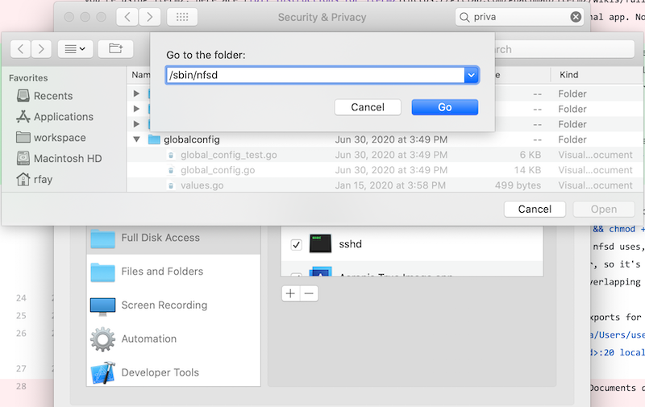
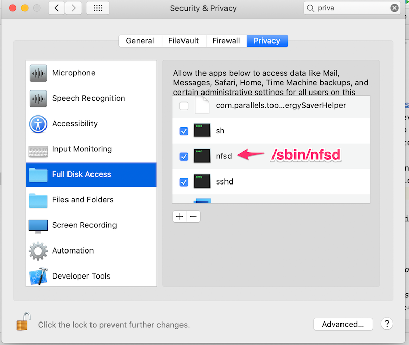
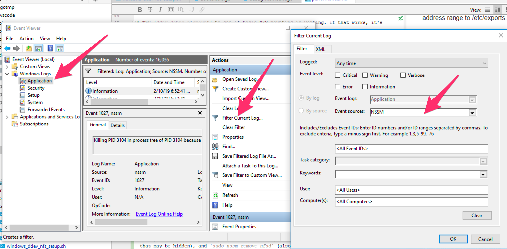

# Performance

Every developer wants both fast startup of the environment and quick response to web page requests. DDEV-Local is always focused on improving this. However, both Docker Desktop on macOS and Windows has significant performance problems with mounted filesystems (like the mounted project where code can be edited either inside the container or on the host).

## Freeing Up System Resources

Every project you run uses system resources, and may compete for those resources. A reasonable practice is to stop projects that aren't currently in use, or stop all projects with `ddev poweroff` and then start the one that you're actually working on. `ddev list` will show you the projects you're working on.

## Docker Desktop for Mac Settings

Docker Desktop for Mac has a number of settings that you'll want to pay attention to. Under "Advanced" in the "Resources" section in "Preferences", you can adjust the amount of memory, disk, and CPUs allocated to Docker. While the defaults work well for a small project or two, you may want to adjust these upward based on your experience. The default memory allocation is 2GB, but many people raise it to 4-5GB or even higher. The disk allocation almost always needs to be raised to accommodate increased downloaded images. Your experience will determine what to do with CPUs.

## Mutagen

The Mutagen asynchronous update feature introduced in offers advanced performance experiences and is recommended for most projects. It's now the preferred way to get great webserving performance on macOS and Windows. Unlike the NFS feature, it requires no pre-configuration or installation. **You do not need to (and should not) install mutagen.** It can also be significantly faster than NFS and massively faster than plain vanilla Docker or Colima. In addition, it makes filesystem watchers (fsnotify/inotify) work correctly.

Mutagen can offer massive webserver performance speedups on macOS and traditional Windows; it works fine (and has automated tests) on Linux or Windows WSL2, but the speedup you see may not be worth turning it on, since Linux/WSL2 are already so fast.

Docker bind-mounts (the traditional approach to getting your code into the DDEV web container) can be slow on macOS and Windows, even with NFS.  The reason is that every file access has to be checked against the file on the host, and Docker's setup to do this on macOS and Windows offers is not very performant. (On Linux and Linux-like systems, Docker provides native file-access performance.)

Mutagen works by decoupling reads and writes inside the container from reads and writes on the host. If something changes on the host, it gets changed "pretty soon" in the container, and if something changes inside the container it gets updated "pretty soon" on the host. This means that the webserver inside the web container does not have to wait for slow file reads or writes, and gets near-native file speeds. However, it also means that at any given moment, the files on the host may not exactly match the files inside the container, and if files are changed both places, conflicts may result.

Another major advantage of Mutagen over NFS is that it supports filesystem notifications, so file-watchers on both the host and inside the container will be notified when changes occur. This is a great advantage for many development tools, which had to poll for changes in the past, but now will be notified via normal inotify/fsnotify techniques.

If you trouble with the Mutagen feature, please try to recreate it and report via one of the [support channels](../index.md#support-and-user-contributed-documentation).

### Enabling Mutagen

!!! warning "Do not separately install mutagen"

    Do not separately install the mutagen binary. It's better if you don't have it installed. DDEV does the installation and upgrades when needed.

To begin using Mutagen, just `ddev stop` and then `ddev config --mutagen-enabled` and start the project again. If the mutagen binary needs to be downloaded, it will be downloaded automatically.

To stop using Mutagen on a project, `ddev mutagen reset && ddev config --mutagen-enabled=false`.

You can also enable mutagen globally (recommended) with `ddev config global --mutagen-enabled`

Note that the nfs-mount-enabled feature is automatically turned off if you're using mutagen.

You can run mutagen on all your projects, there's no limit. To configure it globally, `ddev config global --mutagen-enabled`, but you cannot disable mutagen on individual projects if it's enabled globally (the global configuration wins).

### Caveats about Mutagen Integration

Most people have an excellent experience with Mutagen, but it's good to understand how it works anad what the trade-offs are:

* **Not for every project**: Mutagen is not the right choice for every project. If filesystem consistency is your highest priority (as opposed to performance) then there are reasons to be cautious, although people have had excellent experiences: there haven't been major issues reported, but two-way sync is a very difficult computational problem, and problems may surface.
* **Only one mutagen version on machine please**: DDEV installs its own mutagen. **You do not need to install mutagen.** Multiple mutagen versions can't coexist on one machine, so please stop any running mutagen. On macOS, `killall mutagen`. If you absolutely have to have mutagen installed via homebrew or another technique (for another project) make sure it's the same version as you get with `ddev version`.
* **Works everywhere, best on macOS**: This is mostly for macOS users. WSL2 is already the preferred environment for Windows users, but if you're still using traditional Windows this makes a huge difference. Although DDEV with mutagen is fully supported and tested on traditional Windows and Linux/WSL2, enabling mutagen on Linux/WSL2 may not be your first choice, since it adds some complexity and very little performance.
* **Increased disk usage**: Mutagen integration ends up at least doubling the size of your project code disk usage, because the code exists both on your computer and also inside a docker volume. (As of v1.19+, this does *not* include your file upload directory, so normally it's not too intrusive.) So take care that you have enough overall disk space, and also (on macOS) that you have enough file space set up in Docker Desktop. For projects before v1.19, if you have a large amount of data like user-generated content that does not need syncing (i.e. `fileadmin` for TYPO3 or `sites/default/files` for Drupal), you can exclude specific directories from getting synced and use regular docker mount for them instead. See [below for Advanced Mutagen configuration options](#advanced-mutagen-configuration-options). As of v1.19, this is handled automatically and these files are not mutagen-synced.
* If your project is likely to change the same file on both the host and inside the container, you may be at risk for conflicts.
* **Massive changes** to either the host or the container are the most likely to introduce issues. This integration has been tested extensively with major changes introduced by `ddev composer` and `ddev composer create` but be aware of this issue. Changing git branches, `npm install`, `yarn install`, or a script that deletes huge sections of the synced data are related behaviors that should raise caution. If you `ddev stop` and then change a git branch and then `ddev start` you are almost certain to get misbehavior, because mutagen didn't know you made those changes while it wasn't running, so tries to merge the results. If you have to do this, do a `ddev mutagen reset` before restarting the project, so that only the host side will have contents.
* **Mutagen is asynchronous**: If you make a massive change on either the host or inside the container, you may not see the results for a little while. In studying situations like this, use `ddev mutagen monitor` to watch what's going on on your computer.
* **`ddev mutagen sync`**: You can cause an explicit sync with `ddev mutagen sync` and see syncing status with `ddev mutagen status`. Note that both `ddev start` and `ddev stop` automatically force a mutagen sync.
* **Composer**: If you do composer actions inside the container (with `ddev ssh`) you'll probably want to do a `ddev mutagen sync` to make sure they get synced as soon as possible, although most people won't ever notice the difference and mutagen will get it synced soon enough.
* **Big git operations** (like switching branches) are best done on the host side, rather than inside the container, and you may want to do an explicit `ddev mutagen sync` command after doing something like that. Do them with the project running, rather than when it is stopped.
* **Project with users who don't want mutagen**: If you share a project with some users (perhaps on macOS) that want mutagen and other users (perhaps on WSL2) that don't want or need it, then don't check in the `mutagen_enabled: true` in the .ddev/config.yaml. Instead, you can either use global mutagen configuration or add a not-checked-in project-level `.ddev/config.mutagen.yaml` that just has `mutagen_enabled: true` in it. Then only users that have that will have mutagen enabled.
* **Mutagen restrictions on Windows symlinks**: On macOS and Linux (including WSL2) the default .ddev/mutagen/mutagen.yml chooses the `posix-raw` type of symlink handling (See [mutagen docs](https://mutagen.io/documentation/synchronization/symbolic-links)). This basically means that any symlink created will try to sync, regardless of whether it's valid in the other environment. However, Mutagen does not support posix-raw on traditional Windows, so ddev uses the `portable` symlink mode. So on Windows with Mutagen... symlinks have to be strictly limited to relative links that are inside the mutagen section of the project.
* **Backups!!!**: Keep backups.

### Syncing after `git checkout`

In general, it's best practice on most projects to do significant git operations on the host, but they can be disruptive to the sync. It's easy to add a git post-checkout hook to do a `ddev mutagen sync` operation though. Add the file `.git/hooks/post-checkout` to your project and set it to be executable (`chmod +x .git/hooks/post-checkout`):

```bash
#!/bin/bash
ddev mutagen sync || true
```

### Syncing after yarn, npm, pnpm actions

Actions by those programs can also set off massive filesystem changes.

You should run `ddev mutagen sync` in order to get things into sync, or simply wait.

<a name="mutagen-config"></a>
### Advanced Mutagen configuration options

The Mutagen project provides extensive configuration options that are [documented on the mutagen.io site](https://mutagen.io/documentation/introduction/configuration).

Each project by default already has a .ddev/mutagen/mutagen.yml file with basic defaults which you can override if you remove the `#ddev-generated` line at the beginning of the file.

Remember if you edit the .ddev/mutagen/mutagen.yml file:

* Remove the #ddev-generated line
* Execute a `ddev mutagen reset` to avoid the situation where the docker volume still has files from an older configuration.

The most likely thing you'll want to do is to exclude a path from mutagen syncing, which you can do in the `paths:` section of the `ignore:` stanza in the `.ddev/mutagen/mutagen.yml`.

It is possible to exclude mutagen syncing from a path and then bind-mount something from the host or a different volume on that path with a `docker-compose.*.yaml` file. So if you have an extremely heavyweight subdirectory in your project (lots of fonts or user-generated content for example), you could exclude that subdirectory in the .ddev/mutagen/mutagen.yml and then add a docker-compose.exclude.yaml.

For example, if you want the `stored-binaries` subdirectory of the project to be available inside the container, but do not need mutagen to be syncing it, you can use normal docker bind-mounting for that subdirectory with this procedure:

1. Take over the .ddev/mutagen/mutagen.yml by removing the `#ddev-generated` line

2. Add `/stored-binaries` to the excluded paths:

    ```yaml
        ignore:
          paths:
            - "/stored-binaries"
    ```

3. Add a `.ddev/docker-compose.bindmount.yaml` something like this:

    ```yaml
    version: "3.6"
    services:
      web:
        volumes:
          - "./stored-binaries:/var/www/html/stored-binaries" 
    ```

### Troubleshooting Mutagen Sync Issues

* Please make sure that DDEV projects work *without* mutagen before troubleshooting mutagen. `ddev config --mutagen-enabled=false && ddev restart`.
* DDEV's mutagen may not be compatible with an existing mutagen on your system. Please make sure that any mutagen installs you have are not running, or stop them. You may want to `brew uninstall mutagen-io/mutagen/mutagen mutagen-io/mutagen/mutagen-beta` to get rid of brew-installed versions.
* DDEV's mutagen is installed in `~/.ddev/bin/mutagen`. You can use all the features of mutagen by running that, including `~/.ddev/bin/mutagen sync list` and `~/.ddev/bin/mutagen daemon stop`.
  You can run the script [diagnose_mutagen.sh](https://raw.githubusercontent.com/drud/ddev/master/scripts/diagnose_mutagen.sh) to gather some information about the setup of mutagen. Please report its output when creating an issue or otherwise seeking support.
* Try `~/.ddev/bin/mutagen daemon stop && ~/.ddev/bin/mutagen daemon start` to restart the mutagen daemon if you suspect it's hanging.
* Use `ddev mutagen reset` if you suspect trouble (and always after changing the `.ddev/mutagen/mutagen.yml`. This restarts everything from scratch, including the docker volume that's used to store your project inside the container.)
* `ddev mutagen monitor` can help watch mutagen behavior. It's the same as `~/.ddev/bin/mutagen sync monitor <syncname>`
* `ddev debug mutagen` will let you run any mutagen command using the binary in `~/.ddev/bin/mutagen`.
* If you're working on the host and expecting things to show up immediately inside the container, you can learn a lot by running `ddev mutagen monitor` in a separate window as you work. You'll see when mutagen responds to your changes and get an idea about how much delay there is.
* Consider `ddev stop` before massive file change operations (like moving a directory, etc.)
* If you get in real trouble, `ddev stop`, reset your files with git, and then `ddev mutagen reset` to throw away the docker volume (which may already have incorrect files on it.)
* If you're having trouble, we really want to hear from you to learn and try to sort it out. See the [Support channels](https://ddev.readthedocs.io/en/latest/#support-and-user-contributed-documentation).

#### Advanced Mutagen Troubleshooting

Most people get all the information they need about mutagen by running `ddev mutagen monitor` to see the results. However, Mutagen has full logging. Here's how to run it:

* `killall mutagen`
* `export MUTAGEN_LOG_LEVEL=debug` or `export MUTAGEN_LOG_LEVEL=trace`
* `~/.ddev/bin/mutagen daemon run`
* Work with your project various actions and watch the output.

When you're done, you can `ddev poweroff` and `<ctrl-c>` the running mutagen daemon to get back to normal.

### Mutagen Strategies and Design Considerations

Mutagen provides enormous speed boosts in everyday usage, but of course it's trying desperately under the hood to keep everything that changes in the container updated in the host, and vice versa.

DDEV mounts a fast Docker volume onto `/var/www/html` inside the web container and then delegates to the mutagen daemon (on the host) the job of keeping all the contents of the project on the host in sync with the contents of the docker volume.

The strategy in the DDEV integration is to try to make sure that at key points everything is completely in sync (consistent). Consistency is a really high priority for this integration.

The life cycle of the mutagen daemon and sync sessions are something like this:

1. On `ddev start` the mutagen agent will be started if it's not already running.
2. If there is already a sync session for this project it's stopped and recreated.
3. On `ddev stop` and `ddev pause` the sync session is flushed (made completely consistent) and then terminated.

In addition, a synchronous flush is performed after any `ddev composer` command, because composer may cause massive changes to the filesystem inside the container, and those need to be synced before operation continues.

If you need to reset everything for a project, you can do it with `ddev mutagen reset` which starts the mutagen session from scratch and removes the docker volume so it can be recreated from scratch.

### Interaction with other usages of Mutagen

DDEV requires and provides a specific version of Mutagen, which you can see with `ddev version`.

Mutagen does not guarantee interoperability between different mutagen versions, so you may have trouble if you have another version of mutagen installed. You can find out what version of mutagen you may have installed outside of DDEV with `mutagen version`.

You'll want your system version of mutagen to be the same as the one provided with DDEV if you're using mutagen for anything else, see the [Mutagen installation instructions](https://mutagen.io/documentation/introduction/installation) and install the required version.


## Using NFS to Mount the Project into the Web Container

NFS (Network File System) is a classic, mature Unix technique to mount a filesystem from one device to another. It provides significantly improved webserver performance on macOS and Windows. DDEV-Local supports this technique, but it **does require a small amount of pre-configuration on your host computer.** DDEV-Local doesn't make changes to your computer's configuration without your involvement and approval, so this is  done with a setup script that you run and that asks you for your `sudo` password.

The steps to set up NFS mounting on any operating system are:

1. Make sure DDEV-Local is already working and you can use it.
2. Configure the NFS server and exports files using the provided scripts for each operating system.
3. Test that NFS is working correctly by using `ddev debug nfsmount` in a project directory. The first line should report something like "Successfully accessed NFS mount of /path/to/project"
4. Enable NFS mounting globally with `ddev config global --nfs-mount-enabled`  (You can also configure NFS mounting on a per-project basis with `ddev config --nfs-mount-enabled` in the project directory, but this is unusual. If nfs mounting is turned on globally it overrides any local project settings for NFS.)
5. `ddev start` your project and make sure it works OK. Use `ddev describe` to verify that NFS mounting is being used. The NFS status is near the top of the output of `ddev describe`.

Note that you can use the NFS setup described for each operating system below (and the scripts provided) or you can set up NFS any way that works for you. For example, if you're already using NFS with vagrant on macOS, and you already have a number of exports, the default export here (your home directory) won't work, because you'll have overlaps in your /etc/exports. Or on Windows, you may want to use an NFS server other than Winnfsd, for example the [Allegro NFS Server](https://nfsforwindows.com). The setups provided below and the scripts provided below are only intended to get you started if you don't already use NFS.

Note that NFS does not really add to performance on Linux, so it is not recommended.

=== "macOS NFS Setup"

    Download, inspect, make executable, and run the [macos_ddev_nfs_setup.sh](https://raw.githubusercontent.com/drud/ddev/master/scripts/macos_ddev_nfs_setup.sh) script. Use `curl -O https://raw.githubusercontent.com/drud/ddev/master/scripts/macos_ddev_nfs_setup.sh && chmod +x macos_ddev_nfs_setup.sh && ./macos_ddev_nfs_setup.sh`. This stops running ddev projects, adds your home directory to the /etc/exports config file that nfsd uses, and enables nfsd to run on your computer. This is a one-time setup. Note that this shares your home directory via NFS to any NFS client on your computer, so it's critical to consider security issues; It's easy to make the shares in /etc/exports more limited as well, as long as they don't overlap (NFS doesn't allow overlapping exports).
    
    If your DDEV-Local projects are set up outside your home directory, you'll need to edit /etc/exports to add a line for that share as well.
    `sudo vi /etc/exports` and copy the line the script has just created (`/System/Volumes/Data/Users/username -alldirs -mapall=<your_user_id>:20 localhost`), editing it with the additional path, e.g: `/Volumes/SomeExternalDrive -alldirs -mapall=<your_uid>:20 localhost`.
    
    !!!warning "macOS and the Documents directory"
    
        If your projects are in a subdirectory of the ~/Documents directory or on an external drive, it may necessary to grant the "Full Disk Access" permission to the `/sbin/nfsd` binary. Full details are [below](#macos-full-disk-access-for-special-directories).

=== "Windows NFS Setup"

    The executable components required for Windows NFS (winnfsd and nssm) are packaged with the DDEV Windows Installer in each release, so if you've used the windows installer, they're available already.  To enable winnfsd as a service, please download, inspect and run the script "windows_ddev_nfs_setup.sh" installed by the installer in `C:\Program Files\ddev\windows_ddev_nfs_setup.sh` (or download from [windows_ddev_nfs_setup.sh](https://raw.githubusercontent.com/drud/ddev/master/scripts/windows_ddev_nfs_setup.sh)) in a git-bash session on windows. If your DDEV-Local projects are set up outside your home directory, you'll need to edit the ~/.ddev/nfs_exports.txt created by the script and then restart the service with `sudo nssm restart nfsd`.
    
    !!!warning Firewall Issues
        On Windows 10/11 you will likely run afoul of the Windows Defender Firewall, and it will be necessary to allow `winnfsd` to bypass it. If you're getting a timeout with no information after `ddev start`, try going to "Windows Defender Firewall" -> "Allow an app or feature through Windows Defender Firewall", "Change Settings", "Allow another app". Then choose C:\Program Files\ddev\winnfsd.exe, assuming that's where  winnfsd is installed.
    
    Also see the debugging section below, and the special Windows debugging section.

### Debugging `ddev start` failures with `nfs_mount_enabled: true`

There are a number of reasons that the NFS mount can fail on `ddev start`:

* Firewall issues
* NFS Server not running
* Trying to start more than one NFS server.
* NFS exports overlap. This is typically an issue if you've had another NFS client setup (like vagrant). You'll need to reconfigure your exports paths so they don't overlap.
* Path of project not shared in `/etc/exports` (or `~/.ddev/nfs_exports.txt` on Windows)
* Project is in the ~/Documents directory or an external drive on macOS Catalina or higher (see macOS information below)

Tools to debug and solve permission problems:

* Try `ddev debug nfsmount` in a project directory to see if basic NFS mounting is working. If that works, it's likely that everything else will.
* When debugging, please do `ddev restart` in between each change. Otherwise, you can have stale mounts inside the container and you'll miss any benefit you may find in the debugging process.
* Inspect the /etc/exports (or `~/.ddev/nfs_exports.txt` on Windows).
* Restart the server (`sudo nfsd restart` on macOS, `sudo nssm restart nfsd` on Windows).
* `showmount -e` on macOS will show the shared mounts.

#### macOS Full Disk Access for Special Directories

* If you are on macOS, and your projects are in a subdirectory of the ~/Documents or ~/Desktop directories or on an external drive, you must grant "Full Disk Access" privilege to /sbin/nfsd in the Privacy settings in the System Preferences. On the "Full disk access" section, click the "+" and add `/sbin/nfsd` as shown here: 
You should then see nfsd in the list as shown:
.
* `sudo nfsd restart`
* Use `ddev debug nfsmount` in a project directory to make sure it gives successful output like

    ```
    $ ddev debug nfsmount
    Successfully accessed NFS mount of /Users/rfay/workspace/d8composer
    TARGET    SOURCE                                                FSTYPE OPTIONS
    /nfsmount :/System/Volumes/Data/Users/rfay/workspace/d8composer nfs    rw,relatime,vers=3,rsize=65536,wsize=65536,namlen=255,hard,nolock,proto=tcp,timeo=600,retrans=2,sec=sys,mountaddr=192.168.65.2,mountvers=3,mountproto=tcp,local_lock=all,addr=192.168.65.2
    /nfsmount/.ddev
    ```

#### macOS-specific NFS debugging

* Please temporarily disable any firewall or VPN.
* Use `showmount -e` to find out what is exported via NFS. If you don't see a parent of your project directory in there, then NFS can't work.
* If nothing is showing, use `nfsd checkexports` and read carefully for errors
* Use `ps -ef | grep nfsd` to make sure nfsd is running
* Restart nfsd with `sudo nfsd restart`
* Add the following to your /etc/nfs.conf:

```conf
nfs.server.mount.require_resv_port = 0
nfs.server.verbose = 3
```

* Run Console.app and put "nfsd" in the search box at the top. `sudo nfsd restart` and read the messages carefully. Attempt to `ddev debug nfsmount` the problematic project directory.

#### Windows-specific NFS debugging

* Please temporarily disable any firewall or VPN.

* You can only have one NFS daemon running, so if another application has installed one, you'll want to use that NFS daemon and reconfigure it to allow NFS mounts of your projects.

1. Stop the running winnfsd service: `sudo nssm stop nfsd`
2. Run winnfsd manually in the foreground: `winnfsd "C:\\"`. If it returns to the shell prompt immediately there's likely another nfsd service running.
3. In another window, in a ddev project directory, `ddev debug nfsmount` to see if it can mount successfully. (The project need not be started.). `ddev debug nfsmount` is successful, then everything is probably going to work.
4. After verifying that ~/.ddev/nfs_exports.txt has a line that includes your project directories, `sudo nssm start nfsd` and `nssm status nfsd`. The status command should show SERVICE_RUNNING.
5. These [nssm](https://nssm.cc/) commands may be useful: `nssm help`, `sudo nssm start nfsd`, `sudo nssm stop nfsd`, `nssm status nfsd`, `sudo nssm edit nfsd` (pops up a window that may be hidden), and `sudo nssm remove nfsd` (also pops up a window, doesn't work predictably if you haven't already stopped the service).
6. nssm logs failures and what it's doing to the system event log. Run "Event Viewer" and filter events as in the image below: .
7. Please make sure you have excluded winnfsd from the Windows Defender Firewall, as described in the installation instructions above.
8. On Windows 10/11 Pro you can "Turn Windows features on or off" and enable "Services for NFS"-> "Client for NFS". The `showmount -e` command will then show available exports on the current machine. This can help find out if a conflicting server is running or exactly what the problem with exports may be.
