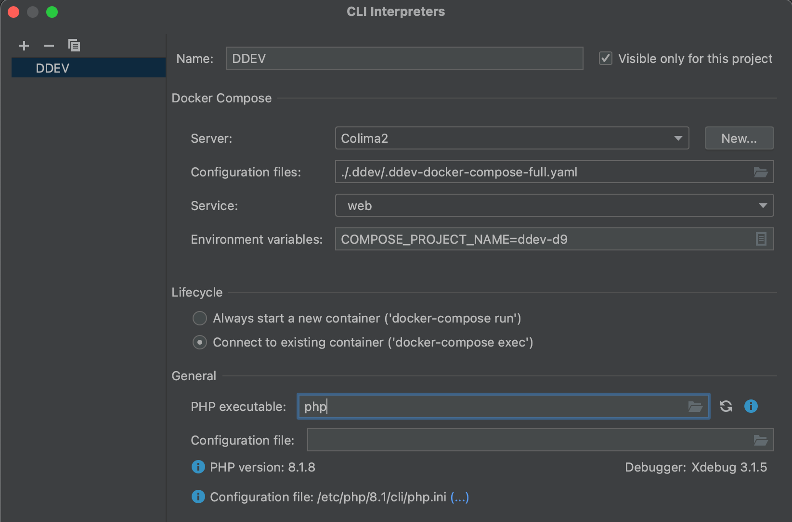
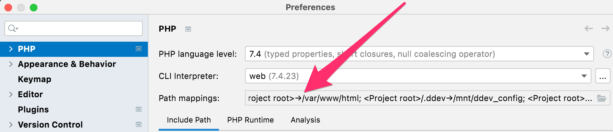
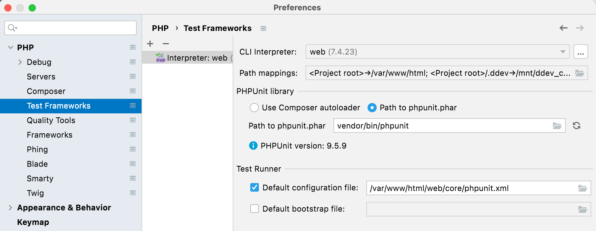
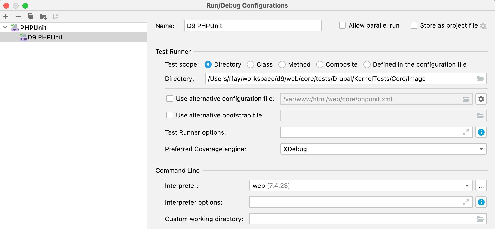
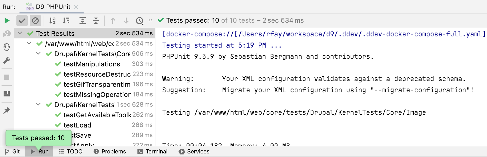

# PhpStorm Setup

If you work with the [PhpStorm](https://www.jetbrains.com/phpstorm/) IDE, you can configure it for tight integration with DDEV and Docker to more easily run actions, access services, enable autocompletion, and enjoy a more convenient development experience.

## Requirements

- PhpStorm 2022.2 or higher.
- DDEV v1.21.1 or higher.
- Make sure to get at least one project going with `ddev start` before trying to set up the plugin, because the plugin assumes it has a project to work with.

## Prerequisite

Regardless of your setup, you need to have PhpStorm use DDEV’s private docker-compose executable.

In PhpStorm, navigate to *Preferences* → *Build, Execution, Deployment* → *Docker* → *Tools*, and set the docker-compose executable to the full path of your `.ddev/bin/docker-compose` file relative to your home directory.

If you’re using WSL2 and running PhpStorm on the Windows side, PhpStorm can’t use docker-compose from WSL2, so configure Docker Desktop in *Settings* → *General* to “Use Docker Compose V2” and use a recent version of Docker Desktop.

## DDEV Integration Plugin

It’s easiest to use the DDEV Integration Plugin, which you can install from [its landing page](https://plugins.jetbrains.com/plugin/18813-ddev-integration) or by searching the in-app marketplace (*Preferences* → *Plugins* → *Marketplace*) for “DDEV”. The integration plugin handles nearly everything on this page automatically, and works on all platforms.

Install and enable the plugin, then [set up `phpunit`](#enabling-phpunit) since it doesn’t yet handle that for you.

## Manual Setup

If you’re not using the DDEV Integration Plugin, you can follow these steps instead:

1. Start your project by running [`ddev start`](../usage/commands.md#start).
2. Open the DDEV project. In this example, the project name is “d9” and the site is “d9.ddev.site”.
    - If you’re on Windows, running PhpStorm on the Windows side but using WSL2 for your DDEV project, open the project as a WSL2 project. In other words, in the *Open* dialog, browse to `\\wsl$\Ubuntu\home\rfay\workspace\d9` (in this example). (If you’re running PhpStorm inside WSL2, there are no special instructions.)
3. Under *Build, Execution, Deployment* → *Docker*, set the correct Docker provider, for example “Colima” or “Docker for Mac”.
4. Set up your project to do normal Xdebug, as described in the [Step Debugging section](../debugging-profiling/step-debugging.md). This will result in a PhpStorm “Server” with the proper name, normally the same as the FQDN of the project. In this example, “d9.ddev.site”. (All you have to do here is click the little telephone to “Start listening for PHP Debug Connections”, run `ddev xdebug on`, and visit a web page and choose the correct mapping from host to server.)
5. Under *File* → *Settings* → *PHP* (Windows) or *Preferences* → *PHP* (macOS), click “...” to the right of “CLI Interpreter”.
    1. Use the “+” to select “From Docker, Vagrant, VM...”.
    2. Choose “Docker Compose”.
    3. Create a “server”; Choose the appropriate Docker provider configured above under *Build, Execution, Deployment* → *Docker*.
    4. In the “Path mappings” of the “Server” you may have to map the local paths (which on WSL2 means `/home/...`) to the in-container paths, especially if you have Mutagen enabled. So “Virtual Machine Path” would be `/var/www/html` and “Local path” would be something like `/Users/rfay/workspace/d9` (on macOS) or `\\wsl$\Ubuntu\home\rfay\workspace\d9` on Windows using WSL2.
    5. Now back in the “Configure Remote PHP Interpreter” for “Configuration files” use `.ddev/.ddev-docker-compose-full.yaml`. On macOS, you may need to use <kbd>⌘</kbd> + <kbd>SHIFT</kbd> + <kbd>.</kbd>, to show hidden dotfiles.
    6. Service: `web`.
    7. In the CLI interpreter “Lifecycle” select “Connect to existing container”.
    8. Here’s an example filled out:
        
6. In the main PHP setup dialog, add an entry to the path mappings, as it doesn’t correctly derive the full path mapping. Add an entry that maps your project location to `/var/www/html`. So in this example, the “Local Path” is `/Users/rfay/workspace/d9` and the “Remote Path” is `/var/www/html`:
    
7. Configure composer under *PHP* → *Composer*.
    - Use “remote interpreter”
    - CLI Interpreter will be “web”

## Enabling PHPUnit

This assumes you’ll need to use PHPUnit and you already have it installed.

1. Under “Test Frameworks” click “+” to add PHPUnit.
    - PHPUnit by remote interpreter
    - Interpreter “DDEV”
    - Choose “Path to phpunit.phar” and use `/var/www/html/vendor/bin/phpunit`, or wherever your PHPUnit is inside the container. You need PHPUnit properly Composer-installed for your project. For example, for Drupal 10, `ddev composer require --dev --with-all-dependencies drupal/core-dev:^10` and `ddev composer require --dev phpspec/prophecy-phpunit:^2`.
    - Default configuration file: `/var/www/html/web/core/phpunit.xml` or wherever yours is inside the container.
    
2. Open Run/Debug configurations and use “+” to add a PHPUnit configuration. Give it a name.
    - Test scope (as you wish, by directory or class or whatever).
    - Interpreter: “web” (the one we set up).
    
3. Enable Xdebug if you want to debug tests with `ddev xdebug on`.
4. Run the runner you created:
    

## PhpStorm Basic Setup on Windows WSL2

It’s possible to use PhpStorm with DDEV on WSL2 in at least three different ways:

1. Run PhpStorm in Windows as usual, opening the project on the WSL2 filesystem at `\\wsl$\<distro>` (e.g. `\\wsl$\Ubuntu`). PhpStorm is slow to index files but can be slow to respond to file changes in this mode, although it's adequate for many people.
2. "Remote Development" in PhpStorm 2022.3+, which has explicit support for WSL2 and actually runs a PhpStorm instance on WSL2.
3. Enabling X11 on Windows and running PhpStorm inside WSL2 as a Linux app. PhpStorm works fine this way; it does require WSL2 graphics support, which is now available on all Windows 10 and Windows 11 systems.

We’ll walk through each of these approaches.

### Basics

- Start with a working DDEV/WSL2 setup as described in the [docs](../install/ddev-installation.md). Until that’s all working it doesn’t help to go farther.

- If you haven’t used Xdebug with DDEV and PhpStorm before, you’ll want to read the [step debugging instructions](../debugging-profiling/step-debugging.md).

- Your project absolutely must be in `/home` inside WSL2, which is on the Linux filesystem. Although you could keep your project on the Windows filesystem and access it in WSL2 via `/mnt/c`, the performance is even worse than native Windows. It does work though, but don’t do it. You’ll be miserable.

### PhpStorm Running On Windows Side and Using Docker Desktop

With the [DDEV Integration Plugin](https://plugins.jetbrains.com/plugin/18813-ddev-integration) almost everything is already done for you, so use it. Create your project inside WSL2 (on the `/home` partition) and get it started first.

1. Your working project will be on the `/home` partition, so you’ll open it using Windows PhpStorm as `\\wsl$\Ubuntu\home\<username>\...\<projectdir>`.
2. On some systems and some projects it may take a very long time for PhpStorm to index the files.
3. File changes are noticed only by polling, and PhpStorm will complain about this in the lower right, “External file changes sync may be slow”.
4. Temporarily disable your Windows firewall. When you have everything working, you can turn it back on again.
5. Use `ddev start` and `ddev xdebug on`.
6. Click the Xdebug listen button on PhpStorm (the little phone icon) to make it start listening.
7. Set a breakpoint on or near the first line of your `index.php`.
8. Visit the project with a web browser or cURL. You should get a popup asking for mapping of the host-side files to the in-container files. Make sure `/home/<you>/.../<yourproject>` is mapped to `/var/www/html`.

Debugging should be working. You can step through your code, set breakpoints, view variables, etc.

Set the PhpStorm terminal path (*Settings* → *Tools* → *Terminal* → *Shell Path*) to `C:\Windows\System32\wsl.exe`. That way when you use the terminal Window in WSL2 it’s using the Bash shell in WSL2.

### PhpStorm with "Remote Development" Option

1. Open your WSL2 project using *File* → *Remote Development* → *WSL* and choose the distro, then the project.
2. For Xdebug you'll want to use `ddev config global --xdebug-ide-location=wsl2` because essentially the IDE is running inside WSL2 (and listening there).
3. Use `ddev xdebug on` as normal; test with a simple breakpoint in your `index.php`.

### PhpStorm Inside WSL2 in Linux

1. On Windows 10 or 11 get "Windows Subsystem for Linux" from the Microsoft Store, which now includes graphical support.
2. Edit `/etc/wsl.conf` to systemd support, which allows for installing PhpStorm with snap, see [details about WSL2 and systemd](https://devblogs.microsoft.com/commandline/systemd-support-is-now-available-in-wsl/):

    ```
    [boot]
    systemd=true
    ```

3. `wsl --shutdown` on the Windows side and wait 10 seconds, then restart your distro.
4. In WSL2, `sudo snap install --classic phpstorm`.
5. DDEV should already be installed as described in [DDEV installation](../install/ddev-installation.md#windows-wsl2).
6. `ddev config global --xdebug-ide-location=wsl2` to tell DDEV that the IDE is listening in WSL2 as opposed to listening on the Windows side.
7. Start PhpStorm, `phpstorm &`.
8. Use `ddev start` and `ddev xdebug on`.
9. Click the Xdebug listen button in PhpStorm (the little phone icon) to make it start listening.
10. Set a breakpoint on or near the first line of your `index.php`.
11. Visit the project with a web browser or cURL. You should get a popup asking for mapping of the host-side files to the in-container files. Make sure `/home/<you>/.../<yourproject>` is mapped to `/var/www/html`.

Debugging should be working! You can step through your code, set breakpoints, view variables, etc.
