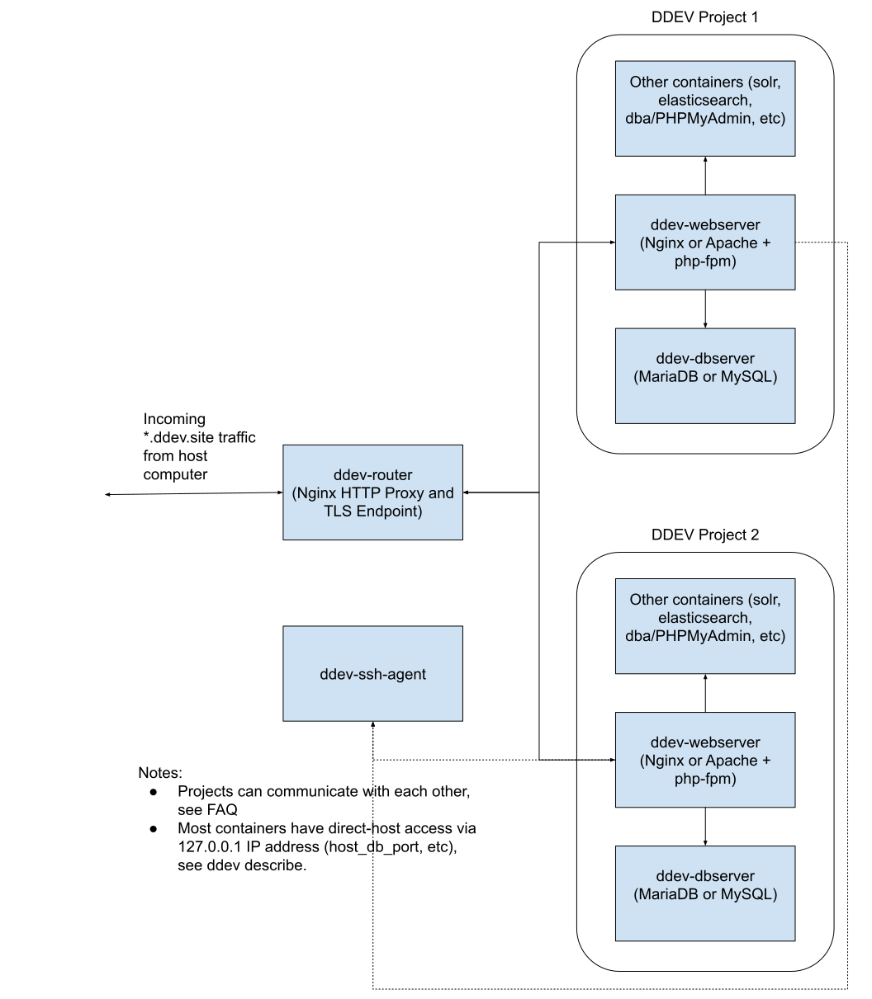

## How DDEV Works

The easiest way to think about how DDEV works is to think of it as a set of little networked computers (docker containers). You can think of them as being in a different network world than your workstation computer, but reachable from there.

* The `ddev-webserver` container (one per project) runs `nginx` or `apache` and `php-fpm` for a single site, so it does all the basic work of a PHP-interpreting webserver.
* The `ddev-dbserver` container (one per project) handles MariaDB/MySQL/Postgresql database management. It can be reached from the webserver by the hostname `db` or with the more explicit name `ddev-<projectname>-db`.
* The optional `dba` container runs PhpMyAdmin for projects with MySQL or MariaDB.
* Additional add-on services may be there for a given project, for example `solr` or `elasticsearch` or `memcached`.

Although it's not common usage, different projects can communicate with each other as described in the [FAQ](../faq.md#projects-communicate-with-each-other)

Now for the two oddball containers, which are global (there is only one of each).

* The `ddev-router` container is a "reverse proxy". It takes incoming HTTP/S requests and looks up the hostname in the incoming URL and routes it to the correct project's `ddev-webserver`. Depending on the project's configuration with `additional_hostnames` and `additional_fqdns` it can route many different URLs to a single project's `ddev-webserver`. If like most people you use the named URLs (like `https://something.ddev.site`) then your request goes through the router. When you use the `127.0.0.1` URLs, the requests go directly to the `ddev-webserver`.
* The `ddev-ssh-agent` container runs an `ssh-agent` inside the docker network so that after you do a `ddev auth ssh` all the different projects can use your ssh keys for outgoing requests (like private composer access or scp from a remote host).

Here's a basic diagram of how it works inside the docker network:

