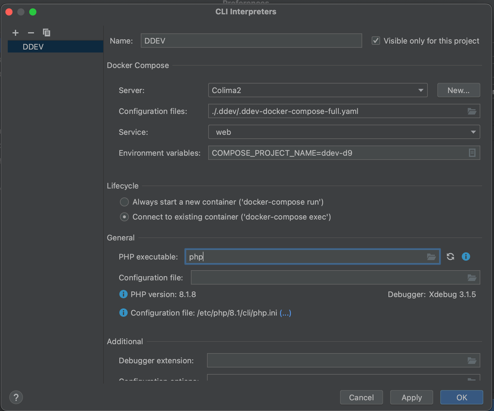
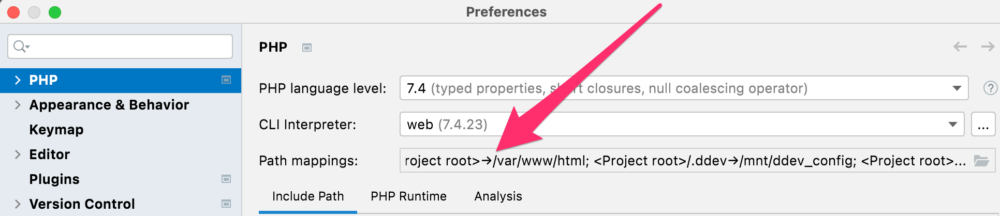
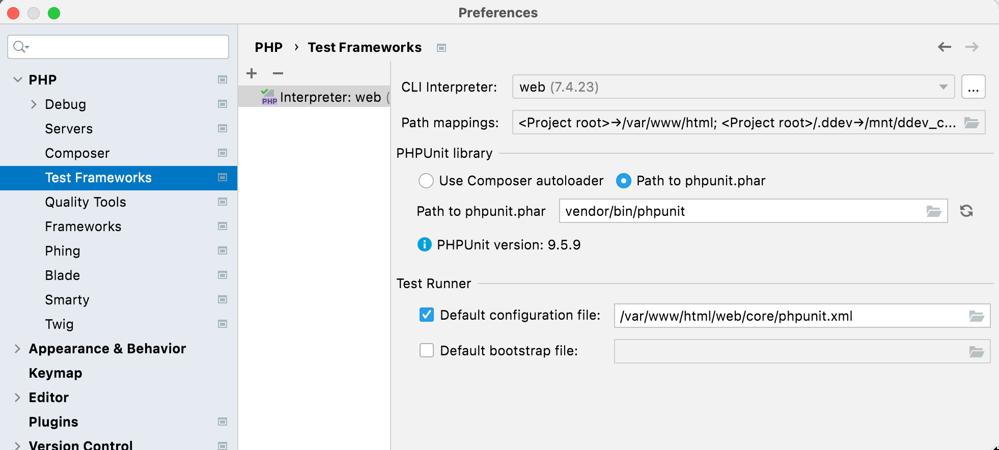
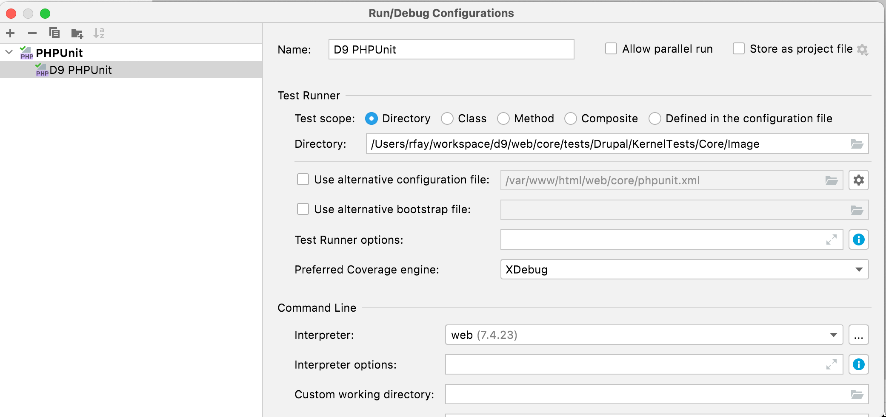
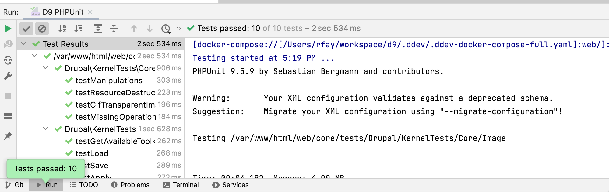

## PhpStorm Configuration and Integration

### Full Integration with Docker, DDEV, and PhpStorm

This explores how to add full PhpStorm integration with a DDEV project, including composer and phpunit. It works on all OS platforms, including macOS and WSL2.

This is based on the wonderful [article](https://susi.dev/fully-integrate-ddev-and-phpstorm-including-unit-tests-with-coverage-update-2021) by [Susanne Moog](https://github.com/susannemoog), and couldn't have been done without it, but since PhpStorm has fixed some things and DDEV has worked around others, this is far easier now. It works on macOS, Linux, Windows with WSL2 and Windows traditional. You'll end up with PhpStorm actually using the PHP interpreter inside the ddev-webserver container of your project, and able to use composer and phpunit inside there as well.

#### Requirements

- PhpStorm 2021.3 or higher
- You may need to add the `PHP Docker` plugin.
- You need to enable Compose V2 Support in PHPStorm. This can be done in `Settings/Preferences | Build, Execution, Deployment | Docker | Tools` by either
   1. set the bundled docker-compose binary as **Docker Compose executable** which can be found in `~/.ddev/bin`.
   2. (Suggested for WSL) enabling **Use Compose V2** in PHPStorm and your Docker installation.
- Any OS platform, but if you're using Windows PhpStorm with WSL2 the path mappings are slightly more complex. WSL2 instructions are provided where necessary.

#### Setup Technique

1. Open a DDEV project. In this example, the project name is "d9" and the site is "d9.ddev.site".
    - If you're on Windows, running PhpStorm on the Windows side but  using WSL2 for your DDEV project, open the project as a WSL2 project. In other words, in the "Open" dialog, browse to `\\wsl$\Ubuntu\home\rfay\workspace\d9` (in this example). (If you're running PhpStorm inside WSL2, there are no special instructions.)
2. Set up your project to do normal Xdebug, as described in the [Step Debugging section](../step-debugging.md). This will result in a PhpStorm "Server" with the proper name, normally the same as the FQDN of the project. In this example, "d9.ddev.site". (All you have to do here is click the little telephone to "Start listening for PHP Debug Connections", then `ddev xdebug on`, then visit a web page and choose the correct mapping from host to server. )
3. Under File→Settings→PHP (Windows) or Preferences→PHP (macOS), click the "..." to the right of "CLI Interpreter"
    1. Use the "+" to select "From Docker, Vagrant, VM..."
    2. Choose "Docker Compose"
    3. Create a server; the default name is "docker", but since the "server" for each project will be different, name it for the project, for example "DDEV d9". Choose "Docker for Windows" or "Docker for Mac"
    4. In the "Path mappings" of the "Server" you may have to map the local paths (which on WSL2 means /home/...) to the in-container paths, especially if you have mutagen enabled. So "Virtual Machine Path" would be "/var/www/html" and "Local path" would be something like /Users/rfay/workspace/d9 (on macOS) or \\wsl$\Ubuntu\home\rfay\workspace\d9 on Windows using WSL2.
    5. Now back in the "Configure Remote PHP Interpreter" for "Configuration files" use `.ddev/.ddev-docker-compose-full.yaml`. On macOS, you may need to use `<cmd><shift>.`, (Command+Shift+Dot) to show hidden dotfiles.
    6. Service: web
    7. Add an environment variable `COMPOSE_PROJECT_NAME=ddev-<projectname>`. In this case, it's `ddev-d9`. (Note that DDEV project names that contain dots do not currently work due to a [PhpStorm bug](https://youtrack.jetbrains.com/issue/WI-63293). You'll need to rename your project to get these instructions to work.)
    8. In the CLI interpreter "Lifecycle" select "Connect to existing container"
    9. In the PHP Interpreter path, you can just put `php` if you're using the default PHP version (currently 7.4). Due to a [PhpStorm bug](https://youtrack.jetbrains.com/issue/WI-62463) you'll want to put the full name of the binary, like `php8.0` if you're not using the default version.
    10. Here's an example filled out 
4. In the main PHP setup dialog, add an entry to the path mappings, as it doesn't correctly derive the full path mapping. Add an entry that maps your project location to /var/www/html. So in this example, the Local Path is /Users/rfay/workspace/d9 and the Remote Path is /var/www/html. 
5. Configure composer under PHP→Composer.
    - Use "remote interpreter"
    - CLI Interpreter will be "web"
6. Under "Test Frameworks" click the "+" to add phpunit
    - PHPUnit by remote interpreter
    - Interpreter "web"
    - Choose "Path to phpunit.phar" and use /var/www/html/vendor/bin/phpunit (or wherever your phpunit is inside the container). You need phpunit properly composer-installed for your CMS. For example, for Drupal 9, `ddev composer require --dev --with-all-dependencies drupal/core-dev:^9`  and `ddev composer require --dev phpspec/prophecy-phpunit:^2`
    - Default configuration file: /var/www/html/web/core/phpunit.xml or wherever yours is inside the container.
   
7. Open Run/Debug configurations and use the "+" to add a phpunit configuration. Give it a name
    - Test scope (as you wish, by directory or class or whatever)
    - Interpreter: "web" (the one we set up)
   
8. Enable Xdebug if you want to debug tests. `ddev xdebug on`
9. Run the runner that you created. 

Notes:

- This was developed with input from many others in [https://github.com/drud/ddev/issues/3130](https://github.com/drud/ddev/issues/3130)
- ([`@eojthebrave`](https://www.drupal.org/u/eojthebrave)) has a great explanation of the whole thing, including Chromedriver and focused on Drupal in the excellent [Drupalize.me](http://drupalize.me) article [Debug any of Drupal's PHPUnit tests in PhpStorm with a DDEV-Local Environment](https://drupalize.me/blog/debug-any-drupals-phpunit-tests-phpstorm-ddev-local-environment)

### PhpStorm Basic Setup on Windows WSL2

It is possible right now to use PHPStorm with DDEV-Local on WSL2 in at least two different ways:

1. Run  PhPStorm in Windows as usual, opening the project on the WSL2 filesystem at `\\wsl$\<distro>`  (for example, `\\wsl$\Ubuntu`). PHPStorm is slow to index files and is slow to respond to file changes in this mode.
2. Enabling X11 on Windows and running PHPStorm inside WSL2 as a Linux app. PHPStorm works fine this way, but it’s yet another complexity to manage and requires enabling X11 (easy) on your Windows system.
We’ll walk through both of these approaches.

(JetBrains is really working to catch up with the slick WSL2 support of vscode. A third option is the [Projector](https://lp.jetbrains.com/projector/) app, which runs PhpStorm on WSL2 (or anywhere else) but displays it in a browser.)

#### Basics

- Start with a working DDEV-Local/WSL2 setup as described in the [docs](../../index.md#installation-or-upgrade-windows-wsl2). Until that’s all working it doesn’t help to go farther.

- If you haven’t used Xdebug with DDEV-Local and PHPStorm before, you’ll want to read the [step debugging instructions](../step-debugging.md).

- For good performance, you want your project to be in `/home` inside WSL2, which is on the Linux filesystem. Although you can certainly keep your project on the Windows filesystem and access it in WSL2 via /mnt/c, the performance is even worse than native Windows. It does work though, but don't do it. You'll be miserable.

#### PhpStorm Running On Windows Side

1. Your working project should be on the /home partition, so you’ll open it using Windows PHPStorm as `\\wsl$\Ubuntu\home\<username>\...\<projectdir>`.
2. On some systems and some projects it may take a very long time for PHPStorm to index the files. At one point I got frustrated and moved to a faster computer.
3. File changes are noticed only by polling, and PHPStorm will complain about this in the lower right, “External file changes sync may be slow”.
4. Turn off your Windows firewall temporarily. When you have everything working you can turn it back on again.
Use `ddev start` and `ddev xdebug on`
5. Click the Xdebug listen button on PHPStorm (the little phone icon) to make it start listening.
6. Set a breakpoint on or near the first line of your index.php
7. Visit the project with a web browser or curl. You should get a popup asking for mapping of the host-side files to the in-container files. You’ll want to make sure that `/home/<you>/.../<yourproject>` gets mapped to `/var/www/html`

Debugging should be working! You can step through your code, set breakpoints, view variables, etc.

(Nice to have) I set the PHPStorm terminal path (Settings→Tools→Terminal→Shell Path) to C:\Windows\System32\wsl.exe. That way when I use the terminal Window in WSL2 it’s using the wonderful bash shell in WSL2.

#### PHPStorm inside WSL2 in Linux

1. On Windows 11 you don't need to install an X11 server, because WSLg comes with that these days. On older Windows 10, Install X410 from the Microsoft Store, launch it, configure in the system tray with “Windowed Apps”, “Allow public access”, “DPI Scaling”→”High quality”. Obviously you can use another X11 server, but this is the one I’ve used.
2. Temporarily disable your Windows firewall. You can re-enable it after you get everything working.
3. If you're on older Windows 10, in the WSL2 terminal `export DISPLAY=$(awk '/^nameserver/ {print $2; exit;}' </etc/resolv.conf):0.0` (You’ll want to add this to your .profile in WSL2). This sets the X11 DISPLAY variable to point to your Windows host side. On Windows 11 this "just works" and you don't need to do anything here.
4. On Windows 11, `sudo apt-get update && sudo apt-get install xdg-utils`. On older Windows 10, `sudo apt-get update && sudo apt-get install libatk1.0 libatk-bridge2.0 libxtst6 libxi6 libpangocairo-1.0 libcups2 libnss3 xdg-utils x11-apps`
5. On older Windows 10, run `xeyes` – you should see the classic X11 play app “xeyes” on the screen. <ctrl-c> to exit. This is just a test to make sure X11 is working.
6. Download and untar PHPStorm for Linux from [Jetbrains](https://www.jetbrains.com/phpstorm/download/#section=linux) – you need the Linux app.
7. Run `bin/phpstorm.sh &`
8. In PHPStorm, under Help→ Edit Custom VM Options, add an additional line: `-Djava.net.preferIPv4Stack=true` This makes PHPStorm listen for Xdebug using IPV4; for some reason the Linux version of PHPStorm defaults to using only IPV6, and Docker Desktop doesn't support IPV6.
9. Restart PHPStorm (`File→Exit` and then `bin/phpstorm.sh &` again.
10. Use `ddev start` and `ddev xdebug` on
Click the Xdebug listen button in PHPStorm (the little phone icon) to make it start listening.
11. Set a breakpoint on or near the first line of your index.php
12. Visit the project with a web browser or curl. You should get a popup asking for mapping of the host-side files to the in-container files. You’ll want to make sure that `/home/<you>/.../<yourproject>` gets mapped to `/var/www/html`.

Debugging should be working! You can step through your code, set breakpoints, view variables, etc.
