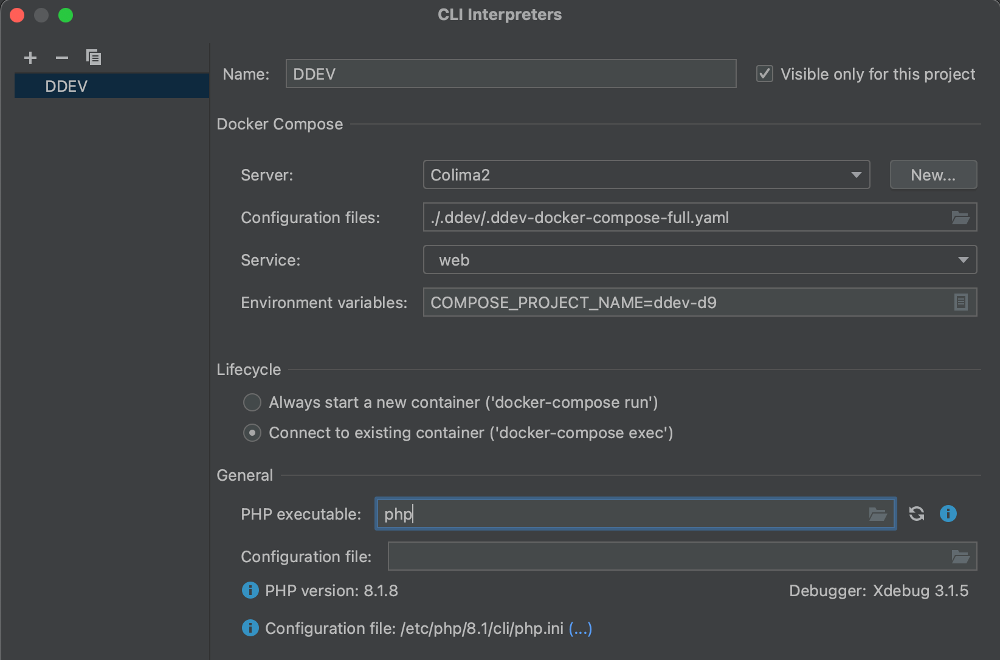
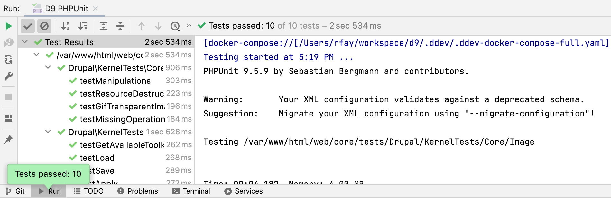

# PhpStorm Configuration and Integration

## Full Integration with Docker, DDEV, and PhpStorm

For full integration of PhpStorm and DDEV, it’s easiest to use the [DDEV Integration Plugin](https://plugins.jetbrains.com/plugin/18813-ddev-integration) or search the marketplace (*Preferences* → *Plugins* → *Marketplace*) for “DDEV”. The integration plugin handles nearly everything on this page automatically, and works on all platforms. The only thing it doesn’t currently do is set up `phpunit`, and it doesn’t point docker-compose correctly.

For any setup, including the [DDEV Integration Plugin](https://plugins.jetbrains.com/plugin/18813-ddev-integration):

1. In *Preferences* → *Build, Execution, Deployment* → *Docker* → *Tools*, set the docker-compose executable to DDEV’s private docker-compose using the full path to `.ddev/bin/docker-compose` in your home directory. If you’re using WSL2 and running PhpStorm on the Windows side, PhpStorm can’t use docker-compose from WSL2, so at least configure Docker Desktop in *Settings* → *General* to “Use Docker Compose V2” and use a recent version of Docker Desktop.

### Requirements

- PhpStorm 2022.2 or higher.
- DDEV v1.21.1 or higher.

### Setup Technique Without [DDEV Integration Plugin](https://plugins.jetbrains.com/plugin/18813-ddev-integration)

1. Start your project with `ddev start`.
2. Open the DDEV project. In this example, the project name is “d9” and the site is “d9.ddev.site”.
    - If you’re on Windows, running PhpStorm on the Windows side but using WSL2 for your DDEV project, open the project as a WSL2 project. In other words, in the *Open* dialog, browse to `\\wsl$\Ubuntu\home\rfay\workspace\d9` (in this example). (If you’re running PhpStorm inside WSL2, there are no special instructions.)
3. Under *Build, Execution, Deployment* → *Docker*, set the correct Docker provider, for example “Colima” or “Docker for Mac”.
4. Set up your project to do normal Xdebug, as described in the [Step Debugging section](../debugging-profiling/step-debugging.md). This will result in a PhpStorm “Server” with the proper name, normally the same as the FQDN of the project. In this example, “d9.ddev.site”. (All you have to do here is click the little telephone to “Start listening for PHP Debug Connections”, run `ddev xdebug on`, and visit a web page and choose the correct mapping from host to server.)
5. Under *File* → *Settings* → *PHP* (Windows) or *Preferences* → *PHP* (macOS), click “...” to the right of “CLI Interpreter”.
    1. Use the “+” to select “From Docker, Vagrant, VM...”.
    2. Choose “Docker Compose”.
    3. Create a “server”; Choose the appropriate Docker provider configured above under *Build, Execution, Deployment* → *Docker*.
    4. In the “Path mappings” of the “Server” you may have to map the local paths (which on WSL2 means `/home/...`) to the in-container paths, especially if you have Mutagen enabled. So “Virtual Machine Path” would be `/var/www/html` and “Local path” would be something like `/Users/rfay/workspace/d9` (on macOS) or `\\wsl$\Ubuntu\home\rfay\workspace\d9` on Windows using WSL2.
    5. Now back in the “Configure Remote PHP Interpreter” for “Configuration files” use `.ddev/.ddev-docker-compose-full.yaml`. On macOS, you may need to use <kbd>⌘</kbd> + <kbd>SHIFT</kbd> + <kbd>.</kbd>, to show hidden dotfiles.
    6. Service: `web`.
    7. In the CLI interpreter “Lifecycle” select “Connect to existing container”.
    8. Here’s an example filled out:
        
6. In the main PHP setup dialog, add an entry to the path mappings, as it doesn’t correctly derive the full path mapping. Add an entry that maps your project location to `/var/www/html`. So in this example, the “Local Path” is `/Users/rfay/workspace/d9` and the “Remote Path” is `/var/www/html`:
    
7. Configure composer under *PHP* → *Composer*.
    - Use “remote interpreter”
    - CLI Interpreter will be “web”

### Enabling PHPUnit

This part is not done for you by the integration plugin.

1. Under “Test Frameworks” click “+” to add PHPUnit, assuming PHPUnit is already installed.
    - PHPUnit by remote interpreter
    - Interpreter “DDEV”
    - Choose “Path to phpunit.phar” and use `/var/www/html/vendor/bin/phpunit`, or wherever your PHPUnit is inside the container. You need PHPUnit properly Composer-installed for your CMS. For example, for Drupal 9, `ddev composer require --dev --with-all-dependencies drupal/core-dev:^9` and `ddev composer require --dev phpspec/prophecy-phpunit:^2`.
    - Default configuration file: `/var/www/html/web/core/phpunit.xml` or wherever yours is inside the container.
    
2. Open Run/Debug configurations and use “+” to add a PHPUnit configuration. Give it a name.
    - Test scope (as you wish, by directory or class or whatever).
    - Interpreter: “web” (the one we set up).
    
3. Enable Xdebug if you want to debug tests with `ddev xdebug on`.
4. Run the runner you created:
    

## PhpStorm Basic Setup on Windows WSL2

It’s possible to use PhpStorm with DDEV on WSL2 in at least three different ways:

1. Run PhpStorm in Windows as usual, opening the project on the WSL2 filesystem at `\\wsl$\<distro>` (e.g. `\\wsl$\Ubuntu`). PhpStorm is slow to index files and is slow to respond to file changes in this mode.
2. Enabling X11 on Windows and running PhpStorm inside WSL2 as a Linux app. PhpStorm works fine this way, but it’s yet another complexity to manage and requires enabling X11 on your Windows system, which is fairly simple.
3. [JetBrains Gateway](https://www.jetbrains.com/remote-development/gateway/) runs PhpStorm on WSL2 (or anywhere else) but displays it in a in your Gateway app. It requires configuring `sshd` in WSL2 and either auto-starting it with `/etc/wsl.conf` (Windows 11) or starting it manually.

We’ll walk through the first two of these approaches.

### Basics

- Start with a working DDEV/WSL2 setup as described in the [docs](../install/ddev-installation.md). Until that’s all working it doesn’t help to go farther.

- If you haven’t used Xdebug with DDEV and PhpStorm before, you’ll want to read the [step debugging instructions](../debugging-profiling/step-debugging.md).

- For usable performance, your project should be in `/home` inside WSL2, which is on the Linux filesystem. Although you could keep your project on the Windows filesystem and access it in WSL2 via `/mnt/c`, the performance is even worse than native Windows. It does work though, but don’t do it. You’ll be miserable.

### PhpStorm Running On Windows Side and Using Docker Desktop

With the [DDEV Integration Plugin](https://plugins.jetbrains.com/plugin/18813-ddev-integration) almost everything is already done for you, so use it. Create your project inside WSL2 (on the `/home` partition) and get it started first.

1. Your working project will be on the `/home` partition, so you’ll open it using Windows PhpStorm as `\\wsl$\Ubuntu\home\<username>\...\<projectdir>`.
2. On some systems and some projects it may take a very long time for PhpStorm to index the files.
3. File changes are noticed only by polling, and PhpStorm will complain about this in the lower right, “External file changes sync may be slow”.
4. Temporarily disable your Windows firewall. When you have everything working, you can turn it back on again.
5. Use `ddev start` and `ddev xdebug on`.
6. Click the Xdebug listen button on PhpStorm (the little phone icon) to make it start listening.
7. Set a breakpoint on or near the first line of your `index.php`.
8. Visit the project with a web browser or cURL. You should get a popup asking for mapping of the host-side files to the in-container files. Make sure `/home/<you>/.../<yourproject>` is mapped to `/var/www/html`.

Debugging should be working. You can step through your code, set breakpoints, view variables, etc.

Set the PhpStorm terminal path (*Settings* → *Tools* → *Terminal* → *Shell Path*) to `C:\Windows\System32\wsl.exe`. That way when you use the terminal Window in WSL2 it’s using the Bash shell in WSL2.

### PhpStorm Inside WSL2 in Linux

1. On Windows 11 you don’t need to install an X11 server, because [WSLg](https://github.com/microsoft/wslg) is included by default. On older Windows 10, Install X410 from the Microsoft Store, launch it, configure in the system tray with “Windowed Apps”, “Allow public access”, “DPI Scaling” → ”High quality”. You can any other X11 server, this is just one possibility.
2. Temporarily disable your Windows firewall. You can re-enable it after you get everything working.
3. If you’re on older Windows 10, in the WSL2 terminal `export DISPLAY=$(awk '/^nameserver/ {print $2; exit;}' </etc/resolv.conf):0.0` (You’ll want to add this to your `.profile` in WSL2). This sets the X11 DISPLAY variable to point to your Windows host side. On Windows 11 this “just works” and you don’t need to do anything here.
4. Install the DDEV apt repository:

    ```bash
    curl -fsSL https://apt.fury.io/drud/gpg.key | gpg --dearmor | sudo tee /etc/apt/trusted.gpg.d/ddev.gpg > /dev/null
    echo "deb [signed-by=/etc/apt/trusted.gpg.d/ddev.gpg] https://apt.fury.io/drud/ * *" | sudo tee /etc/apt/sources.list.d/ddev.list
    sudo apt update && sudo apt install -y ddev
    ```

5. On Windows 11, `sudo apt-get update && sudo apt-get install ddev`. On older Windows 10, `sudo apt-get update && sudo apt-get install ddev libatk1.0 libatk-bridge2.0 libxtst6 libxi6 libpangocairo-1.0 libcups2 libnss3 xdg-utils x11-apps`
6. On older Windows 10, run `xeyes`. You should see the classic X11 play app “xeyes” on the screen. <kbd>CTRL</kbd> + <kbd>C</kbd> to exit. This is just a test to make sure X11 is working.
7. Download and untar PhpStorm for Linux from [JetBrains](https://www.jetbrains.com/phpstorm/download/#section=linux). You need the Linux app.
8. Run `bin/phpstorm.sh &`.
9. In PhpStorm, under *Help* → *Edit Custom VM Options*, add another line: `-Djava.net.preferIPv4Stack=true`. This makes PhpStorm listen for Xdebug using IPv4; for some reason the Linux version of PhpStorm defaults to using only IPv6, and Docker Desktop doesn’t support IPv6.
10. Restart PhpStorm with *File* → *Exit* and run `bin/phpstorm.sh &` again.
11. Use `ddev start` and `ddev xdebug on`.
12. Click the Xdebug listen button in PhpStorm (the little phone icon) to make it start listening.
13. Set a breakpoint on or near the first line of your `index.php`.
14. Visit the project with a web browser or cURL. You should get a popup asking for mapping of the host-side files to the in-container files. Make sure `/home/<you>/.../<yourproject>` is mapped to `/var/www/html`.

Debugging should be working! You can step through your code, set breakpoints, view variables, etc.
