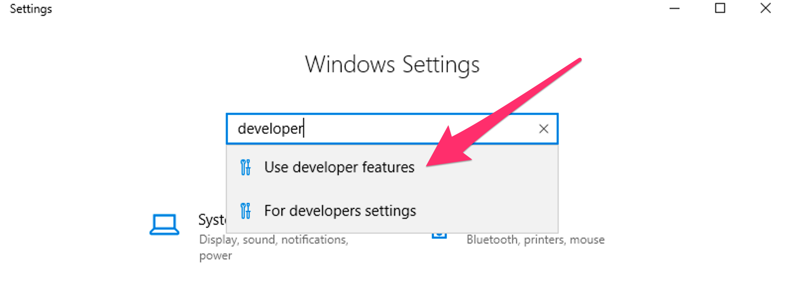
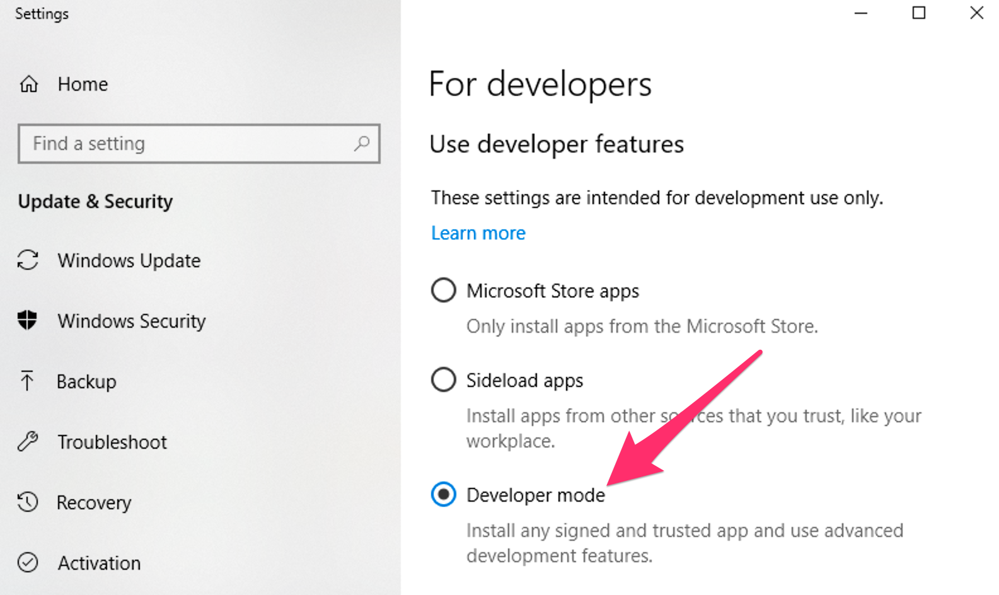

---
search:
  boost: 2
---
# Built-in Developer Tools

Run [`ddev describe`](../usage/commands.md#describe) to see the project information and services available for your project and how to access them.

## Command-line Tools in the Containers

Hundreds of useful developer tools are included inside the containers and can be used via [`ddev exec`](../usage/commands.md#exec) or [`ddev ssh`](../usage/commands.md#ssh). Some of those include:

* MySQL client (`mysql`) - Command-line interface for interacting with MySQL/MariaDB.
* PostgreSQL client (`psql`) - Command-line tool for PostgreSQL.
* [Drush](http://www.drush.org) - Command-line shell and Unix scripting interface for Drupal.
* [PHIVE](https://phar.io/) - Command line tool for “PHAR Installation and Verification Environment”.
* [WP-CLI](http://wp-cli.org/) - Command-line tools for managing WordPress installations, available both as `wp` and as `wp-cli`.
* `npm`, `nvm`, and `yarn` (these also have `ddev` shortcuts like [`ddev npm`](../usage/commands.md#npm), [`ddev nvm`](../usage/commands.md#nvm), [`ddev yarn`](../usage/commands.md#yarn)).
* `node`
* `sqlite3`

These tools can be accessed for single commands using [`ddev exec <command>`](cli.md#executing-commands-in-containers) or [`ddev ssh`](cli.md#ssh-into-containers) for an interactive `bash` or `sh` session.

You can also add tools that are not provided by default using [`webimage_extra_packages` or a custom Dockerfile](../extend/customizing-images.md).

## DDEV and Composer

DDEV provides a built-in command to simplify use of PHP’s dependency manager, [Composer](https://getcomposer.org/), without requiring it to be installed on the host machine. Generally, executing any Composer command through DDEV is as simple as prepending the command with `ddev`. DDEV will execute the command at the project root in the web container, passing (almost) all arguments and flags to Composer. To execute Composer in other directories within the container, use `ddev ssh` or `ddev exec -d <dir>`. For example:

* `ddev composer help` runs Composer’s help command to learn more about what’s available.
* `ddev composer require <package>` tells Composer to require a specific PHP package for the current project.

Additionally, Composer can be used to initialize new projects with `ddev composer create`. This command supports limited argument and flag options, and will install a new project to the composer root (normally `/var/www/html`). The package and version arguments are required:

`ddev composer create [<flags>] "<package>:<version>"`

For example:

`ddev composer create --no-dev "typo3/cms-base-distribution:^9"`

When using `ddev composer create` your project should be essentially empty or the command will refuse to run, to avoid loss of your files.

By default `--no-plugins` and `--no-scripts` options are used while cloning the project and `composer install` is executed afterwards as long as `--no-install` is not provided. When using `--preserve-flags` plugins and scripts are allowed during the cloning step.

To execute a fully-featured `composer create-project` command, you can execute the command from within the container after executing [`ddev ssh`](../usage/commands.md#ssh), or pass the full command to [`ddev exec`](../usage/commands.md#exec), like so:

`ddev exec composer create-project ...`

DDEV uses Composer 2 by default. Use the `--composer-version` option to roll back to version 1: `ddev config --composer-version=1 && ddev start`.

**composer.json Location**: It’s most common for `composer.json` to be in the project root, but you can specify an alternate Composer root using DDEV’s `composer_root` option in `.ddev/config.yaml`, or `ddev config --composer-root <dir>`. The `composer_root` value is the *relative* path from the project root to the directory containing `composer.json`. If yours is at `docroot/composer.json`, for example, the `composer_root` value should be `docroot`.

!!!tip "Careful with Global Requirements!"
    If you run `ddev composer global require` (or `composer global require` inside the web container), global packages will be installed at the home directory within the container (`~/.composer`) and will disappear when the container restarts—meaning you’ll need to re-run the command.

    You may want to synchronize created Composer configuration and installed packages with the DDEV’s [`homeadditions` directory](../extend/in-container-configuration.md) on your host machine.

<a name="windows-os-and-ddev-composer"></a>

### Windows OS and `ddev composer`

DDEV attempts to help with Composer and some configurations of Docker Desktop for Windows that introduce complex filesystem workarounds.

Use [`ddev composer`](../usage/commands.md#composer) (Composer inside the container) instead of using `composer` on the host side, because it uses the right version of PHP and all its extensions for your project:

* On some older configurations of Docker Desktop for Windows, symlinks are created in the container as “simulated symlinks”, or XSym files. These special text files behave as symlinks inside the container (on CIFS filesystem), but appear as simple text files on the Windows host. (On the CIFS filesystem used by Docker for Windows, inside the container, there is no capability to create real symlinks even though Windows now has this capability.)
* DDEV attempts to clean up for this situation. Since Windows 10/11+ (in developer mode) can create real symlinks, DDEV scans your repository after a `ddev composer` command and attempts to convert XSym files into real symlinks. On older versions of Windows 10, it can only do this if your Windows 10 workstation is set to “Developer Mode”.
* To enable developer mode on Windows 10/11+, search for “developer” in settings:
      
    

## Email Capture and Review (Mailpit)

[Mailpit](https://github.com/axllent/mailpit) is a mail catcher that’s configured to capture and display emails sent by PHP in the development environment.

After your project is started, access the Mailpit web interface at `https://mysite.ddev.site:8026`, or run [`ddev mailpit`](../usage/commands.md#mailpit) to launch it in your default browser.

Mailpit will **not** intercept emails if your application is configured to use SMTP or a third-party ESP integration.

If you’re using SMTP for outgoing mail—with [Symfony Mailer](https://www.drupal.org/project/symfony_mailer) or [SMTP](https://www.drupal.org/project/smtp) modules, for example—update your application’s SMTP server configuration to use `localhost` and Mailpit’s port `1025`.

For Drupal 9+ `settings.ddev.php` overrides the Symfony Mailer sendmail configuration to use Mailpit.

For Drupal 8/9 `settings.ddev.php` overrides the [Swift Mailer](https://www.drupal.org/project/swiftmailer) transport configuration to use Mailpit.

For Laravel projects, Mailpit will capture Swift messages via SMTP. Update your `.env` to use Mailpit with the following settings:

```env
MAIL_MAILER=smtp
MAIL_HOST=localhost
MAIL_PORT=1025
MAIL_USERNAME=null
MAIL_PASSWORD=null
MAIL_ENCRYPTION=null
```

## Using Development Tools on the Host Machine

It’s possible in many cases to use development tools installed on your host machine on a project provisioned by DDEV. Tools that interact with files and require no database connection, such as Git or Composer, can be run from the host machine against the codebase for a DDEV project with no additional configuration necessary.

### Database Connections from the Host

If you need to connect to your project’s database from your workstation, run [`ddev describe`](../usage/commands.md#describe) to show the database connection information, like `Host: localhost:49156`.

Each project’s database port is unique, and randomly chosen from available ports on your system when you run [`ddev start`](../usage/commands.md#start).

You can force this port to be the same on every [`ddev start`](../usage/commands.md#start) by setting [`host_db_port`](../configuration/config.md#host_db_port) in the project’s `.ddev/config.yaml`. For example, `host_db_port: "49156"` or `ddev config --host-db-port=49156`. This value needs to be different on each running DDEV project, and unless it is set, the database port will change on every `ddev start`.

You can use this port with various tools that need a direct port, like `mysql` or `psql` clients, but it’s usually easiest to use [`ddev mysql`](../usage/commands.md#mysql), `ddev psql`, `ddev sequelace`, [`ddev tableplus`](../usage/commands.md#tableplus), etc, which set everything up for you.

(If you use PhpStorm and its integrated database browser, use the [DDEV Integration Plugin](https://plugins.jetbrains.com/plugin/18813-ddev-integration) to manage all of this for you.)

## DDEV and Terminus

[Terminus](https://docs.pantheon.io/terminus) is a command line tool providing advanced interaction with [Pantheon](https://pantheon.io/) services. `terminus` is available inside the project’s container, allowing users to get information from, or issue commands to their Pantheon-hosted sites. This is an especially helpful feature for Windows users since Terminus is only officially supported on Unix-based systems.

To use Terminus, you’ll first need to:

1. Use a machine token. (See [Pantheon provider discussion](../providers/pantheon.md).)
2. Run [`ddev ssh`](../usage/commands.md#ssh) to tunnel into your container.
3. Issue a command using the keyword `terminus`. For help using Terminus, try `terminus list` to get a list of possible commands.

Terminus also allows you to issue [Drush](https://www.drush.org/), [WP-CLI](https://wp-cli.org/), and [Composer](https://getcomposer.org/) commands to your Pantheon server. These are all usable from within the container as well, but will require authentication via either your Pantheon password or an SSH key. To use your host machine’s SSH key, you can use the `ddev auth ssh` command [described here](cli.md#ssh-into-containers).
