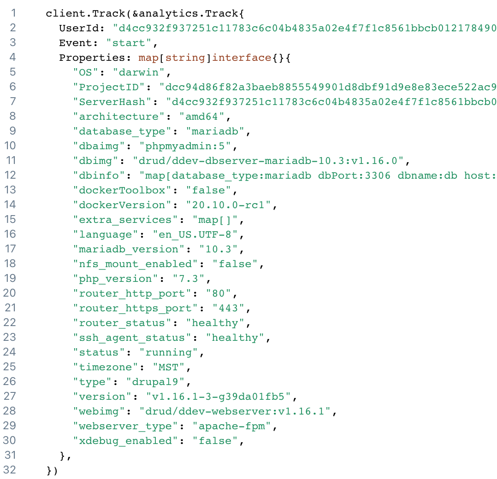

# Opt-In Usage Information

When you start DDEV for the first time or install a new release, you’ll be asked whether to send usage and error information to DDEV’s developers.

Regardless of your choice, you can change this at any time by editing `~/.ddev/global_config.yaml` and setting `instrumentation_opt_in: true` or `instrumentation_opt_in: false`.

If you choose to share diagnostics, it helps us tremendously in our effort to improve the tool. Here’s an example of what we might see:

If you have any reservations about this, please opt out (`ddev config global --instrumentation-opt-in=false`). If you have any issues or concerns with it, we’d like to know.
