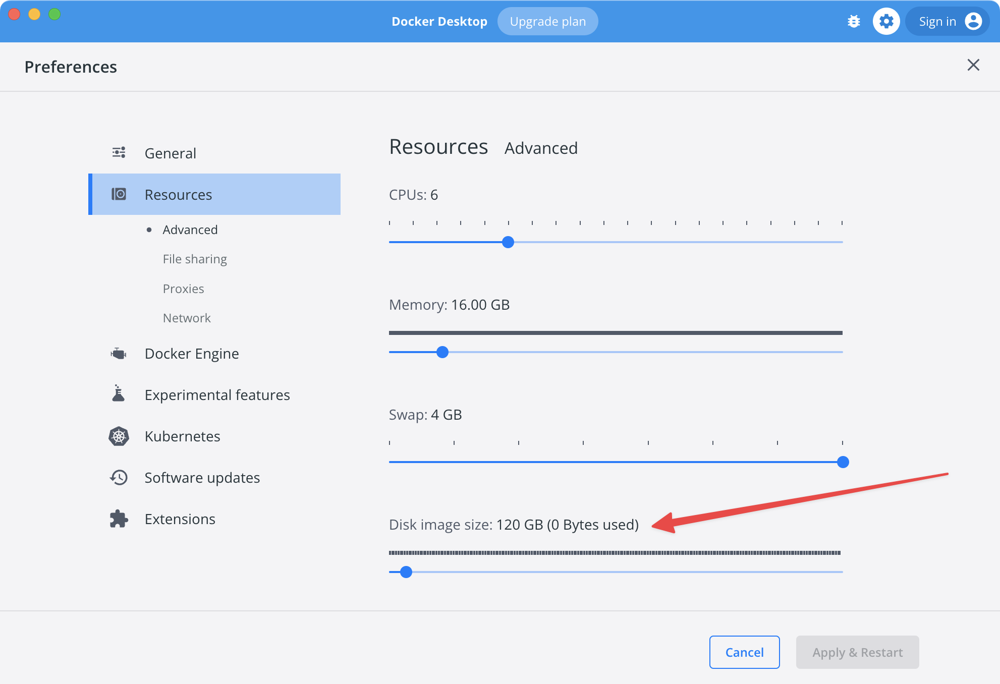

# Troubleshooting

Things might go wrong! In addition to this page, consider checking [Stack Overflow](https://stackoverflow.com/tags/ddev) and [the DDEV issue queue](https://github.com/ddev/ddev/issues) and [other support options](../support.md), as well as [Docker troubleshooting suggestions](../install/docker-installation.md#testing-and-troubleshooting-your-docker-installation).

## General Troubleshooting Strategies

* Start by running [`ddev poweroff`](commands.md#poweroff) to make sure all containers can start fresh.
* Temporarily disable firewalls, VPNs, network proxies, and virus checkers while you’re troubleshooting.
* Temporarily disable any proxies you’ve established in Docker’s settings.
* Use [`ddev debug dockercheck`](commands.md#debug-dockercheck) and [`ddev debug test`](commands.md#debug-test) to help sort out Docker problems.
* On macOS, check to make sure Docker Desktop or Colima are not out of disk space. In *Settings* (or *Preferences*) → *Resources* → *Disk image size* there should be ample space left; try not to let usage exceed 80% because the reported number can be unreliable. If it says zero used, something is wrong.
* If you have customizations like PHP overrides, nginx or Apache overrides, MySQL/PostgreSQL overrides, custom services, or `config.yaml` changes, please back them out while troubleshooting. It’s important to have the simplest possible environment while troubleshooting.
* Restart Docker. Consider a Docker factory reset in serious cases, which will destroy any databases you’ve loaded. See [Docker Troubleshooting](../install/docker-installation.md#troubleshooting) for more.
* Try the simplest possible DDEV project (like [`ddev debug test`](commands.md#debug-test) does):

    ```bash
    ddev poweroff
    mkdir ~/tmp/testddev
    cd ~/tmp/testddev
    ddev config --auto
    printf "<?php\nphpinfo();\n" > index.php
    ddev start
    ```

    If that starts up fine, there may be an issue specifically with the project you’re trying to start.

!!!tip "Using DDEV with Other Development Environments"

    DDEV uses your system’s port 80 and 443 by default when projects are running. If you’re using another local development environment (like Lando or Docksal or a native setup), you can either stop the other environment or configure DDEV to use different ports. See [troubleshooting](troubleshooting.md#unable-listen) for more detailed problem-solving. It’s easiest to stop the other environment when you want to use DDEV, and stop DDEV when you want to use the other environment.

### Debug Environment Variables

Two environment variables meant for DDEV development may also be useful for broader troubleshooting: `DDEV_DEBUG` and `DDEV_VERBOSE`. When enabled, they’ll output more information when DDEV is executing a command. `DDEV_VERBOSE` can be particularly helpful debugging Dockerfile problems because it outputs complete information about the Dockerfile build stage within the `ddev start` command.

You can set either one in your current session by running `export DDEV_DEBUG=true` and `export DDEV_VERBOSE=true`.

<a name="unable-listen"></a>

## Web Server Ports Already Occupied

DDEV may notify you about port conflicts with this message about port 80 or 443:

> Failed to start yoursite: Unable to listen on required ports, localhost port 80 is in use

DDEV sometimes also has this error message that will alert you to port conflicts:

> ERROR: for ddev-router Cannot start service ddev-router: Ports are not available: listen tcp 127.0.0.1:XX: bind: An attempt was made to access a socket in a way forbidden by its access permissions.

or

> Error response from daemon: Ports are not available: exposing port TCP 127.0.0.1:443 -> 0.0.0.0:0: listen tcp 127.0.0.1:443: bind: Only one usage of each socket address (protocol/network address/port) is normally permitted.

This means there’s another web server listening on the named port(s) and DDEV cannot access the port. The most common conflicts are on ports 80 and 443.

In some cases, the conflict could be over MailHog’s port 8025 or 8026.

To resolve this conflict, choose one of these methods:

1. Stop all Docker containers that might be using the port by running `ddev poweroff && docker rm -f $(docker ps -aq)`, then restart Docker.
2. If you’re using another local development environment that uses these ports (MAMP, WAMP, Lando, etc.), consider stopping it.
3. Fix port conflicts by configuring your project to use different ports.
4. Fix port conflicts by stopping the competing application.

### Method 1: Stop the conflicting application

Consider `lando poweroff` for Lando, or `fin system stop` for Docksal, or stop MAMP using GUI interface or [`stop.sh`](https://stackoverflow.com/a/17750194/215713).

### Method 2: Fix port conflicts by configuring your project to use different ports

To configure a project to use non-conflicting ports, edit the project’s `.ddev/config.yaml` to add entries like `router_http_port: 8000` and `router_https_port: 8443` depending on your needs. Then, use `ddev start` again.

For example, if there was a port conflict with a local Apache HTTP on port 80, add the following to the `config.yaml` file:

```yaml
router_http_port: 8080
router_https_port: 8443
```

Then run `ddev start`. This changes the project’s HTTP URL to `http://yoursite.ddev.site:8080` and the HTTPS URL to `https://yoursite.ddev.site:8443`.

If the conflict is over port 8025 or 8026, it’s probably clashing with MailHog’s default port. You can add the following to `.ddev/config.yaml`:

```yaml
mailhog_port: 8300
mailhog_https_port: 8301
```

### Method 3: Fix port conflicts by stopping the competing application

Alternatively, stop the other application.

Probably the most common conflicting application is Apache running locally. It can often be stopped gracefully (but temporarily) with:

```
sudo apachectl stop
```

**Common tools that use port 80 and port 443:**

Here are some of the other common processes that could be using ports 80/443 and methods to stop them.

* MAMP (macOS): Stop MAMP.
* Apache: Temporarily stop with `sudo apachectl stop`, permanent stop depends on your environment.
* nginx (macOS Homebrew): `sudo brew services stop nginx` or `sudo launchctl stop homebrew.mxcl.nginx`.
* nginx (Ubuntu): `sudo service nginx stop`.
* Apache (many environments, often named “httpd”): `sudo apachectl stop` or on Ubuntu `sudo service apache2 stop`.
* VPNKit (macOS): You likely have a Docker container bound to port 80. Do you have containers up for Lando or another Docker-based development environment? If so, stop the other environment.
* Lando: If you’ve previously used Lando, try running `lando poweroff`.
* IIS on Windows (can affect WSL2). You’ll have to disable it in the Windows settings.

To dig deeper, you can use a number of tools to find out what process is listening.

On macOS and Linux, try the `lsof` tool on ports 80 or 443 or whatever port you’re having trouble with:

```
$ sudo lsof -i :443 -sTCP:LISTEN
COMMAND  PID     USER   FD   TYPE DEVICE SIZE/OFF NODE NAME
nginx   1608 www-data   46u  IPv4  13913      0t0  TCP *:http (LISTEN)
nginx   5234     root   46u  IPv4  13913      0t0  TCP *:http (LISTEN)
```

On Windows CMD, use [sysinternals tcpview](https://docs.microsoft.com/en-us/sysinternals/downloads/tcpview) or try using `netstat` and `tasklist` to find the process ID:

```
> netstat -aon | findstr ":80.*LISTENING"
  TCP    127.0.0.1:80           0.0.0.0:0              LISTENING       5760
  TCP    127.0.0.1:8025         0.0.0.0:0              LISTENING       5760
  TCP    127.0.0.1:8036         0.0.0.0:0              LISTENING       5760

> tasklist | findstr "5760"
com.docker.backend.exe        5760 Services                   0      9,536 K
```

The resulting output displays which command is running and its PID. Choose the appropriate method to stop the other server.

You may also be able to find what’s using a port using `curl`. On Linux, macOS, or in Git Bash on Windows, `curl -I localhost` or `curl -I -k https://localhost:443`. The result may give you a hint about which application is at fault.

We welcome your [suggestions](https://github.com/ddev/ddev/issues/new) based on other issues you’ve run into and your troubleshooting technique.

### Debugging Port Issues on WSL2

On WSL2 it’s harder to debug this because the port may be occupied either on the traditional Windows side, or within your WSL2 distro. This means you may have to debug it in both places, perhaps using both the Windows techniques shown above and the Linux techniques shown above. The ports are shared between Windows and WSL2, so they can be broken on either side.

## Database Container Fails to Start

Use `ddev logs -s db` to see what’s wrong.

The most common cause of the database container not coming up is changing the database type or version in the project configuration, so the database server daemon is unable to start using an existing configuration for a different type or version.

To solve this:

* Change the configuration in `.ddev/config.yaml` back to the original configuration.
* Export the database with [`ddev export-db`](commands.md#export-db).
* Delete the project with [`ddev delete`](commands.md#delete), or stop the project and remove the database volume using `docker volume rm <project>-mariadb` or `docker volume rm <project>-postgres`.
* Update `.ddev/config.yaml` to use the new [database type or version](../extend/database-types.md).
* Start the project and import the database from your export.

## “web service unhealthy” or “web service starting” or Exited

Use `ddev logs` to see what’s wrong.

The most common cause of the web container being unhealthy is a user-defined `.ddev/nginx-full/nginx-site.conf` or `.ddev/apache/apache-site.conf`. Please rename these to `<xxx_site.conf>` during testing. To figure out what’s wrong with it after you’ve identified that as the problem, use `ddev logs` and review the error.

Changes to `.ddev/nginx-site.conf` and `.ddev/apache/apache-site.conf` take effect only when you do a `ddev restart` or the equivalent.

## No Input File Specified (404) or Forbidden (403)

If you get a 404 with “No input file specified” (nginx) or a 403 with “Forbidden” (Apache) when you visit your project, it usually means that no `index.php` or `index.html` is being found in the docroot. This can result from:

* Misconfigured docroot: If the docroot isn’t where the web server thinks it is, then the web server won’t find `index.php`. Look at your `.ddev/config.yaml` to verify it has a docroot containing `index.php`. It should be a relative path.
* Missing `index.php`: There may not be an `index.php` or `index.html` in your project.

## `ddev start` Fails and Logs Contain "failed (28: No space left on device)" - Docker File Space

If `ddev start` fails, it’s most often because the `web` or `db` container fails to start. In this case, the error message from `ddev start` says something like “Failed to start <project>: db container failed: log=, err=container exited, please use 'ddev logs -s db' to find out why it failed”. You can`ddev logs -s db` to find out what happened.

If you see any variant of “no space left on device” in the logs when using Docker Desktop, it means you have to increase or clean up Docker’s file space. Increase the “Disk image size” setting under “Resources” in Docker’s Preferences:



If you see “no space left on device” on Linux, it most likely means your filesystem is full.

## `ddev start` Fails with "container failed to become ready"

A container fails to become ready when its health check is failing. This can happen to any of the containers, and you can usually find the issue with a `docker inspect` command.

!!!tip
    You may need to install [jq](https://stedolan.github.io/jq/download/) for these examples (`brew install jq`), or remove the `| jq` from the command and read the raw JSON output.

For the `web` container:

```
docker inspect --format "{{json .State.Health }}" ddev-<projectname>-web | jq
```

For `ddev-router`:

```
docker inspect --format "{{json .State.Health }}" ddev-router
```

For `ddev-ssh-agent`:

```
docker inspect --format "{{json .State.Health }}" ddev-ssh-agent
```

Don’t forget to check logs using `ddev logs` for the `web` container, and `ddev logs -s db` for the `db` container!

For `ddev-router` and `ddev-ssh-agent`: `docker logs ddev-router` and `docker logs ddev-ssh-agent`.

Run [`ddev debug router-nginx-config`](commands.md#debug-router-nginx-config) to print the nginx configuration of the currently running `ddev-router`.

## `ddev start` Fails with "Failed to start [project name]: No such container: ddev-router"

Deleting the images and re-pulling them generally solves this problem.

Try running the following commands from the host machine:

```
ddev poweroff
docker rm -f $(docker ps -aq)
docker rmi -f $(docker images -q)
```

You should then be able to start your DDEV machine.

## Trouble Building Dockerfiles

The additional `.ddev/web-build/Dockerfile` capability in DDEV is wonderful, but it can be hard to figure out what to put in there.

The best approach for any significant Dockerfile is to `ddev ssh` and `sudo -s` and then one at a time, do the things that you plan to do with a `RUN` command in the Dockerfile.

For example, if your Dockerfile were

```dockerfile
RUN npm install --global forever
```

You could test it with `ddev ssh`, `sudo -s`, and then `npm install --global forever`.

The error messages you get will be more informative than messages that come when the Dockerfile is processed.

You can also see the output from the full Docker build using either

```
ddev debug refresh
```

or

```
~/.ddev/bin/docker-compose -f .ddev/.ddev-docker-compose-full.yaml --progress=plain build --no-cache
```

## DDEV Starts but Browser Can’t Access URL

You may see one of two messages in your browser:

* *[url] server IP address could not be found*
* *We can’t connect to the server at [url]*

Most people use `*.ddev.site` URLs, which work great most of the time but require internet access.

`*.ddev.site` is a wildcard DNS entry that always returns the IP address 127.0.0.1 (localhost). If you’re not connected to the internet, however, or if various other name resolution issues fail, this name resolution won’t work.

While DDEV can create a web server and a Docker network infrastructure for a project, it doesn’t have control of your computer’s name resolution, so its backup technique to make a hostname resolvable by the browser is to add an entry to the hosts file (`/etc/hosts` on Linux and macOS, `C:\Windows\system32\drivers\etc\hosts` on traditional Windows).

* If you’re not connected to the internet, your browser will not be able to look up `*.ddev.site` hostnames. DDEV works fine offline, but for your browser to look up names they’ll have to be resolved in a different way.
* DDEV assumes that hostnames can be resolved within 3 seconds. That assumption is not valid on all networks or computers, so you can increase the amount of time it waits for resolution. Increasing to 5 seconds, for example: `ddev config global --internet-detection-timeout-ms=5000`.
* If DDEV detects that it can’t look up one of the hostnames assigned to your project for that or other reasons, it will try to add that to the hosts file on your computer, which requires administrative privileges (sudo or Windows UAC).
    * This technique may not work on Windows WSL2, see below.

### DNS Rebinding Prohibited

You may see one of several messages:

* *Cannot resolve*
* *unknown host*
* *No address associated with hostname*

Some DNS servers prevent the use of DNS records that resolve to `localhost` (127.0.0.1) because in uncontrolled environments this may be used as a form of attack called [DNS Rebinding](https://en.wikipedia.org/wiki/DNS_rebinding). Since `*.ddev.site` resolves to 127.0.0.1, they may refuse to resolve, and your browser may be unable to look up a hostname, and give you messages like “<url> server IP address could not be found” or “We can’t connect to the server at <url>”.

You verify this is your problem by running `ping dkkd.ddev.site`. If you get “No address associated with hostname” or something of that type, your computer is unable to look up `*.ddev.site`.

In this case, you can take any one of the following approaches:

1. Reconfigure your router to allow DNS Rebinding. Many Fritzbox routers have added default DNS Rebinding disallowal, and they can be reconfigured to allow it. See [issue](https://github.com/ddev/ddev/issues/2409#issuecomment-686718237). If you have the local dnsmasq DNS server it may also be configured to disallow DNS rebinding, but it’s a simple change to a configuration directive to allow it.
2. Most computers can use most relaxed DNS resolution if they are not on corporate intranets that have non-internet DNS. So for example, the computer can be set to use 8.8.8.8 (Google) or 1.1.1.1 (Cloudflare) for DNS name resolution.
3. If you have control of the router, you can usually change its DHCP settings to choose a public, relaxed DNS server as in #2.
4. You can live with DDEV trying to edit the `/etc/hosts` file, which it only has to do when a new name is added to a project.

## Windows WSL2 Network Issues

If you’re using a browser on Windows, accessing a project in WSL2, you can end up with confusing results when your project is listening on a port inside WSL2 while a Windows process is listening on that same port. The way to sort this out is to stop your project inside WSL2, verify that nothing is listening on the port there, and then study the port on the Windows side by visiting it with a browser or using other tools as described above.

## Limitations on Symbolic Links (symlinks)

Symbolic links are widely used but have specific limitations in many environments beyond DDEV. Here are some of the ways those may affect you:

* **Crossing mount boundaries**: Symlinks may not generally cross between network mounts. In other words, if you have a relative symlink in the root of your project directory on the host that points to `../somefile.txt`, that symlink will not be valid inside the container where `../` is a completely different filesystem (and is typically not mounted).
* **Symlinks to absolute paths**: If you have an absolute symlink to something like `/Users/xxx/somefile.txt` on the host, it will not be resolvable inside the container because `/Users` is not mounted there. Some tools, especially on Magento 2, may create symlinks to rooted paths, with targets like `/var/www/html/path/to/something`. These basically can’t make it to the host and may create errors.
* **Windows restrictions on symlinks**: Inside the Docker container on Windows, you may not be able to create a symlink that goes outside the container.
* **Mutagen restrictions on Windows symlinks**: On macOS and Linux (including WSL2) the default `.ddev/mutagen/mutagen.yml` chooses the `posix-raw` type of symlink handling. (See [Mutagen docs](https://mutagen.io/documentation/synchronization/symbolic-links)). This basically means that any symlink created will try to sync, regardless of whether it’s valid in the other environment. However, Mutagen does not support posix-raw on traditional Windows, so DDEV uses the `portable` symlink mode. So on Windows with Mutagen, symlinks have to be strictly limited to relative links that are inside the Mutagen section of the project.

### Delete and Re-Download Docker Images

In a few unusual cases, the actual downloaded Docker images can somehow get corrupted. Deleting the images will force them to be re-downloaded or rebuilt. This does no harm, as everything is rebuilt, but running `ddev start` will take longer while it downloads needed resources:

```bash
ddev poweroff
docker rm -f $(docker ps -aq) # Stop any other random containers that may be running
docker rmi -f $(docker images -q) # You might have to repeat this to get rid of all images
```
