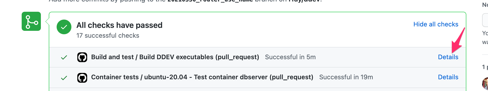
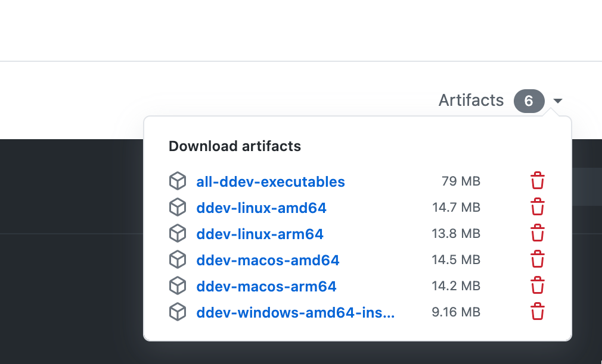

# Building, Testing, and Contributing

## Testing a PR

Each build of a PR has artifacts created in github, so you can click the details of the "Build DDEV Executables" test, and you can use the pulldown menu to access the ddev executable you need.





After you download and unzip the appropriate binary, you can place it in your $PATH. The easiest way to do this if you're using homebrew is `brew unlink ddev` and then copy the binary to /usr/local/bin/ddev. After you're done, you can remove the downloaded binary and `brew link ddev`.

(On macOS Big Sur these downloaded binaries are not signed, so you will want to `xattr -r -d com.apple.quarantine /path/to/ddev` in order to use them. The final binaries in any release are signed, of course.)

You do not typically have to install anything else other than the downloaded binary; when you run it it will access any docker images that it needs.

## Open in Gitpod

[](https://gitpod.io/#https://github.com/drud/ddev)

## Pull Requests and PR Preparation

When preparing your pull request, please use a branch name like "2020_<your_username>_short_description" so that it's easy to track to you.

If you're doing a docs-only PR that does not require full testing, please add "[skip ci][ci skip]" to your commit messages; it saves a lot of testing resources.

## Docker Image changes

If you make changes to a docker image (like ddev-webserver), it won't have any effect unless you:

* You can build an image with a specific tag by going to the image directory (like containers/ddev-webserver) by just doing `make container VERSION=<branchname>` in the containers/ddev-webserver directory.
* Push a container to hub.docker.com. Push with the tag that matches your branch. Pushing to drud/ddev-webserver repo is easy to accomplish with `make push VERSION=<branchname>` **in the container directory**. You might have to use other techniques to push to another repo (`docker push`)
* Update pkg/version/version.go with the WebImg and WebTag that relate to the docker image you pushed.

## Building

Build the project with `make` and your resulting executable will end up in .gotmp/bin/ddev (for Linux) or .gotmp/bin/windows_amd64/ddev.exe (for Windows) or .gotmp/bin/darwin/ddev (for macOS).

Build/test/check static analysis with

 ```
 make # Builds on current os/architecture
 make linux_amd64
 make linux_arm64
 make darwin_amd64
 make darwin_arm64
 make windows_amd64
 make test
 make clean
 make staticrequired
 ```

## Testing

Normal test invocation is just `make test`. Run a single test with an invocation like `go test -v -run TestDevAddSites ./pkg/...` or `make testpkg TESTARGS="-run TestDevAddSites"`. The easiest way to run tests is from inside the excellent golang IDE Goland. Just click the arrowhead to the left of the test name.

To see which DDEV commands the tests are executing, set the environment variable DDEV_DEBUG=true.

Use GOTEST_SHORT=true to run just one CMS in each test, or GOTEST_SHORT=<integer> to run exactly one project type from the list of project types in the [TestSites array](https://github.com/drud/ddev/blob/a4ab2827d8b6e706b2420700045d889a3a69f3f2/pkg/ddevapp/ddevapp_test.go#L43). For example, GOTEST_SHORT=5 will run many tests only against TYPO3.

## Automated testing

Anybody can view the CircleCI automated tests, and they usually show up any problems that are not OS-specific. Just click through on the testing section of the PR to see them.

The Buildkite automated tests require special access, which we typically grant to any PR contributor that asks for it.

## Docker image development

The Docker images that DDEV uses are included in the containers/ directory:

* containers/ddev-webserver: Provides the web servers (the "web" container).
* containers/ddev-dbserver: Provides the "db" container.
* containers/ddev-router: The router image
* containers/ddev-ssh-agent

When changes are made to an image, they have to be temporarily pushed to a tag that is preferably the same as the branch name of the PR, and the tag updated in pkg/version/version.go. Just ask if you need a container pushed to support a PR.

## Contributing

Interested in contributing to DDEV-Local? We would love your suggestions, contributions, and help! Please review our [Guidelines for Contributing](https://github.com/drud/ddev/blob/master/CONTRIBUTING.md), then [create an issue](https://github.com/drud/ddev/issues/new) or open a pull request!
