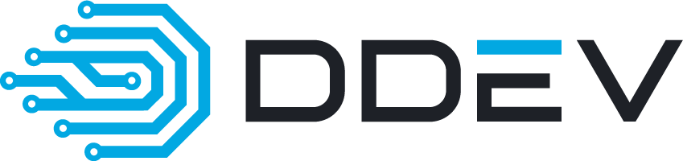

# Styleguide

## Logos

| Figurative Mark                         | Word/Figurative Mark                           |
|-----------------------------------------|------------------------------------------------|
|  |  |

You can find a set of DDEV logos [here](./logos).

If possible, use the SVG version of the logo, as a vector graphic is independent of the resolution and gives the best
results regardless of the pixel density of the display.

If the SVG format is not supported, you can use the exported PNG versions of the logo. Use @2x, @3x, and @4x for high
pixel density displays. Many applications support @2x annotations in the image path and automatically choose the correct
image for the display in use.

Currently there is no prepared version for dark backgrounds of the word/figurative mark.

## Color Plate

| DDEV Blue  | DDEV Black |
|------------|------------|
| `#02a8e2`  | `#1e2127`  |

## Use of the word mark DDEV

The product DDEV is always referenced in capital letters.

When referring to the binary ddev, lowercase letters are preferred.
