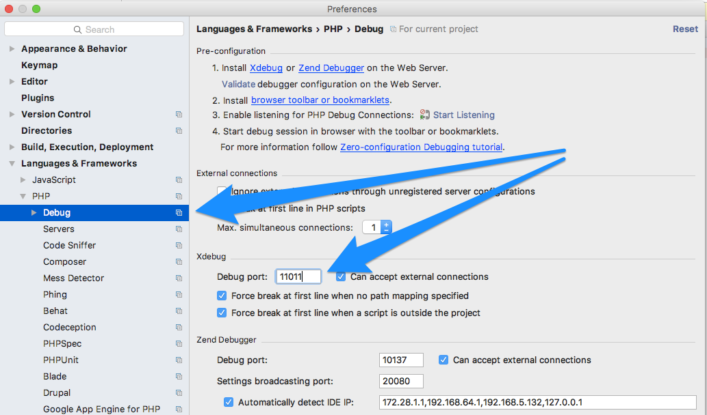
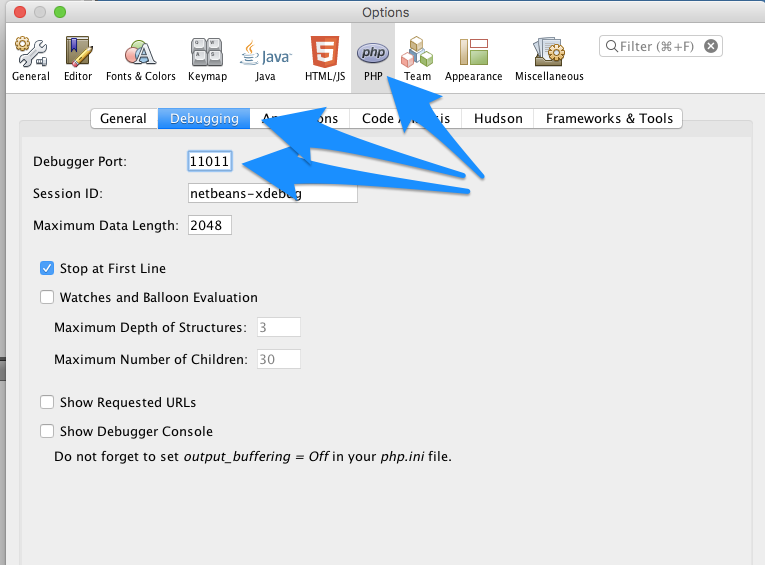
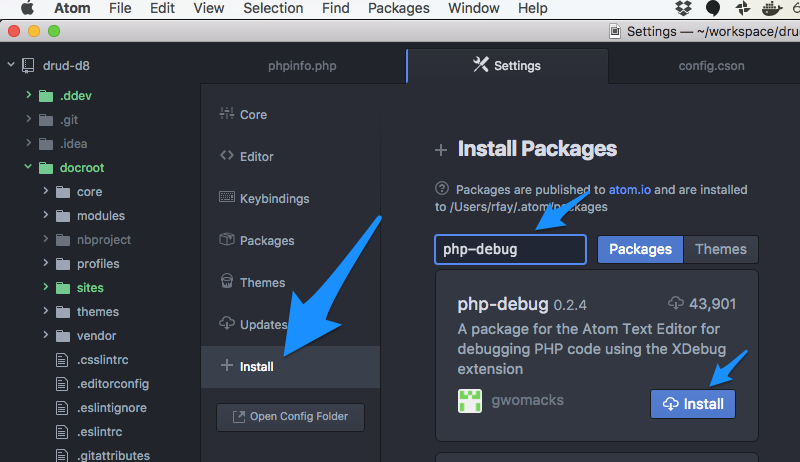

# Step-debugging with ddev and xdebug

Every ddev site is automatically configured with xdebug so that popular IDEs can do step-debugging of PHP code.

xdebug is a server-side tool: It is installed automatically on the container and you do *not* need to install it on your workstation. All you have to do on your workstation is to add an extra IP address (below) and perhaps add a browser extension or bookmark.

All IDEs basically work the same: They listen on a port and react when they're contacted there. So IDEs other than those listed here should work fine, if listening on port 11011.

**Key facts:**
* The debug server port on the IDE must be set to port 11011. Although the xdebug default is port 9000, that port often has conflicts for PHP developers, so 11011 is used with ddev.
* An IP-address *alias* of 172.28.99.99 must be added to your workstation host's loopback address. On MacOS this is done with the command `sudo ifconfig lo0 alias 172.28.99.99`. **This must currently be done after each reboot.**

For more background on XDebug see [XDebug documentation](https://xdebug.org/docs/remote). The intention here is that one won't have to understand XDebug to do debugging.

For each IDE the link to their documentation is provided, and the skeleton steps required are listed here.

## Setup Instructions

* [PHPStorm](#phpstorm)
* [NetBeans](#netbeans)
* [Atom](#atom)

### PHPStorm Debugging Setup

[PHPStorm](https://www.jetbrains.com/phpstorm/download) is a leading PHP development IDE with extensive built-in debugging support. It provides two different ways to do debugging. One requires very little effort in the PHPStorm IDE (they call it zero-configuration debugging) and the other requires you to set up a "run configuration", and is basically identical to the Netbeans or Eclipse setup. With both **you must first change the IDE "Debug port" in "Preferences" to 11011.**

#### PHPStorm Zero-Configuration Debugging

PHPStorm [zero-configuration debugging](https://confluence.jetbrains.com/display/PhpStorm/Zero-configuration+Web+Application+Debugging+with+Xdebug+and+PhpStorm) means you only have to:

1. Make sure your "Debug port" is set to 11011 in preferences.
2. Toggle the “Start Listening for PHP Debug Connections” button:
  
3. Set a breakpoint.
4. Using bookmarks from https://www.jetbrains.com/phpstorm/marklets/, "start debugger"
5. Visit a page that should stop in the breakpoint you set.

#### PHPStorm "Run/Debug configuration" Debugging

PHPStorm [run/debug configurations](https://www.jetbrains.com/help/phpstorm/2017.1/run-debug-configurations.html) require slightly more up-front work but can offer more flexibility and may be easier for some people.

1. Make sure your "Debug port" is set to 11011 in preferences.
2. Under the "Run" menu select "Edit configurations"
3. Click the "+" in the upper left and choose "PHP Web Application" to create a configuration. Give it a reasonable name.
4. Create a "server" for the site. (Screenshot below)
5. Add file mappings for the docroot of the server. If your repo has the main code in the root of the repo, that will map to /var/www/html. If it's in a docroot directory, it would map to /var/www/html/docroot.
6. Set an appropriate breakpoint.
7. Start debugging by clicking the "debug" button, which will launch a page in your browser.

Server creation:

### Netbeans Debugging Setup

[Netbeans](https://netbeans.org/) is a free IDE which has out-of-the-box debugging configurations for PHP. You'll want the *PHP* download bundle from the [download page](https://netbeans.org/downloads/).

Before, beginning anything else, please set your Debugger Port to 11011. (Preferences->PHP->Debugging):

1. Create a PHP project that relates to your site repository. (File->New Project->PHP Application with Existing Sources)
2. Under "Run as", choose "Local web site (running on local web server)".
3. Under "Name and Location", give the sources folder of the **docroot/webroot** of your site.

4. Under "Run configuration" the project URL to the full URL of your dev site, for example http://drud-d8.ddev.local/, and choose the index file.

5. Set a breakpoint.
6. Click the "Debug" button.

### Atom Debugging Setup

[Atom](https://atom.io/) is an extensible developers' editor promoted by Github. There are lots of extensions available for it, including [php-debug](https://atom.io/packages/php-debug), an alpha-level project but one that makes it fairly easy to do PHP debugging.

1. Install an xdebug helper extension for your browser, [as suggested in documentation](https://atom.io/packages/php-debug#setting-up-xdebug)
2. Under Preferences->+Install install the php-debug add-on:

3. Add configuration to the Atom config.cson by choosing "Config..." under the "Atom" menu. A "php-debug" stanza must be added, with file mappings that relate to your project. (Example [config.cson snippet](snippets/atom_config_cson_snippet.txt)

4. Open a project/folder and open a PHP file you'd like to debug.
5. Set a breakpoint. (Right-click->PHP Debug->Toggle breakpoint)
6. Turn on debugging in Atom (Right-click->PHP Debug->Toggle Debugging)
7. Turn on debugging in your browser using the browser extension.
8. Visit a page that should trigger your breakpoint.