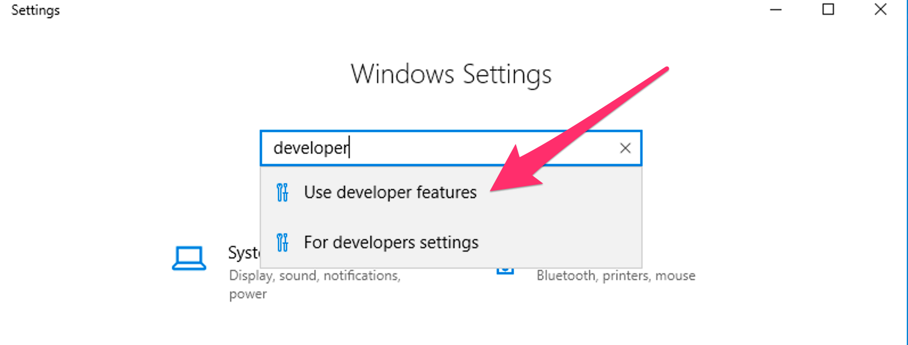
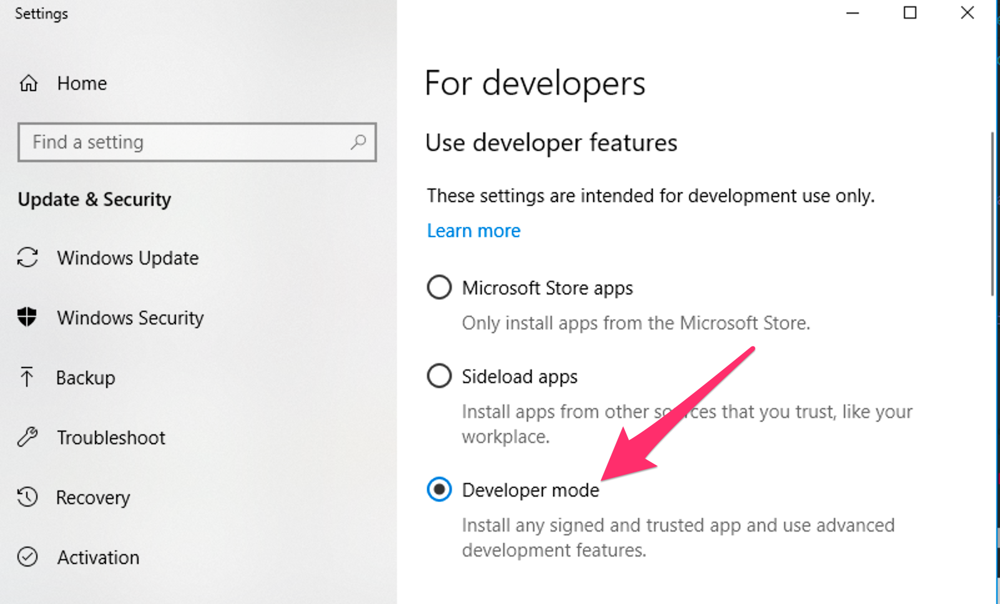

<h1>Using Developer Tools with ddev</h1>

## Developer Tools Included in the Container
Several useful developer tools are included inside the containers. Run `ddev describe` to see the project information and services available for your project and how to access them.   

### Command-line Tools in the Containers
- MySQL Client (mysql) - Command-line interface for interacting with MySQL/MariaDB.
- [Drush](http://www.drush.org) - Command-line shell and Unix scripting interface for Drupal.
- [WP-CLI](http://wp-cli.org/) - Command-line tools for managing WordPress installations, available both as "wp" and as "wp-cli".
- npm and yarn
- node
- sqlite3

These tools can be accessed for single commands using [`ddev exec <command>`](cli-usage.md#executing-commands-in-containers) or [`ddev ssh`](cli-usage.md#ssh-into-containers) for an interactive bash or sh session.

### DDEV and Composer 
ddev provides a built-in command to simplify use of [Composer](https://getcomposer.org/), the dependency manager for PHP, that allows a user to create and manage projects without having Composer installed on the host machine. Generally, executing any Composer command through DDEV is as simple as prepending the command with `ddev`. DDEV will execute the command at the project root in the web container, passing all arguments and flags to Composer. To execute Composer in other directories within the container, use `ddev ssh` or `ddev exec -d <dir>`. For example:

`ddev composer help`
`ddev composer require <package>`

Additionally, Composer can be used to initialize new projects with `ddev composer create`. This command supports limited argument and flag options, and will install a new project to the project root in `/var/www/html`. The package and version arguments are required:

`ddev composer create [<flags>] "<package>:<version>"`

For example:

`ddev composer create --no-dev "typo3/cms-base-distribution:^9"`

To execute a fully-featured `composer create-project` command, you can execute the command from within the container after executing `ddev ssh`, or pass the full command to `ddev exec`, like so:

`ddev exec composer create-project ...`

<a name="windows-os-and-ddev-composer"></a>
#### Windows OS and `ddev composer`

Both composer and Docker Desktop for Windows introduce quite complex filesystem workarounds. DDEV attempts to help you with each of them.

You generally don't have to worry about any of this, but it does keep things cleaner. Mostly just a few of the more complex TYPO3 projects have been affected.

* On Docker Desktop for Windows, symlinks are created in the container as "simulated symlinks", or XSym files. These are special text files that behave as symlinks inside the container (on CIFS filesystem), but appear as simple text files on the Windows host. (on the CIFS filesystem used by Docker for Windows inside the container there is no capability to create real symlinks, even though Windows now has this capability.)
* DDEV-Local attempts to clean up for this situation. Since Windows 10 (in developer mode) can now create real symlinks, DDEV-Local scans your repository after a `ddev composer` command and attempts to convert XSym files into real symlinks. It can only do this if your Windows 10 host is set to Developer Mode.
* On Windows 10, to set your computer to developer mode, search for "developer" in settings. Screenshots are below.
* Docker Toolbox (Windows 10 Home) does not have any capability to create symlinks inside the web container on a mount. But composer detects this and uses copies instead of symlinks.





### Email Capture and Review

[MailHog](https://github.com/mailhog/MailHog) is a mail catcher which is configured to capture and display emails sent by PHP in the development environment.

After your project is started, access the MailHog web interface at its default port:

```
http://mysite.ddev.site:8025
```

Please note this will not intercept emails if your application is configured to use SMTP or a 3rd-party ESP integration. If you are using SMTP for outgoing mail handling ([Swiftmailer](https://www.drupal.org/project/swiftmailer) or [SMTP](https://www.drupal.org/project/smtp) modules for example), update your application configuration to use `localhost` on port `1025` as the SMTP server locally in order to use MailHog.

### Database Management

[phpMyAdmin](https://www.phpmyadmin.net/) is a free software tool to manage MySQL and MariaDB databases from a browser. phpMyAdmin comes installed with ddev. 

After your project is started, access the phpMyAdmin web interface at its default port:

```
http://mysite.ddev.site:8036
```

If you use the free [Sequel Pro](https://www.sequelpro.com/) database browser for macOS, run `ddev sequelpro` within a project folder, and Sequel Pro will launch and access the database for that project. 

## Using Development Tools on the Host Machine

It is possible in many cases to use development tools installed on your host machine on a project provisioned by ddev. Tools that interact with files and require no database connection, such as Git or Composer, can be run from the host machine against the code base for a ddev project with no additional configuration necessary.

### Database Connections from the Host

If you need to connect to the database of your project from the host machine, run `ddev describe` to retrieve the database connection information. The last line of the database credentials will provide your host connection info, similar to this:

```
To connect to mysql from your host machine, use port 32838 on 127.0.0.1
For example: mysql --host 127.0.0.1 --port 32838
```

The port referenced is unique per running project, and randomly chosen from available ports on your system when you run `ddev start`.

**Note:** The host database port is likely to change any time a project is stopped/removed and then later started again.

### Using Drush 8 installed Installation on the Host Computer
If you have PHP and Drush installed on your host system, you can use it to interact with a ddev project. On the host system the extra include ddev_drush_settings.php is written on startup and will allow drush to access the database server. This may not work for all drush commands because of course the actual webserver environment is not available.
