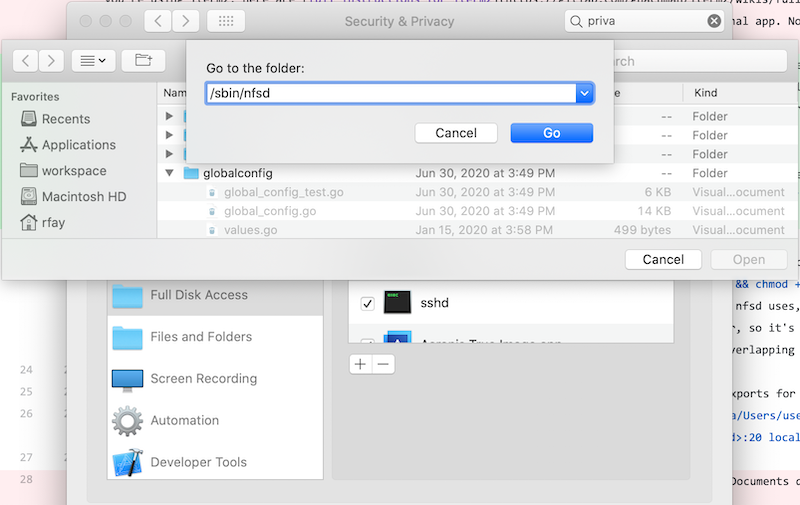

## Performance

Every developer wants both fast startup of the environment and quick response to web page requests. DDEV-Local is always focused on improving this. However, both Docker Desktop for Windows and Docker Desktop for Mac have significant performance problems with mounted filesystems (like the mounted project where code can be edited either inside the container or on the host).

## Freeing Up System Resources

Every project you run uses system resources, and may compete for those resources. A reasonable practice is to stop projects that aren't currently in use, or stop all projects with `ddev poweroff` and then start the one that you're actually working on. `ddev list` will show you the projects you're working on.

## Docker Desktop for Mac Settings

Docker Desktop for Mac has a number of settings that you'll want to pay attention to. Under "Advanced" in the "Resources" section in "Preferences", you can adjust the amount of memory, disk, and CPUs allocated to Docker. While the defaults work well for a small project or two, you may want to adjust these upward based on your experience. The default memory allocation is 2GB, but many people raise it to 4-5GB or even higher. The disk allocation almost always needs to be raised to accommodate increased downloaded images. Your experience will determine what to do with CPUs.

## Using NFS to Mount the Project into the Web Container

NFS (Network File System) is a classic, mature Unix technique to mount a filesystem from one device to another. It provides significantly improved webserver performance on macOS and Windows. DDEV-Local supports this technique, but it **does requires a small amount of pre-configuration on your host computer.** DDEV-Local doesn't make changes to your computer's configuration without your involvement and approval, so this is  done with a setup script that you run and that asks you for your `sudo` password.

The steps to set up NFS mounting on any operating system are:

1. Make sure DDEV-Local is already working and you can use it.
2. Configure the NFS server and exports files using the provided scripts for each operating system.
3. Test that NFS is working correctly by using `ddev debug nfsmount` in a project directory. The first line should report something like "Successfully accessed NFS mount of /path/to/project"
4. Enable NFS mounting globally with `ddev config global --nfs-mount-enabled`  (You can also configure NFS mounting on a per-project basis with `ddev config --nfs-mount-enabled` in the project directory, but this is unusual. If nfs mounting is turned on globally it overrides any local project settings for NFS.)
5. `ddev start` your project and make sure it works OK. Use `ddev describe` to verify that NFS mounting is being used. The NFS status is near the top of the output of `ddev describe`.

Note that you can use the NFS setup described for each operating system below (and the scripts provided) or you can set up NFS any way that works for you. For example, if you're already using NFS with vagrant on macOS,and you already have a number of exports, the default export here (your home directory) won't work, because you'll have overlaps in your /etc/exports. Or on Windows, you may want to use an NFS server other than Winnfsd, for example the [Allegro NFS Server](https://nfsforwindows.com). The setups provided below and the scripts provided below are only intended to get you started if you don't already use NFS.

Note that NFS does not really add to performance on Linux, so it is not recommended.

### macOS NFS Setup

Download, inspect, make executable, and run the [macos_ddev_nfs_setup.sh](https://raw.githubusercontent.com/drud/ddev/master/scripts/macos_ddev_nfs_setup.sh) script. Use `curl -O https://raw.githubusercontent.com/drud/ddev/master/scripts/macos_ddev_nfs_setup.sh && chmod +x macos_ddev_nfs_setup.sh && ./macos_ddev_nfs_setup.sh`. This stops running ddev projects, adds your home directory to the /etc/exports config file that nfsd uses, and enables nfsd to run on your computer. This is a one-time setup. Note that this shares your home directory via NFS to any NFS client on your computer, so it's critical to consider security issues; It's easy to make the shares in /etc/exports more limited as well, as long as they don't overlap (NFS doesn't allow overlapping exports).

If your DDEV-Local projects are set up outside your home directory, you'll need to edit /etc/exports to add a line for that share as well.
`sudo vi /etc/exports` and copy the line the script has just created (`/System/Volumes/Data/Users/username -alldirs -mapall=<your_user_id>:20 localhost`), editing it with the additional path, e.g: `/Volumes/SomeExternalDrive -alldirs -mapall=<your_uid>:20 localhost`.

__Warning:__ You may need to temporarily give your terminal "Full disk access" before you (or the script provided) can edit /etc/exports. The basic idea is that in the System Preferences -> Security and Privacy -> Privacy you need to give "Full Disk Access" permissions to your terminal app. Note that the "Full Disk Access" privilege is only needed when the /etc/exports file is being edited by you, usually a one-time event. (Note that in more recent versions of macOS a prompt will do this automatically and temporarily for you.)

__Warning:__ If the projects are in a subdirectory of the ~/Documents directory or on an external drive, it is necessary to grant the "Full Disk Access" permission to the `/sbin/nfsd` binary. Full details are [below](#upgrading-catalina).

### Windows NFS Setup

The executable components required for Windows NFS (winnfsd and nssm) are packaged with the ddev_windows_installer in each release, so if you've used the windows installer, they're available already.  To enable winnfsd as a service, please download, inspect and run the script "windows_ddev_nfs_setup.sh" installed by the installer in \Program Files\ddev\windows_ddev_nfs_setup.sh (or download from [windows_ddev_nfs_setup.sh](https://raw.githubusercontent.com/drud/ddev/master/scripts/windows_ddev_nfs_setup.sh)) in a git-bash session on windows. If your DDEV-Local projects are set up outside your home directory, you'll need to edit the ~/.ddev/nfs_exports.txt created by the script and then restart the service with `sudo nssm restart nfsd`.

**Firewall issues**: On Windows 10 you will likely run afoul of the Windows Defender Firewall, and it will be necessary to allow `winnfsd` to bypass it. If you're getting a timeout with no information after `ddev start`, try going to "Windows Defender Firewall" -> "Allow an app or feature through Windows Defender Firewall", "Change Settings", "Allow another app". Then choose C:\Program Files\ddev\winnfsd.exe, assuming that's where  winnfsd is installed.

Also see the debugging section below, and the special Windows debugging section.

### Debugging `ddev start` failures with `nfs_mount_enabled: true`

There are a number of reasons that the NFS mount can fail on `ddev start`:

* Firewall issues
* NFS Server not running
* Trying to start more than one NFS server.
* NFS exports overlap. This is typically an issue if you've had another NFS client setup (like vagrant). You'll need to reconfigure your exports paths so they don't overlap.
* Path of project not shared in `/etc/exports` (or `~/.ddev/nfs_exports.txt` on Windows)
* Project is in the ~/Documents directory or an external drive on macOS Catalina or higher (see macOS information below)

Tools to debug and solve permission problems:

* Try `ddev debug nfsmount` in a project directory to see if basic NFS mounting is working. If that works, it's likely that everything else will.
* When debugging, please do `ddev restart` in between each change. Otherwise, you can have stale mounts inside the container and you'll miss any benefit you may find in the debugging process.
* Inspect the /etc/exports (or `~/.ddev/nfs_exports.txt` on Windows).
* Restart the server (`sudo nfsd restart` on macOS, `sudo nssm restart nfsd` on Windows).
* `showmount -e` on macOS will show the shared mounts.

<a name="upgrading-catalina"></a>

### Upgrading to macOS Catalina and Above

* If you are on macOS Catalina and above, and your projects are in a subdirectory of the ~/Documents directory or on an external drive, you must grant "Full Disk Access" privilege to /sbin/nfsd in the Privacy settings in the System Preferences. On the "Full disk access" section, click the "+" and add `/sbin/nfsd` as shown here: 
You should then see nfsd in the list as shown:
.
* `sudo nfsd restart`
* Use `ddev debug nfsmount` in a project directory to make sure it gives successful output like

    ```
    $ ddev debug nfsmount
    Successfully accessed NFS mount of /Users/rfay/workspace/d8composer
    TARGET    SOURCE                                                FSTYPE OPTIONS
    /nfsmount :/System/Volumes/Data/Users/rfay/workspace/d8composer nfs    rw,relatime,vers=3,rsize=65536,wsize=65536,namlen=255,hard,nolock,proto=tcp,timeo=600,retrans=2,sec=sys,mountaddr=192.168.65.2,mountvers=3,mountproto=tcp,local_lock=all,addr=192.168.65.2
    /nfsmount/.ddev
    ```

### macOS-specific NFS debugging

* Please temporarily disable any firewall or VPN.
* Use `showmount -e` to find out what is exported via NFS. If you don't see a parent of your project directory in there, then NFS can't work.
* If nothing is showing, use `nfsd checkexports` and read carefully for errors
* Use `ps -ef | grep nfsd` to make sure nfsd is running
* Restart nfsd with `sudo nfsd restart`
* Add the following to your /etc/nfs.conf:

```conf
nfs.server.mount.require_resv_port = 0
nfs.server.verbose = 3
```

* Run Console.app and put "nfsd" in the search box at the top. `sudo nfsd restart` and read the messages carefully. Attempt to `ddev debug nfsmount` the problematic project directory.

### Windows-specific NFS debugging

* Please temporarily disable any firewall or VPN.

* You can only have one NFS daemon running, so if another application has installed one, you'll want to use that NFS daemon and reconfigure it to allow NFS mounts of your projects.

1. Stop the running winnfsd service: `sudo nssm stop nfsd`
2. Run winnfsd manually in the foreground: `winnfsd "C:\\"`. If it returns to the shell prompt immediately there's likely another nfsd service running.
3. In another window, in a ddev project directory, `ddev debug nfsmount` to see if it can mount successfully. (The project need not be started.). `ddev debug nfsmount` is successful, then everything is probably going to work.
4. After verifying that ~/.ddev/nfs_exports.txt has a line that includes your project directories, `sudo nssm start nfsd` and `nssm status nfsd`. The status command should show SERVICE_RUNNING.
5. These [nssm](https://nssm.cc/) commands may be useful: `nssm help`, `sudo nssm start nfsd`, `sudo nssm stop nfsd`, `nssm status nfsd`, `sudo nssm edit nfsd` (pops up a window that may be hidden), and `sudo nssm remove nfsd` (also pops up a window, doesn't work predictably if you haven't already stopped the service).
6. nssm logs failures and what it's doing to the system event log. Run "Event Viewer" and filter events as in the image below: .
7. Please make sure you have excluded winnfsd from the Windows Defender Firewall, as described in the installation instructions above.
8. On Windows 10 Pro you can "Turn Windows features on or off" and enable "Services for NFS"-> "Client for NFS". The `showmount -e` command will then show available exports on the current machine. This can help find out if a conflicting server is running or exactly what the problem with exports may be.
