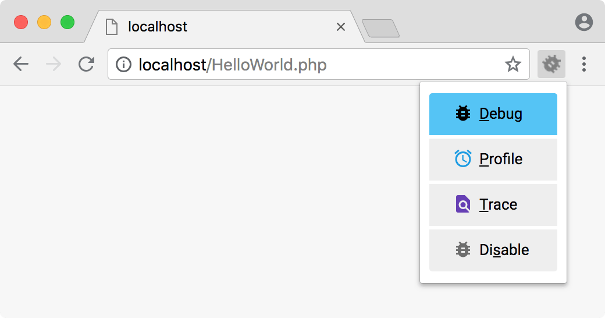

## Step-debugging with ddev and xdebug

Every ddev project is automatically configured with xdebug so that popular IDEs can do step-debugging of PHP code
without any server side configuration. Check the [configuration](#Configuration) section for details how you can
change the xdebug configuration for your ddev project.

### Enable debugging in your IDE

#### PHPStorm

1. Toggle the Start Listen PHP Debug Connections button start listening php debug connections on the PhpStorm toolbar.
   
2. Set a breakpoint
3. When you start debugging a [website](#Debug a website) or [CLI application](#Debug a CLI application) PhpStorm might
   ask you for a path mapping. The default will work for single files, but to debug complex application you have to got
   to `File | Settings | PHP | Servers` and map your project directory to `/var/www/html`.
   

Note that if you are using PhpStorm inside WSL2 (or perhaps other Linux configurations),
under `Help | Edit Custom VM Options`, add a line: `-Djava.net.preferIPv4Stack=true` This makes PhpStorm listen for
Xdebug using IPV4; the Linux version of PhpStorm seems to default to using only IPv6.

For additional information
see [PHPStorm zero-configuration debugging](https://www.jetbrains.com/help/phpstorm/zero-configuration-debugging.html).

#### Visual Studio Code (vscode)

1. Install the [php-debug](https://marketplace.visualstudio.com/items?itemName=felixfbecker.php-debug) extension.
2. Update the project's [launch.json] (in `.vscode/launch.json`)  to add "Listen for xdebug" (
   see [config snippet](snippets/launch.json)). For more on launch.json,
   see [vscode docs](https://code.visualstudio.com/docs/editor/debugging#_launch-configurations).
3. Set a breakpoint in your index.php. If it isn't solid red, restart.
4. In the menu, choose Run->Start Debugging.You may have to select "Listen for XDebug" by the green arrowhead at the top
   left. The bottom pane of vscode should now be orange (live) and should say "Listen for XDebug".

Note that if you are using vscode on Windows with WSL2, you'll want the "PHP Debug" extension enabled in your distro (
for example, Ubuntu). You'll also need the "Remote - WSL" extension enabled. vscode will suggest both of these to you if
you have WSL2 enabled and a PHP project.

### Debug a website

To start and stop Xdebug from the browser, you need to set a cookie parameter. You can use one of the
[available browser debugging extensions](#Available browser debugging extensions). Alternatively you can debug every
request by executing `ddev xdebug autostart`.

Activate the debugging extension in your browser:



#### Available browser debugging extensions

| Chrome                                                                                        | Firefox                                                                                                                                                                        | Internet Explorer                                                               | Microsoft Edge                                                                                                    | Safari                                                                             | Opera                                                                           |
|-----------------------------------------------------------------------------------------------|--------------------------------------------------------------------------------------------------------------------------------------------------------------------------------|---------------------------------------------------------------------------------|-------------------------------------------------------------------------------------------------------------------|------------------------------------------------------------------------------------|---------------------------------------------------------------------------------|
| [Xdebug Helper](https://chrome.google.com/extensions/detail/eadndfjplgieldjbigjakmdgkmoaaaoc) | [Xdebug Helper](https://addons.mozilla.org/en-US/firefox/addon/xdebug-helper-for-firefox/) or [Xdebug-ext](https://addons.mozilla.org/en-US/firefox/addon/xdebug-ext-quantum/) | [PhpStorm bookmarklets generator](https://www.jetbrains.com/phpstorm/marklets/) | [Xdebug Helper](https://microsoftedge.microsoft.com/addons/detail/xdebug-helper/ggnngifabofaddiejjeagbaebkejomen) | [`XDebugToggle`](https://apps.apple.com/app/safari-xdebug-toggle/id1437227804?mt=12) | [PhpStorm bookmarklets generator](https://www.jetbrains.com/phpstorm/marklets/) |

### Debug a command line application

To start a step debug session for a PHP script on the command line prefix your command line
with `php -dxdebug.start_with_request=yes {path_to_your_script}` when executing the script inside the ddev container.

Alternatively you can run `ddev xdebug autostart` and just execute the script as usual.

Your IDE may offer you additional ways to debug for example unit tests.

Please note: When using PHPStorm you should first [debug a website](#Debug a website) and configure a path mapping.

### Configuration

**Key facts:**

* You can let xdebug start a debugging session for every request with `ddev xdebug autostart` and
  return to the default with `ddev xdebug trigger`
* You can disable xdebug with `ddev xdebug off` or setting `xdebug_enabled: false` in your `.ddev/config.yml`
* `ddev xdebug status` will show you the current xdebug configuration
* If xdebug is disabled in your configuration, you can enable it for a already running container with `ddev xdebug on`

For more background on XDebug see the [XDebug documentation](https://xdebug.org/docs/remote).
The intention here is that one won't have to understand XDebug to do debugging.

#### Using Xdebug on a port other than the default

By default, ddev is set up to contact the default port, port 9003 on your IDE. However, if you have something else
listening on that port or your IDE does not yet default to 9003, you'll need to change the port. (PhpStorm and vscode
have switched to supporting 9003 instead of 9000 for some time now.)

* To override the port, add an override file in the project's `.ddev/php` directory. For example, a file
  `.ddev/php/xdebug_client_port.ini` would change to use the traditional old port 9000:

```ini
[PHP]
xdebug.client_port=9000
```

* Then change your IDE's configuration to listen on the new port.

NOTE: If you are using a PHP version below PHP7.2, you will be using Xdebug version 2.x, instead of 3.x. In that case
the port config should be `xdebug.remote_port` instead.

### Troubleshooting Xdebug

xdebug is a server-side tool: It is installed automatically on the container and you do *not* need to install or
configure it on your workstation.

The basic thing to understand about xdebug is that it's a network protocol. Your IDE (like PhpStorm) will listen on the
xdebug port (9003 by default in v1.19+, previously 9000). When an xdebug session is started, php inside the container
will try to open a TCP connection to the IDE. When starting the session via a browser xdebug will try to connect back to
client, otherwise `host.docker.internal:9003` will be used to connect, which is provided by docker. So you have to make
sure that the network connection is clear and can be made and everything should work.

All IDEs basically work the same: They listen on a port and react when they're contacted there. IDEs other than those
listed here work fine, if they listen on the default xdebug port 9003. (This was port 9000 through DDEV v1.18, changed
to 9003 in v1.19+)

Here are basic steps to take to sort out any difficulty:

* Remember that the port in play is port 9003 for DDEV v1.19+, but before that it was port 9000.
* Reboot your computer.
* Temporarily disable any *firewall* or *VPN* if you're having trouble. Xdebug is a network protocol, and the php
  process inside the web container must be able to establish a TCP connection to the listening IDE (PhpStorm, for
  example).
* Use `ddev xdebug autostart` to enable xdebug when you want it, and `ddev xdebug off` or `ddev xdebug trigger` when
  you're done with it.
* Set a breakpoint at the first executable line of your index.php.
* Tell your IDE to start listening. (PhpStorm: Click the telephone button, vscode: run the debugger.)
* Use `curl` or a browser to create a web request. For example, `curl https://d9.ddev.site`
* If the IDE doesn't respond, take a look at `ddev logs`. If you see a message like ""PHP message: Xdebug: [Step Debug]
  Could not connect to debugging client. Tried: host.docker.internal:9003 (through
  xdebug.client_host/xdebug.client_port)" then php/xdebug (inside the container) is not able to make a connection to
  port 9003.
* `ddev ssh` into the web container. Can you `telnet host.docker.internal 9003` and have it connect? If you can't, you
  might have an over-aggressive firewall. Disable it, or add a rule that would allow the connection to pass through. For
  example, on Debian/ Ubuntu that would be `sudo ufw allow 9003/tcp`.
* In PhpStorm, disable the "listen for connections" button so it won't listen. Or just exit PhpStorm. With another IDE
  like vscode, stop the debugger from listening.
* `ddev ssh`: Can `telnet host.docker.internal 9003` connect? If it does, you have something else running on port 9003.
  On the host, use `sudo lsof -i :9003 -sTCP:LISTEN` to find out what is there and stop it,
  or [change the xdebug port and configure PhpStorm to use the new one](#using-xdebug-on-a-port-other-than-the-default)
  . Don't continue debugging until your telnet command does not connect. (Note that on Windows WSL2 you may have to look
  for listeners both inside WSL2 and on the Windows side.)
* Now click the listen button on PhpStorm to start it listening for connections.
* `ddev ssh` and try the `telnet host.docker.internal 9003` again. It should connect. If not, maybe PhpStorm is not
  listening, or not configured to listen on port 9003?
* Check to make sure that Xdebug is enabled. You can use `php -i | grep -i xdebug` inside the container, or use any
  other technique you want that gives the output of `phpinfo()`, including Drupal's admin/reports/status/php. You should
  see `with Xdebug v3` and `php -i | grep xdebug.mode` should include `debug`.
* Set a breakpoint in the first relevant line of the index.php of your project and then visit the site in a browser. It
  should stop at that first line.
* If you are using PhpStorm inside WSL2 (or perhaps other Linux configurations), under `Help→ Edit Custom VM Options`,
  add an additional line: `-Djava.net.preferIPv4Stack=true` This makes PhpStorm listen for Xdebug using IPV4; the Linux
  version of PhpStorm seems to default to using only IPV6.
* If you are on WSL2 using Docker Desktop, make sure that the `docker` command is the one provided by Docker
  Desktop. `ls -l $(which docker)` should show a link to `/mnt/wsl/docker-desktop...`. If you are on WSL2 using docker
  installed inside WSL2, make sure that `ls -l $(which docker)` is *not* a link to `/mnt/wsl`.
