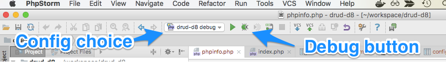

## Step-debugging with ddev and xdebug

Every ddev project is automatically configured with xdebug so that popular IDEs can do step-debugging of PHP code. It is disabled by default for performance reasons, so you'll need to enable it in your config.yaml.

xdebug is a server-side tool: It is installed automatically on the container and you do *not* need to install or configure it on your workstation.

All IDEs basically work the same: They listen on a port and react when they're contacted there. IDEs other than those listed here work fine, if they listen on the default xdebug port 9000.

**Key facts:**

* Enable xdebug by running `ddev xdebug` or `ddev xdebug on` in your project directory. It will remain enabled until you start or restart the project.
* Disable xdebug for better performance when not debugging with `ddev xdebug off`
* `ddev xdebug status` will show current status.
* The debug server port on the IDE must be set to port 9000, which is the default and is probably already set in most IDEs. (If you need to change the xdebug port due to a port conflict on your host computer, you can do it with a PHP override, explained below.)

For more background on XDebug see [XDebug documentation](https://xdebug.org/docs/remote). The intention here is that one won't have to understand XDebug to do debugging.

For each IDE the link to their documentation is provided, and the skeleton steps required are listed here.

### Setup for Various IDEs

* [PhpStorm](#phpstorm)
* [Visual Studio Code (vscode)](#vscode)
* [Atom](#atom)

<a name="phpstorm"></a>

### PhpStorm Debugging Setup

[PhpStorm](https://www.jetbrains.com/phpstorm/download) is a leading PHP development IDE with extensive built-in debugging support. It provides two different ways to do debugging. One requires very little effort in the PhpStorm IDE (they call it zero-configuration debugging) and the other requires you to set up a "run configuration", and is basically identical to the Netbeans or Eclipse setup.

**Please note that PhpStorm 2018 and before are not compatible with current versions of XDebug.**

#### PhpStorm Zero-Configuration Debugging

PhpStorm [zero-configuration debugging](https://confluence.jetbrains.com/display/PhpStorm/Zero-configuration+Web+Application+Debugging+with+Xdebug+and+PhpStorm) will automatically detect a connection and offer to create a "server", a file mapping from your workstation to the container. This means you only have to:

1. Toggle the “Start Listening for PHP Debug Connections” button:
  
2. Set a breakpoint.
3. Visit a page that should stop in the breakpoint you set.
4. PhpStorm will ask you what mapping to use, so it can figure out how to map the path inside the container to the path on your workstation. The first time you do this with a project, PhpStorm will pop up a "server" dialog box to set the mapping. The default will work, but it's best to click the checkbox to map the whole project directory to /var/www/html.

Note when using this recommended option:

1. Please use the latest DDEV version.
2. Under Run >> Edit Configurations, check that there are no "Servers" already defined. PhpStorm will create a new "Server" (file mapping) for you as discussed above, but only if you don't already have one. You can delete all servers and have PhpStorm create a new one, or you can create/edit an existing server as discussed below.

#### PhpStorm "Run/Debug configuration" Debugging

PhpStorm [run/debug configurations](https://www.jetbrains.com/help/phpstorm/creating-and-editing-run-debug-configurations.html) require slightly more up-front work but can offer more flexibility and may be easier for some people.

1. Under the "Run" menu select "Edit configurations"
2. Click the "+" in the upper left and choose "PHP Web Application" to create a configuration. Give it a reasonable name.
3. Create a "server" for the project. Make sure that "Name" is exactly the same as your "host" (e.g. `my-site.ddev.site`) (Screenshot below)
4. Add file mappings for the files on the server. Click on the local repo path and add "/var/www/html" as the "Absolute path on the server" and your repository root as the path on the host.
5. Set an appropriate breakpoint.
6. Start debugging by clicking the "debug" button, which will launch a page in your browser.



Server creation:


#### PhpStorm and Command-Line Debugging

If you need to debug command-line PHP processes, especially code that is outside the docroot (as in /vendor) there's a little extra work to be done:

* If you have used PhpStorm with xdebug you already have a PhpStorm "server" with the same name as your primary URL (see "Languages and Frameworks" -> "PHP" -> "Servers"). The key job of the "server" is to map filesystem locations on the workstation (your computer) to filesystem locations on the remote server (in this case the ddev-webserver container). Often, PhpStorm has automatically set up a mapping that doesn't include the entire project (so the vendor directory is not mapped, for example). So map the top-level directory of your project to /var/www/html in the container, as in this image:

* When debugging a command-line script inside the container, the environment variable PHP_IDE_CONFIG is automatically set for you, so it will be something like `PHP_IDE_CONFIG=serverName=d8composer.ddev.site`.  

<a name="atom"></a>

### Atom Debugging Setup

[Atom](https://atom.io/) is an extensible developers' editor promoted by GitHub. The available extensions include [php-debug](https://atom.io/packages/php-debug) which you can use to conduct PHP debugging with the Xdebug PHP extension. This project is currently an alpha release.

1. Under Preferences->+Install install the php-debug add-on:

2. Add configuration to the Atom config.cson by choosing "Config..." under the "Atom" menu. A "php-debug" stanza must be added, with file mappings that relate to your project. Additionally, you will need to disable the debugger that comes with the `atom-ide-ui` package. (Example [config.cson snippet](snippets/atom_config_cson_snippet.txt)

3. Restart Atom to ensure new settings are loaded.
4. Open a project/folder and open a PHP file you'd like to debug.
5. Set a breakpoint. (Right-click->PHP Debug->Toggle breakpoint)
6. Open the debug view and enable debugging by choosing Packages->PHP-Debug->Toggle Debugging. You should see "Listening on address:port 127.0.0.1:9000".
7. Visit a page that should trigger your breakpoint.

An example configuration:

```
  "atom-ide-ui":
    "atom-ide-debugger": {}
    use:
      "atom-ide-debugger": "never"
  "php-debug":
    PathMaps: [
      "remotepath;localpath"
      "/var/www/html;/Users/rfay/workspace/d8git"
    ]
```

<a name="vscode"></a>

### Visual Studio Code (vscode) Debugging Setup

1. Install the [php-debug](https://marketplace.visualstudio.com/items?itemName=felixfbecker.php-debug) extension.
2. Update the project's launch.json (.vscode/launch.json) to add "Listen for xdebug" (see [config snippet](snippets/launch.json))
3. Set a breakpoint in your index.php. If it isn't solid red, restart.
4. In the menu, choose Run->Start Debugging.You may have to select "Listen for XDebug" by the green arrowhead at the top left. The bottom pane of vscode should now be orange (live) and should say "Listen for XDebug".
5. Enable XDebug with `ddev xdebug on`
6. In a browser, visit your project, you should hit the breakpoint.

Note that if you're using vscode on Windows with WSL2, you'll want the "PHP Debug" extension enabled in your distro (for example, Ubuntu). You'll also need the "Remote - WSL" extension enabled. vscode will suggest both of these to you if you have WSL2 enabled and a PHP project.

### Using Xdebug on a Port Other than the Default

By default, ddev is set up to contact the default port, port 9000 on your IDE. However, if you have something else listening on that port, you'll need to change the port. (The most likely conflict is php-fpm, which also has 9000 as a default port.)

* To override the port, add an override file in the project's .ddev/php directory. For example, a file .ddev/php/xdebug_client_port.ini:

```ini
[PHP]
xdebug.client_port=9003
```

* Then change your IDE's configuration to listen on the new port.

NOTE: If you are not using the latest version of DDEV or if you are using a PHP version below PHP7.2, you will be using Xdebug version 2.x, instead of 3.x. In that case the port config should be `xdebug.remote_port` instead.

### Troubleshooting Xdebug

Debugging Xdebug in any setup can be a little trouble, but here are the steps to take. The steps here assume that you're using PhpStorm, but they can be adapted to any IDE.

* Temporarily disable any firewall if you're having trouble. Xdebug is a network protocol, and the php process inside the web container must be able to establish a TCP connection to the listening IDE (PhpStorm, for example).
* Use `ddev xdebug on` to enable xdebug when you want it, and `ddev xdebug off` when you're done with it.
* Don't assume that some obscure piece of code is being executed and put a breakpoint there. Start by putting a breakpoint at the first executable line in your index.php. Oh-so-many times people think it should be stopping, but their code is not being executed.
* `ddev ssh` into the web container. Can you `ping host.docker.internal` (and get responses)? If you can't, you might have an over-aggressive firewall. Try to disable it, or add a rule that would allow the connection to pass through. For example, on Debian/ Ubuntu that would be `sudo ufw allow 9000/tcp`.
* In PhpStorm, disable the "listen for connections" button so it won't listen. Or just exit PhpStorm.
* `ddev ssh`: Can `telnet host.docker.internal 9000` connect? If it does, you have something else running on port 9000, probably php-fpm. On the host, use `sudo lsof -i :9000 -sTCP:LISTEN` to find out what is there and stop it, or [change the xdebug port and configure PhpStorm to use the new one](#using-xdebug-on-a-port-other-than-the-default) . Don't continue debugging until your telnet command does not connect.
* Now click the listen button on PhpStorm to start it listening for connections.
* `ddev ssh` and try the `telnet host.docker.internal 9000` again. It should connect. If not, maybe PhpStorm is not listening, or not configured to listen on port 9000?
* Check to make sure that Xdebug is enabled. You can use `php -i | grep Xdebug` inside the container, or use any other technique you want that gives the output of `phpinfo()`, including Drupal's admin/reports/status/php. You should see `with Xdebug v2.9.6, Copyright (c) 2002-2020` and `php -i | grep "xdebug.remote_enable"` should give you `xdebug.remote_enable: On`.
* Set a breakpoint in the first relevant line of the index.php of your project and then visit the site in a browser. It should stop at that first line.
