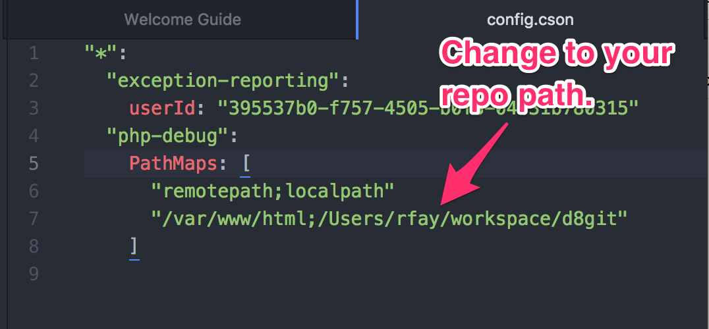

<h1>Step-debugging with ddev and xdebug</h1>

Every ddev project is automatically configured with xdebug so that popular IDEs can do step-debugging of PHP code. It is disabled by default for performance reasons, so you'll need to enable it in your config.yaml.

xdebug is a server-side tool: It is installed automatically on the container and you do *not* need to install it on your workstation.

All IDEs basically work the same: They listen on a port and react when they're contacted there. So IDEs other than those listed here should work fine, if listening on the default xdebug port 9000.

**Key facts:**

* You need to explicitly enable xdebug in your config.yaml with `xdebug_enabled: true` (it's disabled by default). After changing, `ddev start` again.
* The debug server port on the IDE must be set to port 9000, which is the default and is probably already set in most IDEs. (If you need to change the xdebug port due to a port conflict on your host computer, you can do it with a PHP override, explained below.)

For more background on XDebug see [XDebug documentation](https://xdebug.org/docs/remote). The intention here is that one won't have to understand XDebug to do debugging.

For each IDE the link to their documentation is provided, and the skeleton steps required are listed here.

## Setup Instructions

### Enable or disable xdebug in your config.yaml

Enable xdebug in your config.yaml:

`xdebug_enabled: true`

(If you don't want it set all the time, you can `ddev exec enable_xdebug` or `ddev exec disable_xdebug` any time. Many people use enable_xdebug and disable_xdebug because of the performance impact of XDebug being enabled.)

### Setup for Various IDEs

* [PHPStorm](#phpstorm)
* [Atom](#atom)
* [Visual Studio Code (vscode)](#vscode)


<a name="phpstorm"></a>
### PHPStorm Debugging Setup

[PHPStorm](https://www.jetbrains.com/phpstorm/download) is a leading PHP development IDE with extensive built-in debugging support. It provides two different ways to do debugging. One requires very little effort in the PHPStorm IDE (they call it zero-configuration debugging) and the other requires you to set up a "run configuration", and is basically identical to the Netbeans or Eclipse setup.

**Please note that PHPStorm 2018 and before are not compatible with current versions of XDebug.**

#### PHPStorm Zero-Configuration Debugging

PHPStorm [zero-configuration debugging](https://confluence.jetbrains.com/display/PhpStorm/Zero-configuration+Web+Application+Debugging+with+Xdebug+and+PhpStorm) means you only have to:

1. Toggle the “Start Listening for PHP Debug Connections” button:
  
2. Set a breakpoint.
3. Visit a page that should stop in the breakpoint you set.

#### PHPStorm "Run/Debug configuration" Debugging

PHPStorm [run/debug configurations](https://www.jetbrains.com/help/phpstorm/creating-and-editing-run-debug-configurations.html) require slightly more up-front work but can offer more flexibility and may be easier for some people.

1. Under the "Run" menu select "Edit configurations"
2. Click the "+" in the upper left and choose "PHP Web Application" to create a configuration. Give it a reasonable name.
3. Create a "server" for the project. (Screenshot below)
4. Add file mappings for the files on the server. Click on the local repo path and add "/var/www/html" as the "Absolute path on the server" and your repository root as the path on the host.
5. Set an appropriate breakpoint.
6. Start debugging by clicking the "debug" button, which will launch a page in your browser.


Server creation:


<a name="atom"></a>
### Atom Debugging Setup

[Atom](https://atom.io/) is an extensible developers' editor promoted by GitHub. The available extensions include [php-debug](https://atom.io/packages/php-debug) which you can use to conduct PHP debugging with the Xdebug PHP extension. This project is currently an alpha release. 

1. Under Preferences->+Install install the php-debug add-on:

2. Add configuration to the Atom config.cson by choosing "Config..." under the "Atom" menu. A "php-debug" stanza must be added, with file mappings that relate to your project. (Example [config.cson snippet](snippets/atom_config_cson_snippet.txt)

3. Open a project/folder and open a PHP file you'd like to debug.
4. Set a breakpoint. (Right-click->PHP Debug->Toggle breakpoint)
5. Open the debug view and enable debugging by choosing Packages->PHP-Debug->Toggle Debugging. You should see "Listening on address:port 127.0.0.1:9000".
6. Visit a page that should trigger your breakpoint.

An example configuration:
```
  "php-debug":
    PathMaps: [
      "remotepath;localpath"
      "/var/www/html;/Users/rfay/workspace/d8git"
    ]
```

<a name="vscode"></a>
### Visual Studio Code (vscode) Debugging Setup

1. Install the [php-debug](https://marketplace.visualstudio.com/items?itemName=felixfbecker.php-debug) extension.
2. Add to the launch.json the stanza defining "Listen for xdebug" (see [config snippet](snippets/vscode_listen_for_xdebug_snippet.txt))
3. Set a breakpoint in your index.php. If it isn't solid red, restart.
4. Click the vscode debug button: .
5. Run the "Listen for XDebug" job: 
6. Go to a page in your project, you should hit your breakpoint.

## Using xdebug on a Port Other than the Default

By default, ddev is set up to contact the default port, port 9000 on your IDE. However, if you have something else listening on that port, you'll need to change the port. (The most likely conflict is php-fpm, which also has 9000 as a default port.)

* To override the port, add an override file in the project's .ddev/php directory. For example, a file .ddev/php/xdebug_remote_port.ini:

```
[PHP]
xdebug.remote_port=11011
```
* Then change your IDE's configuration to listen on the new port.
