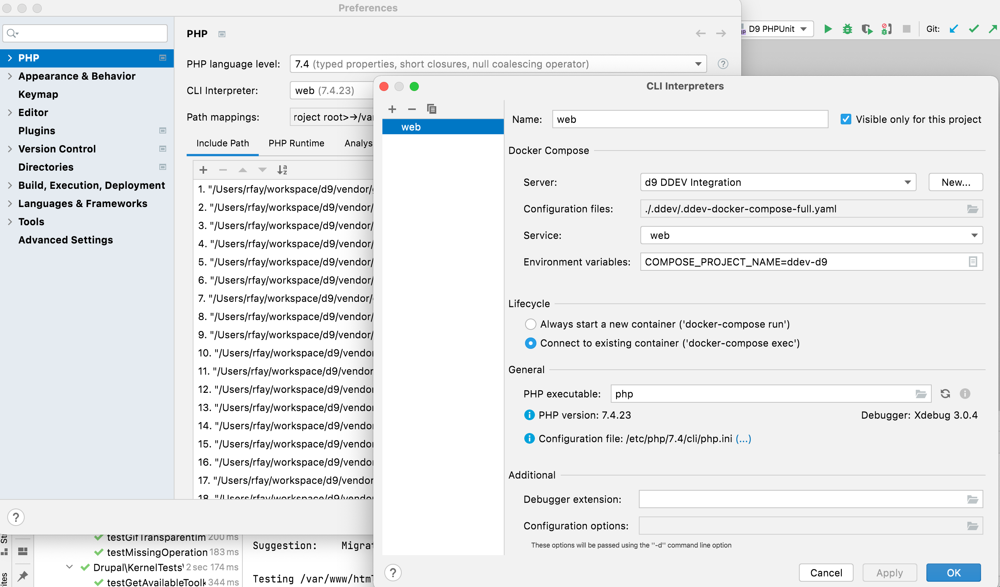
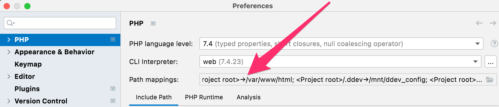
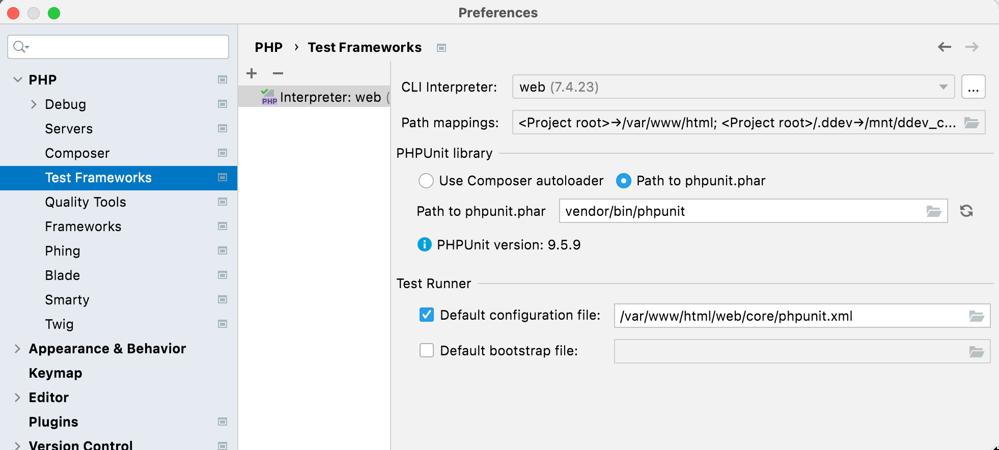
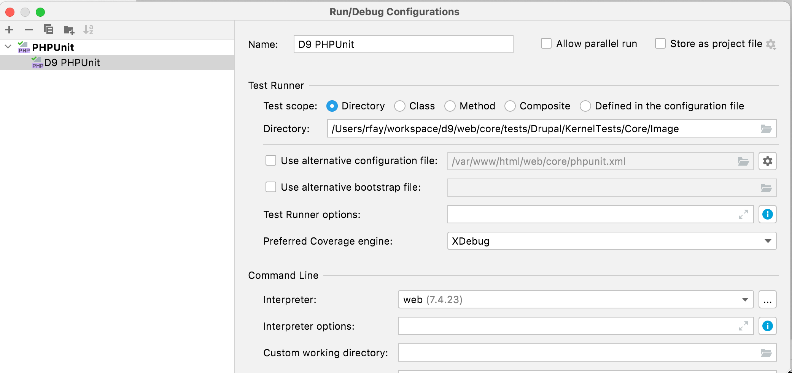
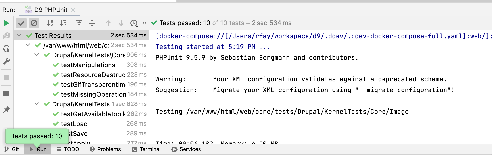

## PhpStorm Integration

This topic explores how to add full PhpStorm integration with a DDEV project, including composer and phpunit.

This is based on the wonderful [article](https://susi.dev/fully-integrate-ddev-and-phpstorm-including-unit-tests-with-coverage-update-2021) by Susi, and couldn't have been done without it, but since PhpStorm has fixed some things and DDEV has worked around others, this is far easier now. It works on macOS, Linux, Windows with WSL2 and Windows traditional. You'll end up with PhpStorm actually using the PHP interpreter inside the ddev-webserver container of your project, and able to use composer and phpunit inside there as well.

### Requirements

- PhpStorm 2021.2 or higher
- docker-compose v1. Due to a [bug or two in PhpStorm](https://youtrack.jetbrains.com/issue/WI-61205), it can't properly interpret docker-compose v2 output as of Sept 2021.  Use `docker-compose disable-v2` to switch to docker-compose v1. (Check version with `docker-compose --version`.)
- Any OS platform, but if you're using Windows PhpStorm with WSL2 the path mappings are slightly more complex. WSL2 instructions are provided where necessary.

Steps:

1. Open a DDEV project. In this example, the project name is "d9" and the site is "d9.ddev.site".
    - If you're on Windows, running PhpStorm on the Windows side but  using WSL2 for your DDEV project, open the project as a WSL2 project. In other words, in the "Open" dialog, browse to `\\wsl$\Ubuntu\home\rfay\workspace\d9` (in this example). (If you're running PhpStorm inside WSL2, there are no special instructions.)
2. Set up your project to do normal Xdebug, as described in the [Step Debugging section](../step_debugging.md). This will result in a PhpStorm "Server" with the proper name, normally the same as the FQDN of the project. In this example, "d9.ddev.site". (All you have to do here is click the little telephone to "Start listening for PHP Debug Connections", then `ddev xdebug on`, then visit a web page and choose the correct mapping from host to server. )
3. Under File→Settings→PHP (Windows) or Preferences→PHP (macOS), click the "..." to the right of "CLI Interpreter"
    1. Use the "+" to select "From Docker, Vagrant, VM..."
    2. Choose "Docker Compose"
    3. Create a server; the default name is "docker", but since the "server" for each project will be different, name it for the project, for example "DDEV d9". Choose "Docker for Windows" or "Docker for Mac"
    4. In the "Path mappings" of the "Server" you may have to map the local paths (which on WSL2 means /home/...) to the in-container paths, especially if you have mutagen enabled. So "Virtual Machine Path" would be "/var/www/html" and "Local path" would be something like /Users/rfay/workspace/d9 (on macOS) or \\wsl$\Ubuntu\home\rfay\workspace\d9 on Windows using WSL2.
    5. Now back in the "Configure Remote PHP Interpreter" for "Configuration files" use `.ddev/.ddev-docker-compose-full.yaml`
    6. Service: web
    7. Add an environment variable `COMPOSE_PROJECT_NAME=ddev-<projectname>`. In this case, it's `ddev-d9`
    8. In the CLI interpreter "Lifecycle" select "Connect to existing container"
    9. In the PHP Interpreter path, you can just put `php` if you're using the default PHP version (currently 7.4). Due to a [PhpStorm bug](https://youtrack.jetbrains.com/issue/WI-62463) you'll want to put the full name of the binary, like `php8.0` if you're not using the default version.
    10. Here's an example filled out 
4. In the main PHP setup dialog, add an entry to the path mappings, as it doesn't correctly derive the full path mapping. Add an entry that maps your project location to /var/www/html. So in this example, the Local Path is /Users/rfay/workspace/d9 and the Remote Path is /var/www/html. 
5. Configure composer under PHP→Composer.
    - Use "remote interpreter"
    - CLI Interpreter will be "web"
6. Under "Test Frameworks" click the "+" to add phpunit
    - PHPUnit by remote interpreter
    - Interpreter "web"
    - Choose "Path to phpunit.phar" and use /var/www/html/vendor/bin/phpunit (or wherever your phpunit is inside the container) (You need phpunit properly composer-installed for your CMS. For example, for Drupal 9, `ddev composer require --dev --with-all-dependencies drupal/core-dev:^9`  and `ddev composer require --dev phpspec/prophecy-phpunit:^2`
    - Default configuration file: /var/www/html/web/core/phpunit.xml or wherever yours is inside the container.
   
7. Open Run/Debug configurations and use the "+" to add a phpunit configuration. Give it a name
    - Test scope (as you wish, by directory or class or whatever)
    - Interpreter: "web" (the one we set up)
   
8. Enable Xdebug if you want to debug tests. `ddev xdebug on`
9. Run the runner that you created. 

Notes:

- Almost all of the ideas here were pioneered by [Susanne Moog](https://susi.dev/) in a [set of articles](https://susi.dev/fully-integrate-ddev-and-phpstorm-including-unit-tests-with-coverage-update-2021).
- This was developed with input from many others in [https://github.com/drud/ddev/issues/3130](https://github.com/drud/ddev/issues/3130)
- Joe Shindelar ([@eojthebrave](https://www.drupal.org/u/eojthebrave)) has a great explanation of the whole thing, including Chromedriver and focused on Drupal in the excellent [Drupalize.me](http://drupalize.me) article [Debug any of Drupal's PHPUnit tests in PhpStorm with a DDEV-Local Environment](https://drupalize.me/blog/debug-any-drupals-phpunit-tests-phpstorm-ddev-local-environment)
