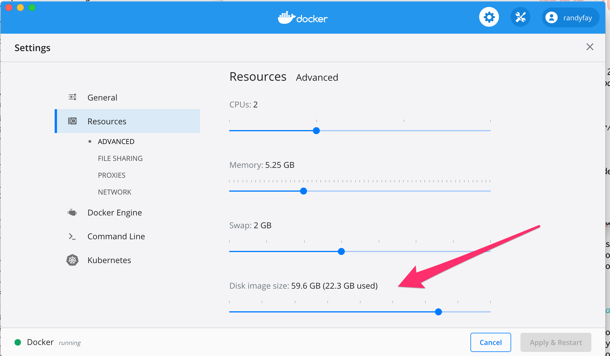

## Troubleshooting

Things might go wrong! Besides the suggestions on this page don't forget about [Stack Overflow](https://stackoverflow.com/tags/ddev) and [the ddev issue queue](https://github.com/drud/ddev/issues) and [other support options](../index.md#support). And see [Docker troubleshooting suggestions](docker_installation.md#troubleshooting).

## General Troubleshooting Strategies

* Please start with a `ddev poweroff` to make sure all containers can start fresh.
* Temporarily turn off firewalls, VPNs, network proxies, and virus checkers while you're troubleshooting.
* On macOS and traditional Windows, please check to make sure that Docker Desktop is not out of disk space. In Settings (or Preferences)->Resources->Disk image size there should be lots of space left; I never let it go over 80% because the number reported here is not reliable. If it says zero used, something is wrong.
* If you have customizations (PHP overrides, nginx or Apache overrides, MySQL overrides, custom services, config.yaml changes) please back them out while troubleshooting. It's important to have the simplest possible environment while troubleshooting.
* Check your Docker disk space and memory allocation if you're using Docker Desktop on Windows or macOS.
* Restart Docker. Consider a Docker factory reset in serious cases (this will destroy any databases you've loaded). See [Docker Troubleshooting](docker_installation.md#troubleshooting) for more.
* Try the simplest possible ddev project to try to get it to work: `ddev poweroff && mkdir ~/tmp/testddev && cd ~/tmp/testddev && ddev config --project-type=php && ddev start`. Does that start up OK? If so, maybe something is wrong with the more complicated project you're trying to start.

<a name="unable-listen"></a>

## Webserver ports are already occupied by another webserver

ddev notifies you about port conflicts with this message:

```
Failed to start yoursite: Unable to listen on required ports, localhost port 80 is in use,
```

This means there is another webserver listening on the named port(s) and ddev cannot access the port. The most common conflicts are on ports 80 and 443.

(In some cases the conflict could be over port 8036 (phpMyAdmin) or port 8025 (MailHog)).

To resolve this conflict, choose one of two methods:

1. If you are using another local development environment (MAMP, WAMP, lando, etc.) that uses these ports, consider stopping it.
2. Fix port conflicts by configuring your project to use different ports.
3. Fix port conflicts by stopping the competing application.

### Method 1: Fix port conflicts by configuring your project to use different ports

To configure a project to use non-conflicting ports, edit the project's .ddev/config.yaml to add entries like `router_http_port: 8000` and `router_https_port: 8443` depending on your needs. Then use `ddev start` again.

For example, if there was a port conflict with a local apache http on port 80 add the following to the to the config.yaml file.

```yaml
router_http_port: 8080
router_https_port: 8443
```

Then run `ddev start`. This changes the project's http URL to <http://yoursite.ddev.site:8080> and the https URL to <https://yoursite.ddev.site:8443>.

If the conflict is over port 8025, it's normally a conflict over the default port for MailHog. You can add to your .ddev/config.yaml

```yaml
mailhog_port: 8300
```

If the conflict is over port 8036, it's normally about phpMyAdmin, and you can add to your .ddev/config.yaml

```yaml
phpmyadmin_port: 8302
```

### Method 2: Fix port conflicts by stopping the competing application

Alternatively, stop the other application.

Probably the most common conflicting application is Apache running locally. It can often be stopped gracefully (but temporarily) with:

```
sudo apachectl stop
```

**Common tools that use port 80 and port 443:**

Here are some of the other common processes that could be using ports 80/443 and methods to stop them.

* MAMP (macOS): [Stop MAMP](http://documentation.mamp.info/en/MAMP-Mac/Preferences/Start-Stop/)
* Apache: Temporarily stop with `sudo apachectl stop`, permanent stop depends on your environment.
* nginx (macOS Homebrew): `sudo brew services stop nginx`
or `sudo launchctl stop homebrew.mxcl.nginx`
* nginx (Ubuntu): `sudo service nginx stop`
* apache (often named "httpd") (many environments): `sudo apachectl stop` or on Ubuntu `sudo service apache2 stop`
* vpnkit (macOS): You likely have a docker container bound to port 80, do you have containers up for Lando or another docker-based development environment? If so, stop the other environment.
* Lando: If you have previously used Lando try running `lando poweroff`

To dig deeper, you can use a number of tools to find out what process is listening.

On macOS and Linux, try the lsof tool on ports 80 or 443 or whatever port you're having trouble with:

```
$ sudo lsof -i :80 -sTCP:LISTEN
COMMAND  PID     USER   FD   TYPE DEVICE SIZE/OFF NODE NAME
nginx   1608 www-data   46u  IPv4  13913      0t0  TCP *:http (LISTEN)
nginx   5234     root   46u  IPv4  13913      0t0  TCP *:http (LISTEN)
```

On Windows CMD, use [sysinternals tcpview](https://docs.microsoft.com/en-us/sysinternals/downloads/tcpview) or try using netstat and tasklist to find the pid:

```
> netstat -aon | findstr ":80.*LISTENING"
  TCP    127.0.0.1:80           0.0.0.0:0              LISTENING       5760
  TCP    127.0.0.1:8025         0.0.0.0:0              LISTENING       5760
  TCP    127.0.0.1:8036         0.0.0.0:0              LISTENING       5760
  
> tasklist | findstr "5760"
com.docker.backend.exe        5760 Services                   0      9,536 K
```

The resulting output displays which command is running and its pid. Choose the appropriate method to stop the other server.

We welcome your [suggestions](https://github.com/drud/ddev/issues/new) based on other issues you've run into and your troubleshooting technique.

<a name="container-restarts"></a>

## DDEV-Local reports container restarts and does not arrive at "ready"

## Restarts of the database container

The most common cause of the database container not coming up is a damaged database, so the mariadb server daemon is unable to start. This is typically caused by an unexpected docker event like system shutdown or docker exit which doesn't give the db container time to clean up and close connections. See [issue](https://github.com/drud/ddev/issues/748). In general, the easiest fix is to destroy and reload the database from either a database dump or a ddev snapshot. Otherwise, that issue has more ambitious approaches that may be taken if you have neither. But the easiest approach is this, which *will destroy and then reload your project database*:

1. `ddev stop --remove-data --omit-snapshot`
2. mv .ddev .ddev.bak (renames the directory with config.yaml and docker-compose.yml and any custom nginx/php/mariadb config you may have added. Renaming it means .)
3. `ddev config`
4. `ddev start`
5. `ddev import-db` or `ddev restore-snapshot <snapshot-name>` if you have a db to import or a snapshot to restore.

Another approach to destroying the database is to destroy the docker volume where it is =stored with `docker volume rm <projectname>-mariadb`

## "web service unhealthy" or "web service starting" or exited

The most common cause of the web container being unhealthy is a user-defined .ddev/nginx-full/nginx-site.conf or .ddev/apache/apache-site.conf - Please rename these to <xxx_site.conf> during testing. To figure out what's wrong with it after you've identified that as the problem, use `ddev logs` and review the error.

Changes to .ddev/nginx-site.conf and .ddev/apache/apache-site.conf take effect only when you do a `ddev restart` or the equivalent.

## No input file specified (404) or Forbidden (403)

If you get a 404 with "No input file specified" (nginx) or a 403 with "Forbidden" (apache) when you visit your project it may mean that no index.php or index.html is being found in the docroot. This can result from:

* Misconfigured docroot: If the docroot isn't where the webserver thinks it is, then the webserver won't find the index.php. Look at your .ddev/config.yaml to verify it has a docroot that will lead to the index.php. It should be a relative path from the project root to the directory where the index.php is.
* Missing index.php: There may not be an index.php or index.html in your project.
* Docker not mounting your code: If you `ddev ssh` and `ls` and there's nothing there, Docker may not be mounting your code. See [docker installation](./docker_installation.md) for testing docker install. (Is Docker, the drive or directory where your project is must be shared.

## `ddev start` fails and logs contain "failed (28: No space left on device)" - Docker File Space

If `ddev start` fails, it's most often because the web container or db container fails to start. In this case the error message from `ddev start` says something like "Failed to start <project>: db container failed: log=, err=container exited, please use 'ddev logs -s db' to find out why it failed". You can`ddev logs -s db` to find out what happened.

If you see any variant of "no space left on device" in the logs when using Docker Desktop, it means that you have to increase or clean up Docker's file space. To increase the allocated space, go to "Resources" in Docker's Preferences as shown in 

If you see "no space left on device" on Linux, it most likely means your filesystem is full.

## `ddev start` fails with "container failed to become ready"

If a container fails to become ready, it means it's failing the healthcheck.  This can happen to any of the containers, but you can usually find out quickly what the issue is with a `docker inspect` command.

You may need to install `jq` for these, `brew install jq`, or just remove the "| jq" from the command and read the raw json output.

For the web container, `docker inspect --format "{{json .State.Health }}" ddev-<projectname>-web | jq`
For ddev-router, `docker inspect --format "{{json .State.Health }}" ddev-router`
For ddev-ssh-agent, `docker inspect --format "{{json .State.Health }}" ddev-ssh-agent`

Don't forget that `ddev logs` (for the web container) or `ddev logs -s db` (for the db container) are your friend.

For ddev-router and ddev-ssh-agent, `docker logs ddev-router` and `docker logs ddev-ssh-agent`.

## Trouble Building Dockerfiles

The additional .ddev/web-build/Dockerfile capability in ddev is wonderful, but it can be hard to figure out what to put in there.

The best approach for any significant Dockerfile is to `ddev ssh` and `sudo -s` and then one at a time, do the things that you plan to do with a `RUN` command in the Dockerfile.

For example, if your Dockerfile were

```dockerfile
ARG BASE_IMAGE
FROM $BASE_IMAGE
RUN npm install --global gulp-cli
```

You could test it with `ddev ssh`, `sudo -s` and then `npm install --global gulp-cli`

The error messages you get will be more informative than messages that come when the Dockerfile is processed.

## Ddev starts fine, but my browser can't access the URL "<url> server IP address could not be found" or "We can’t connect to the server at <url>"

Most people use \*.ddev.site URLs for most projects, and that works great most of the time, but requires internet access. "\*.ddev.site" is a wildcard DNS entry that always returns the IP address 127.0.0.1 (localhost). However, if you're not connected to the internet, or if various other name resolution issues (below) fail, this name resolution won't work.

While ddev can create a webserver and a docker network infrastructure for a project, it doesn't have control of your computer's name resolution, so its backup technique to make a hostname resolvable by the browser is to add an entry to the hosts file (/etc/hosts on Linux and macOS, C:\Windows\system32\drivers\etc\hosts on traditional Windows).

* If you're not connected to the internet, your browser will not be able to look up \*.ddev.site hostnames. DDEV works fine offline, but for your browser to look up names they'll have to be resolved in a different way.
* DDEV assumes that hostnames can be resolved within 750ms (3/4 of a second). That assumption is not valid on all networks or computers, so you can increase the amount of time it waits for resolution with `ddev config global --internet-detection-timeout-ms=3000` for example.
* If DDEV detects that it can't look up one of the hostnames assigned to your project for that or other reasons, it will try to add that to the hosts file on your computer, but of course that requires administrative privileges (sudo or Windows UAC)
    * This technique may not work on Windows WSL2, see below.
    * Only 10 hosts are valid on a line on traditional Windows, see [below](#windows-hosts-file-limited-to-10-hosts-per-ip-address-line); beyond that hostnames are ignored.

## Windows WSL2 name resolution on non-ddev.site hostnames or when not internet-connected

On Windows WSL2, there is a hosts file inside the WSL2 instance (`/etc/hosts`), and there is also one on the Windows side (`C:\Windows\system32\drivers\etc\hosts`). Many people use a browser on the Windows side, which has no idea about hostnames that may be set up in the WSL2 /etc/hosts file. So a WSL2 project which uses `*.ddev.site` works fine when accessed by a browser on the Windows side, as long as internet connectivity is available (DNS lookups of `*.ddev.site` succeed).

However, if the project uses non-ddev.site hostnames, or if not connected to the Internet, or if use_dns_when_possible is false in the .ddev/config.yaml, a Windows-side browser will be unable to look up project hostnames, and you'll get complaints from the browser like "<url> server IP address could not be found" or "We can’t connect to the server at <url>".  In this case, you can:

1. Add the needed hostname(s) manually to the Windows hosts file. This can easily be done with the *Windows* version of ddev.exe with `sudo ddev hostname <hostname> 127.0.0.1` on *Windows* in PowerShell or Cmd or git-bash.
2. Or run a browser within WSL2 (currently requires an X11 server like X410, but Microsoft plans to provide natively)

## DNS Rebinding Prohibited

Some DNS servers prevent the use of DNS records that resolve to `localhost` (127.0.0.1) because in uncontrolled environments this may be used as a form of attack called [DNS Rebinding](https://en.wikipedia.org/wiki/DNS_rebinding). Since \*.ddev.site resolves to 127.0.0.1, they may refuse to resolve, and your browser may be unable to look up a hostname, and give you messages like "<url> server IP address could not be found" or "We can’t connect to the server at <url>".

In this case, you can

1. Reconfigure the DNS server to allow DNS Rebinding. Many Fritzbox routers have added default DNS Rebinding disallowal, and they can be reconfigured to allow it, see [issue](https://github.com/drud/ddev/issues/2409#issuecomment-686718237). If you have the local dnsmasq DNS server it may also be configured to disallow DNS rebinding, but it's a simple change to a configuration directive to allow it.
2. Most computers can use most relaxed DNS resolution if they are not on corporate intranets that have non-internet DNS. So for example, the computer can be set to use 8.8.8.8 (Google) or 1.1.1.1 (Cloudflare) for DNS name resolution.
3. If you have control of the router, you can usually change its DHCP settings to choose a DNS server to a public, relaxed DNS server as in #2.
4. You can live with ddev trying to edit the /etc/hosts file, which it only has to do when a new name is added to a project.

<a name="windows-hosts-file-limited"></a>

### Windows Hosts File limited to 10 hosts per IP address line

On Windows only, there is a limit to the number of hosts that can be placed in one line. But since all ddev hosts are typically on the same IP address (typically 127.0.0.1, localhost), they can really add up. As soon as you have more than 10 entries there, your browser won't be able to resolve the addresses beyond the 10th entry.

There are two workarounds for this problem:

1. Use `ddev stop --all` and `sudo ddev hostname --remove-inactive` to prune the number of hosts on that hosts-file line. When you start a project, the hostname(s) associated with that project will be added back again.
2. Manually edit the hosts file (typically `C:\Windows\System32\drivers\etc\hosts`) and put some of your hosts on a separate line in the file.

## Windows WSL2 Network Issues

If you're using a browser on Windows, accessing a project in WSL2, you can end up with very confusing results if your project is listening on a port inside WSL2, but a Windows process is listening on the port on Windows. The way to sort this out is to stop your project inside WSL2, verify that nothing is listening on the port there, and then study the port on the Windows side, by visiting it with a browser or using other tools as described above.
