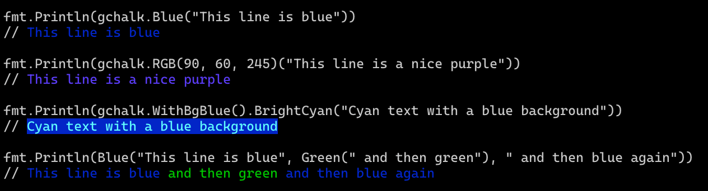

# GChalk

[](https://pkg.go.dev/github.com/jwalton/gchalk?readme=expanded#section-readme)
[](https://github.com/jwalton/gchalk/actions)
[](https://goreportcard.com/report/github.com/jwalton/gchalk)
[](https://github.com/jwalton/gchalk/releases/latest)

GChalk is a library heavily inspired by [chalk](https://github.com/chalk/chalk), the popular Node.js terminal color library, and using go ports of [supports-color](https://github.com/jwalton/go-supportscolor) and [ansi-styles](https://github.com/jwalton/gchalk/tree/master/pkg/ansistyles).



## Features

- Expressive API
- Highly performant
- Ability to nest styles
- [256/Truecolor color support](https://github.com/jwalton/gchalk#256-and-truecolor-color-support) with automatic conversion if not supported
- [Auto-detects color support](https://github.com/jwalton/gchalk#color-detection)
- Painless [Windows 10 support](https://github.com/jwalton/gchalk#windows-10-support)

## Feature Comparison

|                                  Feature                                  | gchalk | [termenv](https://github.com/muesli/termenv) | [aurora](https://github.com/logrusorgru/aurora) | [fatih/color](https://github.com/fatih/color) | [mgutz/ansi](https://github.com/mgutz/ansi) |
| :-----------------------------------------------------------------------: | :----: | :------------------------------------------: | :---------------------------------------------: | :-------------------------------------------: | :-----------------------------------------: |
|                               TTY Detection                               |   ✅   |                    ✅ (1)                    |                       ❌                        |                    ✅ (1)                     |                     ❌                      |
|                              Color Detection                              |   ✅   |                      ✅                      |                       ❌                        |                      ❌                       |                     ❌                      |
|                                Windows 10                                 |   ✅   |                    ✅ (5)                    |                       ❌                        |                    ✅ (2)                     |                     ❌                      |
|                               Nested Styles                               |   ✅   |                    ? (6)                     |                     ✅ (3)                      |                      ❌                       |                     ❌                      |
|                             256 Color Support                             |   ✅   |                      ✅                      |                     ✅ (4)                      |                      ❌                       |                   ✅ (4)                    |
|                            16.7m Color Support                            |   ✅   |                      ✅                      |                       ❌                        |                      ❌                       |                     ❌                      |
| [Speed](https://gist.github.com/jwalton/2394e848be3070c6667220baa70cdeda) |  70ns  |                    330ns                     |                      196ns                      |                     420ns                     |                    40ns                     |

1. fatih/color and termenv support automatic TTY detection, but assume that if stdout is not a TTY, then stderr is also not a TTY, which may not be true.
2. fatih/color supports Windows 10, but you need to write to a special stream.
3. aurora supports nested styles via its custom `Sprintf()`, but you can't convert things to a string first - need to keep everything as aurora `Value`s.
4. aurora and mgutz/ansi both support 256 color output, but they don't detect whether the terminal supports it or not, and won't automatically convert 256 color output to 16 color output if it doesn't.
5. termenv assumes Windows always supports 16.7m colors, which might cause problems on really old Windows 10 builds. termenv also does not enable ANSI support on Windows 10, so users not using Windows Terminal may have to take extra steps to enable ANSI support (although this is done for you if you are using the related library [LipGloss](https://github.com/charmbracelet/lipgloss/blob/master/ansi_windows.go)).
6. termenv claims to support nested styles, but I couldn't figure out how to make them work.

## Install

```sh
go get github.com/jwalton/gchalk
```

## Usage

```go
package main

import (
    "fmt"
    "github.com/jwalton/gchalk"
)

func main() {
    fmt.Println(gchalk.Blue("This line is blue"))
}
```

Note that this works on all platforms - there's no need to write to a special stream or use a special print function to get color on Windows 10.

GChalk uses a chainable syntax for composing styles together, which should be instantly familiar if you've ever used chalk or similar libraries. To style a string blue, for example, you"d call `gchalk.Blue("hello")`. To style it blue with a red background, you can use `gchalk.WithBgRed().Blue("hello")`.

```go
// Combine styled and normal strings
fmt.Println(gchalk.Blue("Hello") + " World" + gchalk.Red("!"))

// Compose multiple styles using the chainable API
fmt.Println(gchalk.WithBlue().WithBgRed().Bold("Hello world!"))

// Pass in multiple arguments
fmt.Println(gchalk.Blue("Hello", "World!", "Foo", "bar", "biz", "baz"))

// Nest styles
fmt.Println(gchalk.Green(
    "I am a green line " +
    gchalk.WithBlue().WithUnderline().Bold("with a blue substring") +
    " that becomes green again!"
))

// Use RGB colors in terminal emulators that support it.
fmt.Println(gchalk.WithRGB(123, 45, 67).Underline("Underlined reddish color"))
fmt.Println(gchalk.WithHex("#DEADED").Bold("Bold gray!"))

// Use color name strings
fmt.Println(gchalk.StyleMust("blue")("Hello World!"))


// Write to stderr:
os.Stderr.WriteString(gchalk.Stderr.Red("Ohs noes!\n"))
```

You can easily define your own themes:

```go
var error = gchalk.WithBold().Red
var warning = gchalk.Yellow

fmt.Println(error("Error!"))
fmt.Println(warning("Warning!"))
```

## API

### gchalk[.With&lt;style>][.with&lt;style>...].&lt;style>(string [, string...])

Example:

```go
fmt.Println(gchalk.WithRed().WithBold().Underline("Hello", "world"))
```

Chain styles and call the last one as a method with a string argument. Order doesn't matter, and later styles take precedent in case of a conflict. Multiple arguments will be separated by a space.

You can also obtain a `Builder` instance and then use the `Paint()` function, similar to Rust's `ansi_term` crate, or use the `Sprintf()` convenience function:

```go
fmt.Println(gchalk.WithRed().Paint("Hello", "world"))
fmt.Println(gchalk.WithRed().Sprintf("Hello %v", "world"))
```

### gchalk.Style(style [, style...])(string [, string...])

Example:

```go
styler, err := gchalk.Style("bold", "red")
if err == nil {
    fmt.Println(styler("This is bold and red"))
}

fmt.Println(gchalk.StyleMust("bold", "red")("This is also bold and red."))
```

`Style` and `StyleMust` allow styling a string based on the names of colors and modifiers. There's also a `WithStyle` and `WithStyleMust` for chaining named styles with other styles.

### gchalk.SetLevel(level) and gchalk.GetLevel()

Specifies the level of color support. See [the section on color detection](https://github.com/jwalton/gchalk#color-detection) for details about how gchalk auto-detects color support. You can override the detected level by calling `SetLevel()`. You should however only do this in your own application, as it applies globally to all gchalk consumers. If you need to change this in a library, create a new instance:

```go
var myGChalk = gchalk.New(gchalk.ForceLevel(gchalk.LevelNone))
```

|       Level        | Description                           |
| :----------------: | :------------------------------------ |
|  `LevelNone = 0`   | All colors disabled                   |
|  `LevelBasic = 1`  | Basic color support (16 colors)       |
| `LevelAnsi256 = 2` | 256 color support                     |
| `LevelAnsi16m = 3` | Truecolor support (16 million colors) |

### gchalk.Stderr

`gchalk.Stderr` contains a separate instance configured with color support detected for `stderr` stream instead of `stdout`.

Stdout and stderr can be different in cases where the user is piping output. For example, if a user runs:

```sh
myprogram > out.txt
```

then `stdout` will not be a TTY, so by default gchalk will not emit any color, however `stderr` will be a TTY, so `gchalk.Stderr.Red(...)` will still generate colored output.

### gchalk.New(options...)

Creates a new instance of gchalk. Options include:

- `gchalk.ForceLevel(level)` - Force the color level. If not specified, will be autodetected from stdout.

## Styles

### Modifiers

- `Reset` - Resets the current color chain.
- `Bold` - Make text bold.
- `Dim` - Emitting only a small amount of light.
- `Italic` - Make text italic. _(Not widely supported)_
- `Underline` - Make text underline. _(Not widely supported)_
- `Inverse`- Inverse background and foreground colors.
- `Hidden` - Prints the text, but makes it invisible.
- `Strikethrough` - Puts a horizontal line through the center of the text. _(Not widely supported)_
- `Visible`- Prints the text only when gchalk has a color level > 0. Can be useful for things that are purely cosmetic.

### Colors

- `Black`
- `Red`
- `Green`
- `Yellow`
- `Blue`
- `Magenta`
- `Cyan`
- `White`
- `BrightBlack` (alias: `gray`, `grey`)
- `BrightRed`
- `BrightGreen`
- `BrightYellow`
- `BrightBlue`
- `BrightMagenta`
- `BrightCyan`
- `BrightWhite`

### Background colors

- `BgBlack`
- `BgRed`
- `BgGreen`
- `BgYellow`
- `BgBlue`
- `BgMagenta`
- `BgCyan`
- `BgWhite`
- `BgBrightBlack` (alias: `BgGray`, `BgGrey`)
- `BgBrightRed`
- `BgBrightGreen`
- `BgBrightYellow`
- `BgBrightBlue`
- `BgBrightMagenta`
- `BgBrightCyan`
- `BgBrightWhite`

## 256 and Truecolor color support

GChalk supports 256 colors and [Truecolor](https://gist.github.com/XVilka/8346728) (16 million colors) on supported terminal apps, including Windows 10.

Colors are downsampled from 16 million RGB values to an ANSI color format that is supported by the terminal emulator (or by specifying `{level: n}` as a Chalk option). For example, GChalk configured to run at level 1 (basic color support) will downsample an RGB value of #FF0000 (red) to 91 (ANSI escape for bright-red).

Examples:

- `gchalk.WithHex('#DEADED').Underline('Hello, world!')`
- `gchalk.WithRGB(15, 100, 204).Inverse('Hello!')`

Background versions of these models are prefixed with `Bg` and the first level of the module capitalized:

- `gchalk.WithBgHex('#DEADED').Underline('Hello, world!')`
- `gchalk.WithBgRgb(15, 100, 204).Unverse('Hello!')`

The following color models can be used:

- [`rgb`](https://en.wikipedia.org/wiki/RGB_color_model) - Example: `gchalk.RGB(255, 136, 0)('Orange!')`
- [`hex`](https://en.wikipedia.org/wiki/Web_colors#Hex_triplet) - Example: `gchalk.Hex('#FF8800')('Orange!')`
- [`ansi256`](https://en.wikipedia.org/wiki/ANSI_escape_code#8-bit) - Example: `gchalk.BgAnsi256(194)('Honeydew, more or less')`
- [`ansi`](https://en.wikipedia.org/wiki/ANSI_escape_code#3/4_bit) - Example: `gchalk.WithAnsi(31).BgAnsi(93)('red on bright yellow')`

## Windows 10 Support

GChalk is cross-platform, and will work on Linux and MacOS systems, but will also work on Windows 10, and without the need for writing to a special stream or using [ansicon](https://github.com/adoxa/ansicon).

Many ANSI color libraries for Go do a poor job of handling colors in Windows. This is because historically, Windows has not supported ANSI color codes, so hacks like ansicon or [go-colorable](https://github.com/mattn/go-colorable) were required. However, Windows 10 has supported ANSI escape codes since 2017 (build 10586 for 256 color support, and build 14931 for 16.7 million true color support). In [Windows Terminal](https://github.com/Microsoft/Terminal) this is enabled by default, but in `CMD.EXE` or PowerShell, ANSI support must be enabled via [`ENABLE_VIRTUAL_TERMINAL_PROCESSING`](https://docs.microsoft.com/en-us/windows/console/console-virtual-terminal-sequences). GChalk, of course, takes care of all of this for you. This functionality is also availabile in the [supportscolor](https://github.com/jwalton/go-supportscolor) library if you're an ANSI library author and you'd like to add this functionality to your own project.

## Color Detection

Color support is automatically detected using [supportscolor](https://github.com/jwalton/go-supportscolor), and [flags and command line arguments](https://github.com/jwalton/go-supportscolor#info) supported by supportscolor are also supported here. GChalk will automatically obey all the recommendations from [Command Line Interface Guidelines](https://clig.dev/#output). The following will disable color:

- stdout is not a TTY. (Or, for `gchalk.Stderr`, stderr is not a TTY.)
- The `NO_COLOR` environment variable is set.
- The `TERM` variable has the value `dumb`.
- The user passes the option `--no-color`, `--no-colors`, `--color=false`, or `--color=never`.
- The `FORCE_COLOR` environment variable is 0.

Color support will be forcefully enabled if:

- The `FORCE_COLOR` environment variable is set to `1`, `2`, or `3` (for 16 color, 256 color, and 16.7m color support, respectively).
- The `FORCE_COLOR` environment variable is set with no value, or with `true`.
- The uses passes the option `--color`, `--colors`, `--color=true`, or `--color=always`.

GChalk will also support colored output when run from popular CI environments, including Travis, CircleCI, Appveyor, GitlabCI, GitHub Actions, Buildkite, Drone, and TeamCity.

## Related

- [ansistyles](https://github.com/jwalton/gchalk/tree/master/pkg/ansistyles) - A low level library for generating ANSI escape codes, ported from Node.js's [ansi-styles](https://github.com/chalk/ansi-styles).
- [supportscolor](https://github.com/jwalton/go-supportscolor) - Detect whether a terminal supports color, ported from Node.js's [supports-color](https://github.com/chalk/supports-color).
