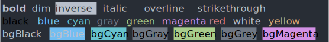

# ansistyles

> [ANSI escape codes](https://en.wikipedia.org/wiki/ANSI_escape_code#Colors_and_Styles) for styling strings in the terminal

This is a port of [Sindre Sorhus](https://github.com/sindresorhus) and [Josh Junon](https://github.com/qix-)'s library [ansi-styles](https://github.com/chalk/ansi-styles) (part of [chalk](https://github.com/chalk/chalk)) from JavaScript to Golang.  This port is up-to-date as of ansi-styles@v5.1.0.



This library just generates ANSI escape codes - it does nothing to decide whether the current terminal is capable of showing the generated codes.  You probably want a higher-level module for styling your strings.

There are quite a few popular libraries for doing ANSI escape codes in go, but many will not work on Windows, even though Windows 10 has supported ANSI out-of-the-box [since 2016](https://en.wikipedia.org/wiki/ANSI_escape_code#DOS,_OS/2,_and_Windows) in CMD.EXE, in Powershell since v5.1, and in [Windows Terminal](https://github.com/Microsoft/Terminal) since it was created.  This library is meant to be a building block for bulding something cross-platform.

## Install

```sh
$ go get github.com/jwalton/gchalk/pkg/ansistyles
```

## Usage

```go
package main

import (
    "fmt"

    "github.com/jwalton/gchalk/pkg/ansistyles"
)

func main() {
    fmt.Println(ansistyles.Green.Open + "Hello world!" + ansistyles.Green.Close)

    // Color conversion between 16/256/truecolor
    // NOTE: If conversion goes to 16 colors or 256 colors, the original color
    //       may be degraded to fit that color palette. This means terminals
    //       that do not support 16 million colors will best-match the
    //       original color.
    fmt.Println(ansistyles.Ansi256(ansistyles.RGBToAnsi256(199, 20, 250)) + "Hello World" + ansistyles.Close)
    fmt.Println(ansistyles.Ansi16m(ansistyles.HexToRGB("#abcdef")) + "Hello World" + ansistyles.Close)
}
```

## API

Each style has an `Open` and `Close` property.

## Styles

### Modifiers

- `Reset`
- `Bold`
- `Dim`
- `Italic` _(Not widely supported)_
- `Underline`
- `Overline` _Supported on VTE-based terminals, the GNOME terminal, mintty, and Git Bash._
- `Inverse`
- `Hidden`
- `Strikethrough` _(Not widely supported)_

### Colors

- `Black`
- `Red`
- `Green`
- `Yellow`
- `Blue`
- `Magenta`
- `Cyan`
- `White`
- `BrightBlack` (alias: `Gray`, `Grey`)
- `BrightRed`
- `BrightGreen`
- `BrightYellow`
- `BrightBlue`
- `BrightMagenta`
- `BrightCyan`
- `BrightWhite`

### Background colors

- `BgBlack`
- `BgRed`
- `BgGreen`
- `BgYellow`
- `BgBlue`
- `BgMagenta`
- `BgCyan`
- `BgWhite`
- `BgBrightBlack` (alias: `BgGray`, `BgGrey`)
- `BgBrightRed`
- `BgBrightGreen`
- `BgBrightYellow`
- `BgBrightBlue`
- `BgBrightMagenta`
- `BgBrightCyan`
- `BgBrightWhite`

## Advanced usage

Styles are available directly as values (e.g. `ansistyles.Blue`), via a lookup map using string names (e.g. `ansistyles.Styles["blue"]`), and also by grouped maps (e.g. `ansistyles.BgColor["bgBlue"]`):

- `ansistyles.Modifier`
- `ansistyles.Color`
- `ansistyles.BgColor`

Example:

```go
fmt.Println(ansistyles.Color["green"].open);
```

Raw escape codes (i.e. without the CSI escape prefix `\u001B[` and render mode postfix `m`) are available under `style.Codes`, which returns a `map` with the open codes as keys and close codes as values.

Example:

```go
fmt.Println(ansistyles.Codes[36]); //=> 39
```

## [256 / 16 million (TrueColor) support](https://gist.github.com/XVilka/8346728)

`ansistyles` allows converting between various color formats and ANSI escapes, with support for 256 and 16 million colors.  The following color spaces are supported:

- `rgb`
- `hex`
- `ansi256`

To use these, call the associated conversion function with the intended output, for example:

```go
ansistyles.Ansi256(ansistyles.RGBToAnsi256(100, 200, 15)) // RGB to 256 color ansi foreground code
ansistyles.BgAnsi256(ansistyles.HexToAnsi256("#C0FFEE")) // HEX to 256 color ansi foreground code
ansistyles.Ansi(ansistyles.RGBToAnsi(100, 200, 15)) // RGB to 16 color ansi foreground code

ansistyles.Ansi16m(100, 200, 15); // RGB to 16 million color foreground code
ansistyles.BgAnsi16m(ansistyles.HexToRgb("#C0FFEE")); // Hex (RGB) to 16 million color foreground code
ansistyles.BgAnsi(ansistyles.RGBToAnsi(100, 200, 15)) // RGB to 16 color ansi background code
```
